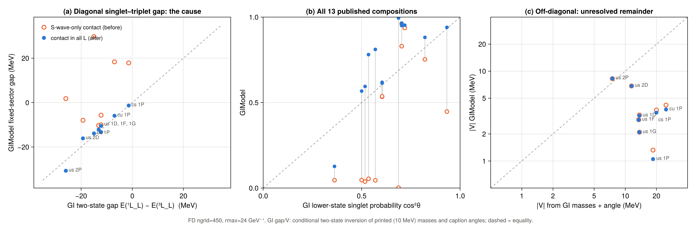

# Why GIModel did not reproduce GI's mixing compositions

> **Status: closed (2026-09-27), antisymmetric spin–orbit investigation.**
> The missing higher-L contact term was fixed and its execution paths unified.
> The remaining large mismatch with GI85 captions is a historical reference
> discrepancy, corroborated by later GI-model calculations. Its historical
> origin is unknown; reproducing those captions is not an open implementation
> task. [GI85/GK91 benchmark ledger](../../data/mixing_angle_targets.md).
> Small later-table residuals remain recorded below as optional precision work;
> ψ(3.82) tensor admixtures and photon-decay residuals remain separate open work.

Targets and evidence standards: [mixing_matching_targets.md](mixing_matching_targets.md).
All numbers below: [mixing_composition_results.md](mixing_composition_results.md),
generated by `GIPaper/scripts/investigate_mixing_composition.jl` (before = commit
88e9a99, after = this fix; FD ngrid=450, rmax=24 GeV⁻¹ unless stated).



## Conclusion

**Demonstrated cause (diagonal side).** GIModel applied the smeared contact
hyperfine term only to S waves. Eq. (A15) has no L restriction, and GI's
Eqs. (23)–(26) keep it in every P-wave level (¹P₁ gets −3S/4, ³P_J get +S/4;
S "small but nonzero due to relativistic smearing"). The relativized smeared
∇²G̃ gives S ≈ 46, 25, 20 and 10 MeV for the K, D, Ds and B 1P singlet waves.
Omitting it put the pre-mixing singlet–triplet gap of every unequal-mass P wave
20–45 MeV too high. In the K/D/Ds/B 1P blocks the triplet then sat ~20 MeV below
the singlet, so the lower state was almost pure ³P₁ (singlet probability
0.2–5 %). That is the three headline discrepancies.

The GIModel core now includes the contact term in every L (FD and HO, operator
and reported shifts). Four independent lines of evidence support the correction:

1. **Source.** A15 and Eqs. (23)–(26), checked on the page images.
2. **Composition-free gap test.** GI's printed J=L masses plus caption angle give
   a two-state gap for 8 rows. Before, ours differed by up to +45 MeV and had the
   wrong sign in four P-wave rows. After, all 8 agree within the 10 MeV print
   precision: K 1P −13.9 vs −15.0, K 2P −30.7 vs −26.0, D 1P −5.9 vs −7.0,
   Ds 1P −1.3 vs −1.4 (panel a).
3. **Spectrum-wide test, independent of mixing.** Over all seven catalogs the
   L>0 singlets carried a +17.3 MeV mean residual (P waves) and the triplets
   −8.4 MeV, exactly the signature of the missing term. After: +1.6 and −3.2.
   Mean |residual| for 153 L>0 states fell from 6.4 to 3.7 MeV, with L=0
   unchanged. The equal-mass isovector/isoscalar sectors, which have no
   antisymmetric mixing, improved from 8.6 to 3.1 and 3.0 MeV.
4. **Independent derivation.** A separate Python code (numerical A7–A8 smearing,
   momentum factors applied by a j₁ Hankel transform) reproduces S for the D 1P
   waves to 1e-4 relative.

The median angular distance of the 13 published angles fell from 32.6° to 15.1°.
Rows within 6° went from 3 to 6: K 2P, Ds 1P, Bs 1P, D 1D and Ds 1D. The K 2D row
stayed at 4.9°.

**Unresolved remainder (off-diagonal side).** For radial ground states, the
antisymmetric element V is 4–18× smaller than GI's two-state value: K 1P −1.1 vs
−18.5, K 1D/1F/1G −2 to −3 vs ≈ −14, D 1P +3.7 vs +24.8, Ds 1P +3.5 vs +20.0.
The radially excited rows agree (K 2P −8.3 vs −7.5) or nearly agree (K 2D −6.8 vs
−11.5); see panel c. This deficit accounts for every remaining large angle miss:

- K 1P, 1D, 1F, 1G are 20–30° too small.
- D 1P and B 1P are 15° too small.
- Bc is 58° off. There V's sign follows the c-quark vector term instead of the
  Thomas term, so its angle has the opposite sign to B/Bs.

It also accounts for the J=1 splittings. With the corrected gap, the D/Ds/K 1P
pairs are now split 7–14 MeV where GI print 40–50. Those splittings were 20–30
MeV before, but only because the wrong gap compensated for the small V.

The K 1D row got worse (8.6° → 20.2°). Its earlier agreement was two
compensating errors: gap −5.7 instead of −12.2, and V −3.2 instead of −13.7.

The operator itself is not the problem as printed. A15/A16 coefficients, signs,
smearing σ_ii, momentum factors and cross-radial elements are reproduced
independently to 1e-4.

**Update 2026-09-27: the remainder is a property of the 1985 captions, not of
GIModel.** Two new tests settle where the off-diagonal disagreement lives.

1. *V is the only disagreeing quantity.* Invert GI Eqs. (23)–(26) for
   (M, S, T, L, V) in every P-wave multiplet GI print: uū, ss̄, cc̄, bb̄ (1P, 2P),
   K 1P/2P, D, Ds. Apply the identical inversion to our final masses and angles.
   S, T and L agree within 1–4 MeV in all 11 multiplets, including unequal-mass
   K, D and Ds (e.g. Ds: S 15.4/15.4, T 14.2/14.2, L 28.3/28.2). Only V differs,
   in three sets: K 1P, D 1P, Ds 1P.
   ([`investigate_multiplet_parameters.jl`](../../scripts/investigate_multiplet_parameters.jl),
   [CSV](mixing_composition/multiplet_parameters.csv).)
   No rescaling of the vector-ii, Thomas and vector-cross kernels fits all 11 L
   and 4 V together: the best fit leaves K 1P at 5.6σ and K 2P at 2.6σ. No
   sign or omission pattern of the four per-quark pieces fits either (best
   χ² = 35 on 4 values). A15/A16-type kernels cannot give GI's V while
   keeping GI's S, T and L.
2. *Godfrey's own later GI-model calculations agree with us, not with the 1985
   captions.* These use the same Table II parameters (b = 0.18 GeV²,
   m_q = 0.220, m_s = 0.419, m_c = 1.628, m_b = 4.977 GeV):
   [Godfrey–Moats 2016](https://arxiv.org/abs/1510.08305) (D, Ds),
   [Godfrey–Moats–Swanson 2016](https://arxiv.org/abs/1607.02169) (B, Bs),
   [Godfrey 2004](https://arxiv.org/abs/hep-ph/0406228) (Bc) and
   [Blundell–Godfrey–Phelps 1996](https://arxiv.org/abs/hep-ph/9510245) (K, citing
   Godfrey–Kokoski 1991). Lower-state singlet probability, which does not depend
   on sign conventions:

   | State | GI 1985 caption | Godfrey later | GIModel (fixed) |
   |---|---:|---:|---:|
   | K 1P | 0.687 | ≈ 0.99 (θ_K = −5°) | 0.994 |
   | D 1P | 0.570 | 0.812 (−25.68°) | 0.811 (−25.77°) |
   | Ds 1P | 0.517 | 0.630 (−37.48°) | 0.594 (−39.57°) |
   | D 1D | 0.604 | 0.618 (−38.17°) | 0.619 (−38.14°) |
   | Ds 1D | 0.604 | 0.614 (−38.47°) | 0.613 (−38.45°) |
   | B 1P | 0.535 | 0.746 (\|θ\| = 30.28°) | 0.781 (\|θ\| = 27.9°) |
   | Bs 1P | 0.500 | 0.602 (\|θ\| = 39.12°) | 0.567 (\|θ\| = 41.1°) |
   | Bc 1P | 0.362 | 0.146 | 0.127 |

   All twenty 1P masses (3P₀, J=1 pair, 3P₂) for D, Ds, B, Bs and Bc agree with
   those tables within 0–4 MeV. Ours are systematically 2–4 MeV low in 3P₀.
   Blundell et al. quote unmixed K₁ masses of 1.37/1.35 GeV and a θ_K = −5° that
   leaves the masses unchanged. Ours: 1.366/1.352 GeV, 4.3°, shifts ≈ 0.1 MeV.
   Their contact expectation ⟨H_cont⟩ = 33 MeV matches our inverted K 1P
   S = 33.9 MeV. Godfrey's later implementation therefore includes the P-wave
   contact term (independent confirmation of the fix), and it produces the same
   small ground-state V we find.

So the 1985 caption angles for K/D/Ds/B/Bs/Bc 1P and K 1D/1F/1G, and the matching
40–50 MeV J=1 splittings, cannot be reproduced by the GI model as its first
author later implemented it. GIModel now agrees with that implementation to
≲ 2° in the D/1D cases and ≲ 3.5° elsewhere. The historical reason for the 1985
numbers (an earlier code version, a different treatment of the antisymmetric
term, or a transcription error) is not recoverable from the publications.
Neither of Godfrey's later papers comments on the difference.

**Earliest follow-up (added 2026-09-27).** Godfrey & Kokoski (draft July 1986,
PRD 43, 1679 (1991)) use the GI85 convention and present their table as the GI85
calculation. They give θ = −5° (K as sū), −26° (D), −38° (Ds), −31° (B), −40° (Bs)
and +68° (Bc). These match GIModel in magnitude and in sign, including Bc, where
the GI85 caption has −53°. Their P-wave ⟨H_cont⟩, ⟨H⁺_so⟩ and ⟨H_ten⟩ match our
inverted S, L and 2T to about 1 MeV. They also call the model's spin–orbit mixing
amplitude small. Sources and conventions:
[mixing-angle target ledger](../../data/mixing_angle_targets.md).

## Hypothesis ledger

| # | Hypothesis | Test | Verdict |
|---|---|---|---|
| H1 | Targets or convention misread | Page images of Figs. 3–9 captions, J=L labels and Table II rechecked. Singlet probabilities are invariant under basis signs, and a low/high swap cannot turn 0.2 % into 69 %. | Ruled out |
| H2 | Second-stage basis too small (only requested levels) | Blocks truncated to N = n…40 radial eigenstates, plus the full coupled-channel grid problem [H(¹L_L) W; W H(³L_L)] | Ruled out: ≤ 0.2° over all 13; outside-pair norm ≤ 0.27 % |
| H3 | Stage-1 radial convergence | FD 450 vs 900, rmax 24 vs 32, adaptive native HO | Ruled out: FD ≤ 0.03°, HO ≤ 1.1° |
| H4 | Eigensolver, block assembly, state assignment | Prior census (residual 7e-15, trace and rephasing checks); coupled-grid assembly written independently of production | Ruled out |
| H5 | Kernel implementation error (vector/Thomas coefficients, 1/4 vs 1/2, quark ordering, √L(L+1), smearing, momentum factors, normalization) | Independent Python derivation from A7–A16 on the same waves | Ruled out for A15/A16 as printed (≤ 3e-4 relative) |
| H6 | **Missing L>0 contact term in fixed-sector diagonals** | Source text; 8 two-state gaps; spectrum-wide L>0 bias; independent S | **Demonstrated; fixed** |
| H7 | GI's historical small HO basis (A17 truncated intermediate sums) | Native HO at nbasis = 6, unconverged | Ruled out: shrinking the basis makes V slightly smaller, not 4–18× larger |
| H8 | GI evaluated the antisymmetric element with a different relativization or smearing | σ₁₂ smearing; f₁₂ factor for 11/22 terms; no factor on either or both terms | No single variant gives V_GI/V ≈ 1 across the 8 rows; ratios scatter from 0.03 to 3 |
| H9 | Charmonium T disagrees (10.3 vs GI's calculated +13 MeV) | Define T, L as GI do, from the three ³P_J masses (Eqs. 23–25), not as a first-order expectation on the ³P₁ wave | Ruled out: T = 12.6, L = 27.6 vs +13, +28 |
| H10 | Some other diagonal ingredient is also off in unequal-mass sectors | Like-for-like (M, S, T, L, V) inversion of all 11 printed P-wave multiplets | Ruled out at 1–4 MeV: only V disagrees |
| H11 | Any vector/Thomas/cross kernel rescaling, or a sign/omission error among the four per-quark antisymmetric pieces, reproduces GI | Weighted fit to 11 L + 4 V; exhaustive sign/omission enumeration | Ruled out: best fits leave K 1P at 5.6σ / χ² = 35 |
| H12 | GIModel's small ground-state V is itself an implementation error | Godfrey's later GI-model papers with identical parameters | Ruled out: same angles (D 0.1°, D/Ds 1D 0.03°, others ≤ 3.5°) and masses (0–4 MeV) |
| H13 | The 1985 caption angles (ground-state 1P, K 1D/1F/1G) are not what the GI model as later implemented produces | All of the above | **Supported**. The historical cause in 1985 cannot be identified from the publications |
| H14 | Fig. 6 ψ(3.82) 2S/3S tensor admixtures (0.008/0.001 vs 0.03/0.01) | No independent GI-model S–D amplitude found; 1S amplitude and Figs. 3/4 agree | **Open**, low weight (probabilities ≤ 0.1 %) |

## Tensor compositions

Figs. 3 and 4 are reproduced: 1³D₁ amplitude 0.045 and 0.039 vs GI 0.04, at
masses 1455 and 1579 MeV. For Fig. 6 ψ(3.82), the 1³S₁ amplitude matches
(0.013 vs 0.01) and so do the 1S/2S relative signs under an origin-positive
radial phase. The 2³S₁ and 3³S₁ magnitudes are 4× and 8× too small. The contact
fix changes these amplitudes by < 1 %. The small 3S admixture is sensitive to
radial nodes; its sign is not a robust target.

## Residual limitations and separate follow-up work

- GI's V and gap come from a two-state inversion of masses printed to 10 MeV.
  The resulting |V_GI| uncertainty is ≈ 25 %, which cannot explain factors of
  4–18. The angles alone already require the larger V, given the matched gap.
- The earlier "charmonium T" lead was an artefact of comparing a first-order
  ³P₁ expectation with GI's mass-defined T. Defined consistently, T and L agree.
- For the 13 angles, the reproduction target should be recorded as
  "GI 1985 caption" and "GI model (Godfrey later)" side by side. Matching the
  1985 caption would require a Hamiltonian that contradicts GI's own printed
  S, T and L. We found no such Hamiltonian, and Godfrey's later implementation
  does not have one either. We do not tune toward the caption.
- Small residues against Godfrey's later tables: 3P₀ is 2–4 MeV low, and the
  Ds/B/Bs angles differ by 2–3.5°. Next check: our HO path at the basis size
  and β choice of A17 (one β per sector, set by the last state). HO already
  moves B 1P by 1.1°.
- ψ(3.82) S–D admixtures: evaluate the ⟨2S|T|1D⟩ element independently, as was
  done for the antisymmetric element, before treating it as anything more than
  a caption-rounding or 1985-code issue.

## What changed

- `src/contact_hyperfine.jl` and `src/fixed_channel_solver.jl`: the contact
  operator, native HO matrix and first-order shifts act in every L. The
  momentum factor uses the state's own centrifugal p². The follow-up architecture commit `2fff5fd` also routes contact-only
  diagnostics for every L through the same fixed-sector solver.
- `test/spin_kernels.jl`: the "only S-waves" test is replaced by a regression
  test. ¹P₁/³P₁ shifts must be −3S/4 / +S/4 with S ≈ 25 MeV for c ū in FD and
  HO, pinned to the independent value 25.064 MeV. It failed before the fix.
- Regenerated: residual reports and audits (see `GIPaper/docs/residual_reports/`).
  Follow-up on 2026-09-27: `trace_rate_inputs.jl` (Tables V–VII) and the
  Table VI audit have now been regenerated from the current working tree,
  preserving the existing transition-code edits. The affected E1 amplitudes
  and report figures were refreshed; see [report refresh](report_contact_refresh.md).
- Superseded: the angle/shift numbers in [mixing_layer_review.md](mixing_layer_review.md)
  and the "much too weak repulsion" reading. The P-wave kernels in
  [pwave_fine_structure.md](pwave_fine_structure.md) are unchanged, but its
  fixed-sector masses no longer include the whole diagonal.

Reproduce (≈ 6 min; the before run needs a checkout of 88e9a99):

```sh
julia --project=GIPaper/scripts GIPaper/scripts/investigate_mixing_composition.jl --label after
julia --project=GIPaper/scripts GIPaper/scripts/investigate_mixing_composition.jl --report
```
