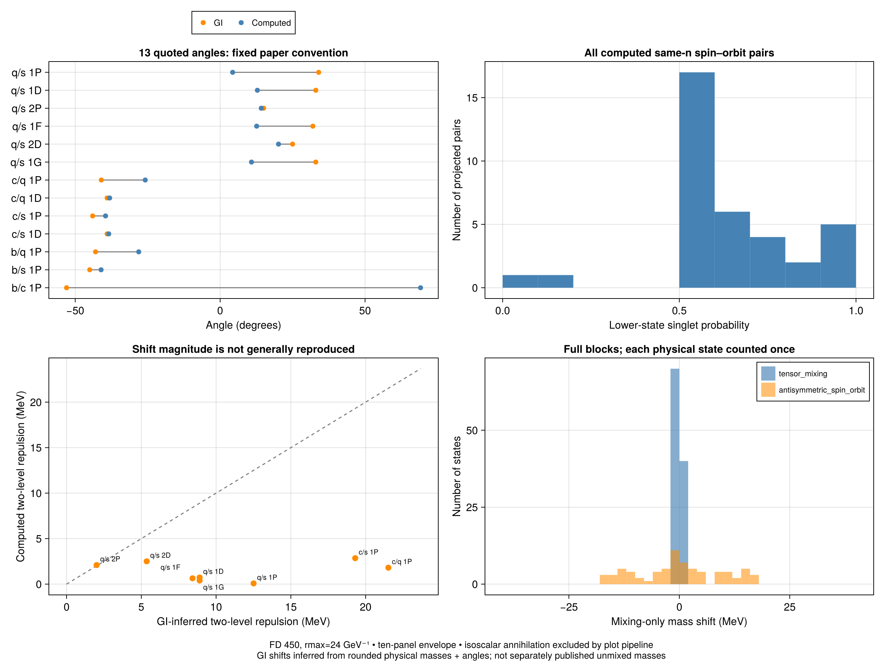

# Quantitative review of the mixing layer

> **Superseded prose.** The text below was written for the S-wave-only-contact
> model. The census files ([results](mixing_layer_results.md), CSVs, figure)
> have been regenerated with the L>0 contact fix, so quoted numbers here may not
> match them. Cause and interpretation:
> [mixing_composition_investigation.md](mixing_composition_investigation.md).

For the evidence hierarchy and the next investigation's acceptance targets,
see [Mixing matching targets](mixing_matching_targets.md). Published composition
is the primary target; the repulsion scatter is a conditional two-state inverse,
not a direct measurement of GI's full-block shifts.

The mixing machinery passes the algebraic and bookkeeping checks exercised
here. Agreement with GI is a separate question: we reproduce the expected
level-repulsion behavior, but **we do not generally reproduce either the quoted
angles or the inferred magnitude of the mixing shifts**. Accurate final masses
can coexist with an incorrect decomposition into diagonal masses and mixing.



## Scope: ten panels are not ten independent lists of angles

This study uses the exact state identities in the full
`scripts/spectrum_plots/ten_meson_calculated_spectrum.csv`, produced by
`plot_ten_meson_spectra.jl`: three S radial levels, two P and D, one F and G.
There are ten unique flavor pairs, 30 states each. The ten panels display 330
entries because the light-isoscalar panel contains both q/q and s/s and the
q/q calculation also appears in the isovector panel. Here q denotes the common
u/d constituent mass. Repeated q/q dynamics are counted once: **300 states**.

The plot calls `compute_spectrum`, which applies two mechanisms:

- **Antisymmetric spin–orbit:** singlet/triplet mixing at the same L=J, only
  for unequal flavors. Six sectors (kaons, D, Ds, B, Bs, Bc), each with four
  blocks: P and D are 4×4, F and G are 2×2. Total: **24 blocks, 72 states**.
  Six same-n projections per sector give **36 reportable angles**. They are
  summaries of full eigenvectors, not 36 independent two-level rotations.
- **Tensor:** triplet L=J−1/J+1 mixing in every sector. Each has one 5×5 S–D
  block and two 3×3 P–F and D–G blocks. Total: **30 blocks, 110 states**.
  These blocks need full components or probabilities; one angle per block
  would discard radial information.

Thus **54 blocks act on 182 distinct states**; 118 states have no inter-sector
mixing in this envelope. The two mechanisms act on disjoint spectroscopic
sectors here, so the participating-state count has no double counting.

Tensor mixing has median absolute shift **0.020 MeV**, maximum **1.606 MeV**,
and maximum non-dominant component probability about **0.35%**. Spin–orbit
mixing has median absolute shift **9.074 MeV** and maximum **18.118 MeV** over
its 72 states; some have nearly equal singlet/triplet weights. These descriptive
statistics refer to the complete plotted envelope, including unquoted states.

**Isoscalar annihilation is absent from this ten-panel plotting pipeline.**
The light-isoscalar title does not imply that flavor annihilation was applied.
That third mechanism is implemented through `add_isoscalar_annihilation` and
reviewed separately in the [Table III audit](../residual_reports/table_iii_mixing_audit.md)
and [P1 investigation](non_pwave_discrepancies.md). Its larger flavor/radial
vectors, and especially mass-dependent P2 poles, should not be pooled into a
histogram of two-state spin–orbit angles.

## What the angle distribution means

The paper supplies **13 explicit same-J angles**: six in Fig. 4 (strange),
four in Fig. 7 (D/Ds), and three in Fig. 9 (B/Bs/Bc). These cover 13 of our
36 same-n projections; the remaining 23 are predictions in the expanded
ten-panel envelope, not failed paper comparisons. There are no explicit
tensor-angle targets in that caption ledger.

We retain the caption convention
`low = cos(theta) singlet + sin(theta) triplet`, with positive singlet
coefficient and the paper's constituent ordering. An angle near 90 degrees
means the lower state is almost pure triplet, **not maximal mixing**. Maximal
two-state mixing occurs near ±45 degrees. The distribution therefore shows
the lower state's singlet probability, cos²(theta), which is invariant under
an overall eigenstate phase. It separates nearly pure states from strongly
mixed states more clearly than an absolute-angle histogram.

Angular residuals use distance modulo 180 degrees, without allowing an
unjustified low/high exchange. The median discrepancy over the 13 rows is
**32.45 degrees**. In particular, the Bc discrepancy is 49.31 degrees as an
eigenvector direction, rather than the raw arithmetic difference of 130.69
degrees. This convention-aware comparison still leaves a substantial mismatch.

## Define a mixing shift before comparing it

The reported state shift is the mixed eigenvalue minus the pre-mixing
fixed-sector mass assigned to it by ascending mass order. It excludes the
diagonal spin-dependent corrections already included in that mass.
The [numerical census](mixing_layer_results.md) reports both members of every
quoted pair; [all state shifts](mixing_state_shifts.csv) retain all 182 entries.

For an isolated block H=[[a,V],[V,b]], define Δ=a−b and the physical splitting
S=sqrt(Δ²+4V²). Mixing shifts the lower ordered level by −δ and the upper by +δ,
where δ=(S−abs(Δ))/2. The corresponding angle fixes the ratio of V to Δ, whereas
the masses constrain the trace and S. Similar final masses therefore do not
uniquely validate V or the angle.

For the full 4×4 radial blocks, the two same-n shifts need not sum to zero:
other radial states exchange shifts with them. For example, both strange 1P
members move slightly downward. Trace conservation holds over the **whole
block**, and its lowest/highest states move outward. It would be incorrect to
flag each downward-moving upper same-n member as a diagonalization bug.

## Does the shift size agree with GI?

GI does not give the unmixed diagonal masses for these pairs. Under the
caption's approximate two-state interpretation, we can infer

`abs(V_GI) = S_GI abs(sin(2 theta_GI))/2`

`delta_GI = S_GI [1−abs(cos(2 theta_GI))]/2`.

Only **8 of 13 pairs** have both final masses printed in the digitized spectrum
catalog: all six strange pairs and the D/Ds 1P pairs. The inference uses the
printed masses at their 10 MeV precision; its extra decimal places are
arithmetic, not physical accuracy. Even allowing a 10 MeV change in the
splitting from rounding, the largest deficits below remain substantial.

| Pair | Our isolated-pair repulsion (MeV) | GI-inferred (MeV) | Interpretation |
|---|---:|---:|---|
| kaon 1P | 0.059 | 12.508 | Much too weak; lower state almost pure triplet |
| kaon 1D | 1.472 | 8.899 | Too weak |
| kaon 2P | 7.413 | 2.010 | Too large; a small local diagonal gap produces near-maximal mixing |
| kaon 1F | 0.750 | 8.424 | Too weak |
| kaon 2D | 3.928 | 5.358 | Comparable scale within the limited reference precision |
| kaon 1G | 0.419 | 8.899 | Too weak |
| D 1P | 0.910 | 21.521 | Much too weak |
| Ds 1P | 0.730 | 19.302 | Much too weak |

This table compares our isolated subblock with a two-state reconstruction of
GI's approximate caption composition. It is not an established like-for-like
comparison of full-block shifts. The separate full-block shifts
in the census include cross-radial effects and must not be confused with δ.
The complete envelope increases the outside-pair norm of some heavy 1P states
to about 0.25%, compared with the smaller restricted audit. It changes angles
by fractions of a degree, not the tens of degrees needed for agreement.

The source images confirm why five mass-pair comparisons are unavailable:
Fig. 7 explicitly omits the D/Ds 2− states, saying they lie within 20 MeV of
their 3− partners; Fig. 9 omits the B/Bs/Bc 1+ states, saying they lie within
40 MeV of their 2+ partners. Those are final-mass bounds, not mixing shifts.
Angles alone cannot determine V or δ without a mass splitting. We do not
substitute the different-J partner masses to manufacture a comparison.

## Evidence that the layer works, and what it cannot prove

The fresh FD calculation uses ngrid=450, rmax=24 GeV⁻¹ and the same Hamiltonian
settings as the ten-panel plot. Every unique production block was checked for:

- the eigen-equation H U = U diag(E), with maximum residual 7.5×10⁻¹⁵ GeV;
- orthonormal columns, with maximum infinity-norm defect 6.8×10⁻¹⁵;
- trace conservation, with maximum defect 7.2×10⁻¹⁵ GeV, and the independent
  sum-of-squared-eigenvalues identity;
- invariance of masses under a consistent basis-sign change;
- outward motion of the extreme eigenvalues relative to the unmixed diagonals;
- agreement of each isolated same-n subblock with its analytic eigenvalues.

The existing `test/fine_structure.jl` and `test/spectrum.jl` also ran successfully:
**270 checks** covering angular factors, the equal-flavor zero, block sharing,
trace conservation, physical component composition, and the separate
annihilation layer. These checks support correct linear algebra and state
bookkeeping. They do not independently derive every off-diagonal kernel from GI.

The earlier [HO/FD kernel investigation](pwave_fine_structure.md) provides a
different numerical realization for representative P-wave elements. It supports
the conclusion that the large discrepancy is not fixed merely by changing the
radial basis. This census is not a new convergence certification for every
high-L or excited-state angle. It tests one explicitly stated full envelope;
adding omitted levels can change the block and its shifts.

The remaining physics question is the diagonal splitting and the net
off-diagonal interaction supplied to this verified layer. The existing
[operator ledger](../residual_reports/mixing_angles.md) shows vector/Thomas
cancellations, explaining why small changes can strongly affect angles.
Sensitivity is a plausible mechanism for disagreement, but it does not establish
the historical source of that disagreement. The justified conclusion is:
**the mixing layer is internally consistent; reproduction of GI mixing remains
quantitatively incomplete, including shift magnitudes where they can be inferred.**

## Reproduction

Run from the repository root:

```sh
julia --project=GIPaper/scripts GIPaper/scripts/investigate_mixing_layer.jl
```

The script writes the figure, numerical census and four CSV ledgers in this
directory. It reuses the existing angle ledger and canonical spectrum catalog
as reference inputs. `--reuse` redraws from the last computed CSV census and
does not rerun its eigensystem checks; use a full run after any physics change.
No core implementation or parameter was changed for this investigation.
