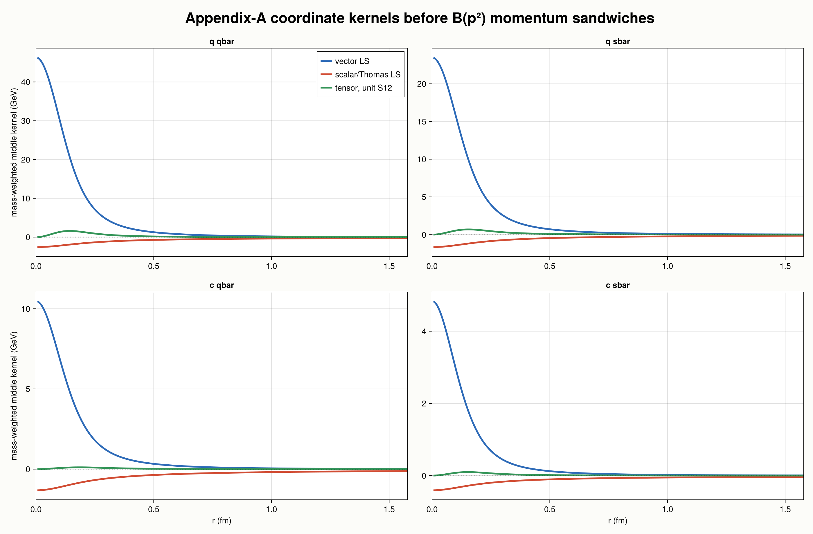
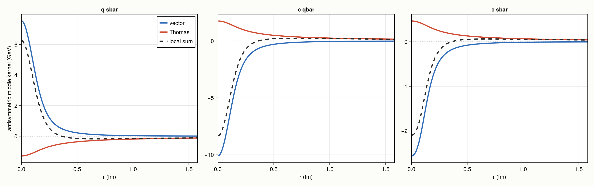
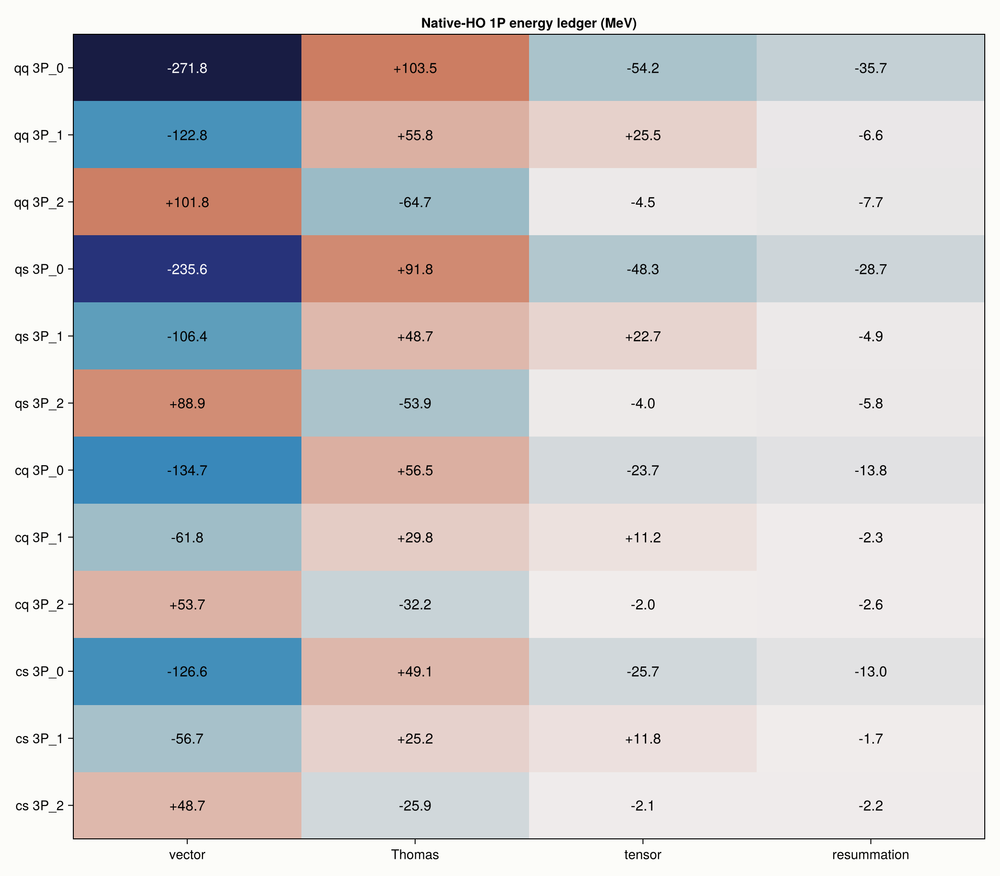

# Light and Charmed P-wave Fine Structure

Generated by `julia GIPaper/scripts/investigate_pwave_fine_structure.jl` on 2026-09-23.

This is a mechanism investigation, not an independent paper-number audit.
The canonical residuals and quoted-angle comparison remain in
[`../residual_reports/mixing_angles.md`](../residual_reports/mixing_angles.md)
and the sector reports. Here we ask why those residuals are sensitive.

## Operators being separated

Appendix A15-A16 contains three distinct fine-structure mechanisms:

1. the vector/color-magnetic spin-orbit kernel `(1/r) dGtilde/dr`;
2. the scalar-confinement Thomas kernel `-(1/r) dStilde/dr`;
3. the tensor kernel `(1/r) dGtilde/dr - d2Gtilde/dr2`.

Each displayed coordinate kernel is only the middle `K(r)` of the nonlocal
GI operator `B(p^2) K(r) B(p^2)`. The energy tables below include those
momentum factors, the A15-A16 mass denominators, and the exact angular matrix
elements. The plots therefore diagnose shape and sign; the tables carry the
physical matrix elements.

For diagonal triplets the vector and Thomas curves multiply `L dot S`;
the green curve is shown per unit conventional `S12`, whose P-wave values
are -4, +2, and -2/5 for J=0,1,2.

The dashed local sum is illustrative only because vector and Thomas pieces
have different epsilon exponents and hence different momentum sandwiches.
The cancellation must be judged from the full matrix elements below.

## Numerical design

HO is the primary calculation. Numerics: `OscillatorSolver` — nbasis = 24:8:72 adaptive, ΔE ≤ 0.1 MeV, beta in [0.25, 2.35] GeV (22 bracket points, refined to 0.002 GeV), 1 levels/channel.
FD is an independent control. Numerics: `FiniteDifferenceSolver` — ngrid = 700, rmax = 30.0 GeV^-1 (h = 0.0428), relativistic, full, 1 levels/channel.
For each flavor sector a central 1P wave gives the first-order ledger; each
triplet J sector is then diagonalized with the complete fine structure.
`resummation` is the full HO mass minus central energy minus the complete
central-wave first-order shift.

## Triplet energy ledger

| sector | state | first-order vector | first-order Thomas | first-order tensor | first-order total | full HO shift | resummation | FD-HO mass |
|---|---|---:|---:|---:|---:|---:|---:|---:|
| q qbar | `1^3P_0` | -226.18 | +120.71 | -48.67 | -154.13 | -222.44 | -35.72 | +0.509 |
| q qbar | `1^3P_1` | -113.09 | +60.36 | +24.33 | -28.40 | -41.46 | -6.59 | +0.610 |
| q qbar | `1^3P_2` | +113.09 | -60.36 | -4.87 | +47.86 | +32.51 | -7.73 | -0.016 |
| q sbar | `1^3P_0` | -196.43 | +102.81 | -43.21 | -136.83 | -192.21 | -28.67 | +0.397 |
| q sbar | `1^3P_1` | -98.22 | +51.41 | +21.60 | -25.20 | -34.92 | -4.87 | +0.356 |
| q sbar | `1^3P_2` | +98.22 | -51.41 | -4.32 | +42.49 | +31.05 | -5.80 | -0.018 |
| c qbar | `1^3P_0` | -115.88 | +62.34 | -21.27 | -74.81 | -101.90 | -13.79 | +0.322 |
| c qbar | `1^3P_1` | -57.94 | +31.17 | +10.63 | -16.14 | -20.83 | -2.32 | +0.089 |
| c qbar | `1^3P_2` | +57.94 | -31.17 | -2.13 | +24.64 | +19.40 | -2.63 | -0.022 |
| c sbar | `1^3P_0` | -105.74 | +51.11 | -22.38 | -77.01 | -103.16 | -13.00 | -0.025 |
| c sbar | `1^3P_1` | -52.87 | +25.55 | +11.19 | -16.13 | -19.65 | -1.74 | -0.031 |
| c sbar | `1^3P_2` | +52.87 | -25.55 | -2.24 | +25.08 | +20.79 | -2.17 | -0.025 |

All energies in the table are MeV. The full shift is the expectation of
vector + Thomas + tensor in the fully diagonalized fixed-sector state;
its components are recorded next.

| sector | state | full vector | full Thomas | full tensor | full sum | central relaxation | vector distortion | Thomas distortion | tensor distortion | closure |
|---|---|---:|---:|---:|---:|---:|---:|---:|---:|---:|
| q qbar | `1^3P_0` | -271.80 | +103.52 | -54.17 | -222.44 | +32.59 | -45.62 | -17.19 | -5.50 | +0.00 |
| q qbar | `1^3P_1` | -122.77 | +55.79 | +25.52 | -41.46 | +6.47 | -9.68 | -4.57 | +1.19 | -0.00 |
| q qbar | `1^3P_2` | +101.79 | -64.73 | -4.55 | +32.51 | +7.62 | -11.30 | -4.38 | +0.32 | -0.00 |
| q sbar | `1^3P_0` | -235.63 | +91.77 | -48.35 | -192.21 | +26.71 | -39.20 | -11.04 | -5.14 | +0.00 |
| q sbar | `1^3P_1` | -106.35 | +48.72 | +22.71 | -34.92 | +4.85 | -8.14 | -2.69 | +1.11 | +0.00 |
| q sbar | `1^3P_2` | +88.94 | -53.86 | -4.04 | +31.05 | +5.65 | -9.27 | -2.45 | +0.28 | +0.00 |
| c qbar | `1^3P_0` | -134.72 | +56.53 | -23.71 | -101.90 | +13.31 | -18.84 | -5.81 | -2.45 | -0.00 |
| c qbar | `1^3P_1` | -61.78 | +29.81 | +11.15 | -20.83 | +2.37 | -3.85 | -1.36 | +0.52 | -0.00 |
| c qbar | `1^3P_2` | +53.65 | -32.24 | -2.00 | +19.40 | +2.61 | -4.29 | -1.07 | +0.12 | +0.00 |
| c sbar | `1^3P_0` | -126.57 | +49.14 | -25.73 | -103.16 | +13.16 | -20.83 | -1.97 | -3.35 | -0.00 |
| c sbar | `1^3P_1` | -56.68 | +25.21 | +11.82 | -19.65 | +1.78 | -3.81 | -0.34 | +0.63 | +0.00 |
| c sbar | `1^3P_2` | +48.74 | -25.86 | -2.10 | +20.79 | +2.12 | -4.13 | -0.31 | +0.14 | +0.00 |

`central relaxation` is the change in the expectation of the central
Hamiltonian when the spin-dependent terms distort the radial state. `closure`
is central relaxation plus the three operator distortions minus the reported
resummation; it should vanish up to printed rounding.

## Unequal-mass same-J mixing

| sector | solver | vector c | Thomas c | total c | survives | singlet-triplet gap | low-state angle |
|---|---|---:|---:|---:|---:|---:|---:|
| q sbar | HO | +7.73 | -8.54 | -0.80 | 4.9% | +30.08 | +88.47 deg |
| q sbar | FD | +7.82 | -9.14 | -1.32 | 7.8% | +29.73 | +87.45 deg |
| c qbar | HO | -25.10 | +29.01 | +3.92 | 7.2% | +18.46 | -78.50 deg |
| c qbar | FD | -25.15 | +29.34 | +4.19 | 7.7% | +18.34 | -77.72 deg |
| c sbar | HO | -17.87 | +21.54 | +3.67 | 9.3% | +17.87 | -78.82 deg |
| c sbar | FD | -17.87 | +21.56 | +3.69 | 9.4% | +17.87 | -78.79 deg |

## Findings

1. **The basis is not the limiting uncertainty.** HO and FD agree on the
   complete 1P masses at sub-MeV scale across all four sectors.
2. **Diagonal light-P structure is genuinely nonperturbative.** The 3P0
   state is pulled down by tens of MeV beyond its central-wave first-order
   estimate, whereas 3P1 and 3P2 are much less distorted.
3. **The mixing interaction is a cancellation, not a weak force.** In every
   unequal-mass 1P block the vector and Thomas elements are individually
   several to tens of MeV, but only a small remainder survives.
4. **Tensor controls part of the diagonal gap.** It does not connect 1P1
   to 3P1, but its positive J=1 diagonal contribution changes the denominator
   governing the mixing angle. It therefore matters indirectly.
5. **No isolated sign/factor defect appears.** The A15-A16 coefficients,
   angular sum rules, HO/FD agreement, and operator expectations are mutually
   consistent. The unresolved reproduction error is the quantitative balance
   of smeared vector, scalar/Thomas, and tensor strength.

## Next discriminating calculations

The useful next step is not another basis scan. It is a controlled parameter
response study: vary `epsilon_so_vector`, `epsilon_so_scalar`, and `epsilon_t`
one at a time, refit nothing, and monitor triplet centroids, 3P_J splittings,
and same-J angles together. A change that fixes an angle but spoils the
well-reproduced heavy-heavy P multiplets must be rejected. Smearing-width
dependence should be tested second because it changes all three short-distance
profiles simultaneously and is therefore less diagnostic.
