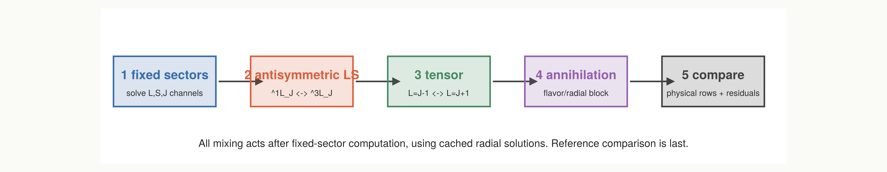
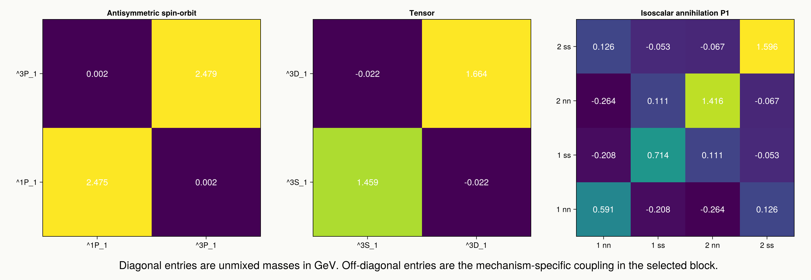
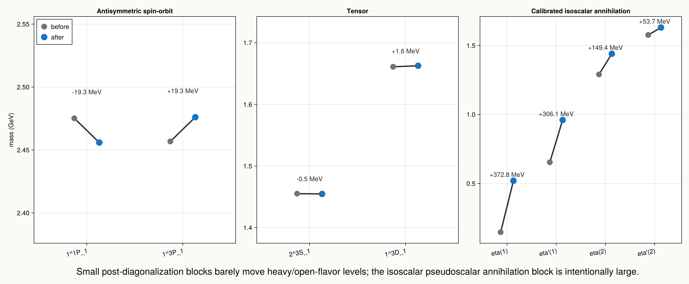

# Mixing Mechanism Demo

Generated by `julia docs/mixing_studies.jl`.
Numerics: `FiniteDifferenceSolver` — ngrid = 180, rmax = 18.0 GeV^-1 (h = 0.1), relativistic, full, 6 levels/channel.

## Application Order

The fixed-sector solve comes first. `compare` then applies the assigned post-diagonalization blocks in this order: antisymmetric spin-orbit, tensor, and isoscalar annihilation. Reference residuals are computed only after those assignments.

## Matrix Blocks

The first two mechanisms are ordinary two-state blocks. Isoscalar pseudoscalar annihilation is a flavor/radial block over `1 nn`, `1 ss`, `2 nn`, and `2 ss`. The comparison layer selects the mechanism; cached radial solutions provide the needed matrix elements.

## Mass Movement

The arrows show unmixed-to-mixed movement for representative blocks. Antisymmetric spin-orbit and tensor mixing are small corrections in these examples. The calibrated isoscalar pseudoscalar annihilation path is large by design because it absorbs the GI Table-III/Fig.-5 pseudoscalar assignment.

## Concrete Blocks Used

- Antisymmetric spin-orbit example: `charmed` sector, `1^1P_1` / `1^3P_1`.
- Tensor example: `isovector` sector, `2^3S_1` / `1^3D_1`.
- Isoscalar annihilation example: `isoscalar` `^1S_0` block over `1 nn`, `1 ss`, `2 nn`, `2 ss`.
