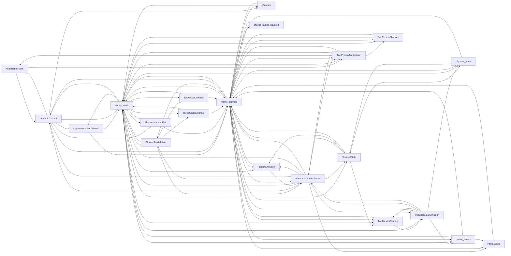

# Public documentation graph

Generated from all 21 supported API names (all exported).
All 21 public docstrings have independently executable examples (21 blocks).
Every entry reaches every other entry through explicit help links. GIModel links are validated separately.

Regenerate and execute the examples from the repository root:

```sh
julia --project=. QuarkModelTransitions/scripts/audit_documentation.jl
```

The graph describes help navigation, not function calls or numerical dependencies.

| Entry | Access | Incoming | Outgoing |
|---|---|---:|---:|
| `AnnihilationTerm` | exported | 2 | 2 |
| `GluonicAnnihilation` | exported | 3 | 4 |
| `LeptonNeutrinoChannel` | exported | 2 | 2 |
| `LeptonicCurrent` | exported | 4 | 7 |
| `MasslessLeptonPair` | exported | 2 | 2 |
| `PartialWave` | exported | 3 | 1 |
| `PhotonEmission` | exported | 4 | 2 |
| `PhysicalState` | exported | 4 | 4 |
| `PseudoscalarEmission` | exported | 4 | 5 |
| `ThreeGluonChannel` | exported | 2 | 2 |
| `TwoGluonChannel` | exported | 2 | 2 |
| `TwoMesonChannel` | exported | 4 | 2 |
| `TwoPhotonAnnihilation` | exported | 4 | 5 |
| `TwoPhotonChannel` | exported | 3 | 2 |
| `Vacuum` | exported | 2 | 2 |
| `charge_radius_squared` | exported | 1 | 1 |
| `decay_width` | exported | 12 | 16 |
| `mass_correction_factor` | exported | 7 | 9 |
| `matrix_element` | exported | 18 | 15 |
| `partial_waves` | exported | 3 | 3 |
| `physical_state` | exported | 4 | 2 |

<details>
<summary>Complete graph (90 links)</summary>



</details>
