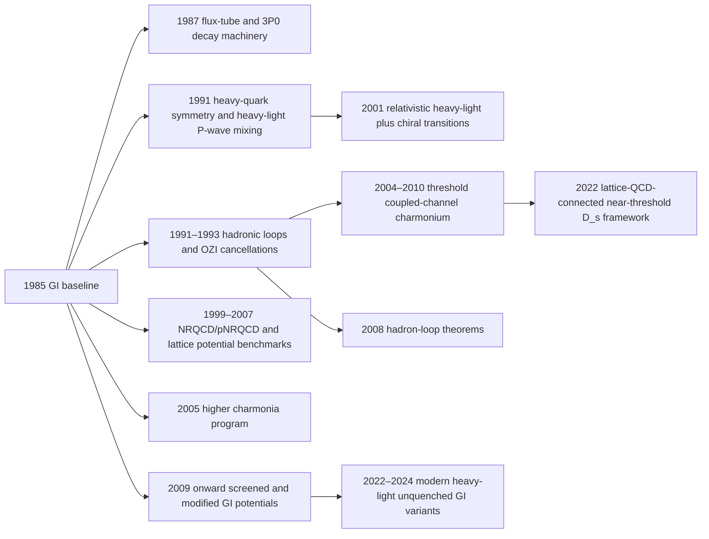

# Development of the Godfrey–Isgur quark model after 1985

## Executive summary

The 1985 relativized meson model of entity["people","Stephen Godfrey","particle physicist"] and entity["people","Nathan Isgur","particle physicist"] became the standard quenched \(q\bar q\) baseline for meson spectroscopy because it combined a relativistic kinetic term with a QCD-motivated one-gluon-exchange plus linear-confinement interaction, and it treated relativistic corrections in a phenomenological but sector-spanning way. In its own terms, it was a unified Hamiltonian model for mesons from the light sector to bottomonium, with spectroscopy cross-checked against strong, electromagnetic, and weak couplings. citeturn34view0turn39view0turn37view0turn40view2

The main post-1985 development was not a wholesale replacement of the GI baseline, but a layering of additional physics on top of it. The field added: heavy-quark symmetry as the organizing principle for heavy-light multiplets; phenomenological decay operators such as flux-tube breaking and the \(^{3}P_0\) model; explicit hadronic loops and coupled channels near thresholds; screened or modified confining potentials as effective stand-ins for string breaking; EFT reinterpretations through NRQCD and pNRQCD; and increasingly stringent lattice-QCD benchmarks for spin-independent and spin-dependent potentials. citeturn16search1turn14search0turn41search5turn17search20turn17search4turn17search8turn17search0

A stable historical conclusion now emerges. Bare GI-type single-channel calculations remain most reliable for states well below open-flavor thresholds and for broad global pattern recognition. The large stresses on the model came from threshold-adjacent hadrons such as \(D_{s0}^*(2317)\), \(D_{s1}(2460)\), and \(X(3872)\), where explicit continuum dynamics became indispensable. At the same time, several states such as \(\chi_{c2}(2P)\), \(h_c\), \(\eta_b\), and \(h_b\) broadly reinforced the central logic of quark-potential spectroscopy and the importance of getting spin-dependent interactions right. citeturn7search0turn30search0turn7search1turn30search1turn7search2turn7search3turn30search2turn41search0turn42search10turn42search3

For reproducibility, the most tractable target today is the **bare GI Hamiltonian** itself: masses, wavefunctions, mixing angles, and radiative matrix elements. Reproducing threshold-dressed spectra is possible, but only after fixing conventions for channel truncation, form factors, pair-creation strength, and whether the original GI parameters are refit to avoid double counting. In the surveyed public sources, no official public reference implementation tied to the 1985 paper surfaced; current reruns therefore need a transparent reimplementation with explicit numerical conventions. citeturn42search7turn42search10turn42search1turn20view0turn20view2

The highest-value reproduction sequence is: original 1985 single-channel spectra; 1991 heavy-light \(P\)-wave mixing; 2005 higher-charmonium radiative and strong-decay calculations; 2009 screened-potential variants; and only then modern coupled-channel or unquenched calculations for \(D_s\), charmonium threshold states, and heavy-light sectors. That ordering gives the best return in physics insight per unit coding effort. citeturn16search0turn9search2turn9search7turn42search10turn42search3turn42search1

## The 1985 baseline

The GI model is best understood as a **relativized single-channel meson Hamiltonian**. In later follow-up papers that explicitly restate the original formalism, the rest-frame equation is written as a Schrödinger-type eigenvalue problem
\[
H\lvert\psi\rangle=\left(\sqrt{p^2+m_q^2}+\sqrt{p^2+m_{\bar q}^2}+V_{q\bar q}(p,r)\right)\lvert\psi\rangle=E\lvert\psi\rangle ,
\]
with a Lorentz-vector short-distance one-gluon-exchange interaction and a Lorentz-scalar linear confining interaction. In the nonrelativistic limit, the interaction reduces to the familiar central, contact, tensor, and spin-orbit pieces. citeturn39view0turn37view0

The distinctive move of the 1985 model was its **phenomenological relativization**. Later summaries of the same scheme emphasize four ingredients that are central if one wants to reproduce it faithfully: a running \(\alpha_s(r)\); flavor-dependent smearing parameters \(\sigma\); replacement of the quark masses in spin-dependent terms by effective kinetic energies; and Gaussian smearing of the coordinate-space interaction to account semi-quantitatively for relativistic and nonlocal effects. This is the part of the GI machinery that most sharply distinguishes it from a plain Cornell-type nonrelativistic model. citeturn37view0turn40view2

The original paper presented the model as a **unified description of the meson spectrum from the pion to the upsilon**, and it explicitly advertised that the spectroscopic fit was backed by analyses of strong, electromagnetic, and weak couplings. That broader program matters historically: GI was never just a mass formula, but a wavefunction-producing framework meant to feed decay and transition calculations. citeturn34view0turn18search12

From the point of view of implementation, the Hamiltonian is solved first in an \(L\)-\(S\) basis, after which unequal-mass states with the same \(J\) but different total spin are mixed by the antisymmetric spin-orbit interaction. In heavy-light systems, this is exactly where the later heavy-quark-symmetry interpretation enters: the GI basis is \(L\)-\(S\), but the physically transparent basis in the heavy-quark limit is the \(j_\ell\) basis of the light degrees of freedom. Later GI-style applications make this explicit and quote the heavy-quark-limit \(P\)-wave mixing angles \(35.3^\circ\) and \(-54.7^\circ\). citeturn37view0turn39view0turn16search1

A practical point for reruns is that many later calculations use the GI wavefunctions directly for radiative transitions, while strong-decay studies often replace the exact model wavefunctions by **effective harmonic-oscillator surrogates** matched through rms radii. That hybrid practice is visible, for example, in the higher-charmonium program of 2005 and in later heavy-light spectroscopy papers. If one does not track that choice carefully, it is easy to think two “GI-based” calculations disagree physically when they actually differ computationally. citeturn9search2turn38view0

The baseline limitations were already visible in hindsight. A later paper by Godfrey, using the same relativized framework, states plainly that because coupled-channel effects are neglected and the relativization itself is approximate, one should not expect mass predictions to be reliable to much better than roughly \(10\)–\(20\) MeV in general. That estimate is consistent with how the model performed historically: very useful as a global spectrum organizer, less definitive for threshold-sensitive states. citeturn40view2turn43search0

## Development map since 1985

The condensed chronology below tracks the main branches that grew out of the GI baseline: decay operators, heavy-quark symmetry, hadronic loops, EFT reinterpretation, lattice constraints, screened potentials, and modern coupled-channel unquenching. The table that follows provides the analytical details. citeturn14search0turn16search0turn16search1turn10search2turn41search6turn17search8turn41search5turn9search7turn42search1

| Year | Authors | Key idea | Main result | Impact on spectra and decays |
|---|---|---|---|---|
| 1987 | Kokoski & Isgur | Flux-tube breaking as a dynamical picture for OZI-allowed strong decays | Built a QCD-motivated decay formalism for mesons with low orbital/radial excitations. citeturn14search0 | This became the natural decay companion to GI wavefunctions and fed later \(^{3}P_0\)-style width calculations. citeturn14search0turn9search2 |
| 1991 | Godfrey & Kokoski | GI applied systematically to \(L=1\) heavy-light mesons | Predicted the \(P\)-wave \(D\), \(D_s\), \(B\), and \(B_s\) spectra in a relativized model. citeturn16search0 | Established the canonical heavy-light ordering that later became the reference point for the \(D_{sJ}\) puzzles. citeturn16search0turn7search0turn30search0 |
| 1991 | Isgur & Wise | Heavy-quark symmetry as the organizing principle for heavy-light spectroscopy | Showed that hadrons with one heavy quark exhibit flavor-spin symmetry and discussed implications for masses and widths. citeturn16search1turn16search4 | Reframed GI heavy-light states into \(j_\ell=1/2\) and \(j_\ell=3/2\) doublets, clarifying mixing-angle physics and decay patterns. citeturn16search1turn37view0 |
| 1991–1993 | Geiger & Isgur | Hadronic loops and OZI-rule cancellations | Argued that large loop effects can coexist with quark-model success because of systematic cancellations; identified the scalar sector as an exception. citeturn10search0turn10search2turn10search12 | This was the conceptual seed of later “unquenching”: the valence model can survive large continuum effects, but only after renormalization and channel summation. citeturn10search2turn41search5 |
| 2001 | Di Pierro & Eichten | Relativistic heavy-light spectroscopy plus chiral transitions | Studied orbital and radial excitations in \(D\), \(D_s\), \(B\), \(B_s\); included leading \(1/m_{c,b}\) corrections and used a chiral quark model for light-hadron transitions. citeturn41search2turn41search6 | Tightened the link between heavy-light spectroscopy and decay widths, and became a standard comparison point for GI-like heavy-light predictions. citeturn41search6 |
| 1999–2007 | Brambilla, Pineda, Vairo; Koma & Koma | EFT reinterpretation of quark potentials and lattice extraction of relativistic corrections | pNRQCD provided a scale-separated definition of potentials and non-potential effects; complete \(O(1/m^2)\) spin-dependent and spin-independent potentials were derived; lattice QCD extracted \(O(1/m)\) and spin-dependent potentials nonperturbatively. citeturn17search20turn17search4turn17search8turn17search10turn17search0 | This gave the GI spin-dependent structures a firmer QCD interpretation and showed where phenomenological ansätze match or miss nonperturbative QCD, especially for fine and hyperfine splittings. citeturn17search8turn17search0turn17search10 |
| 2004 | Eichten, Lane & Quigg | Open-charm channels near charmonium threshold | Studied how threshold channels distort charmonium and analyzed \(X(3872)\) candidates. citeturn41search0turn41search4 | Marked the shift from pure valence spectroscopy to threshold-dressed spectroscopy in charmonium. citeturn41search4turn7search1 |
| 2005 | Barnes, Godfrey & Swanson | Full higher-charmonium program with spectra, E1/M1 widths, and strong decays | Computed masses, radiative widths, and open-charm decay amplitudes for 40 \(c\bar c\) states up to the \(4S\) multiplet, using GI and an NR comparator. citeturn9search2turn9search6 | This paper effectively operationalized GI wavefunctions for phenomenology and remains one of the best reproduction targets after the 1985 baseline. citeturn9search2 |
| 2008 | Barnes & Swanson | General theorems for hadron loops | Proved that, under stated assumptions, loop mass shifts are equal within an \(N,L\) multiplet, decay widths are equal, and configuration mixing vanishes for many channels. citeturn41search5 | Explained how quark models can remain predictive even when continuum components are large, and clarified what gets absorbed into refitted parameters. citeturn41search5 |
| 2009–2018 | Li & Chao; Song et al.; Pang et al.; Wang et al. | Screened or modified GI potentials as effective string-breaking models | Introduced color screening from light-pair creation and showed that higher charmonium and bottomonium masses move down substantially; later extended the idea to \(D_s\), kaons, and higher bottomonia. citeturn9search7turn12search0turn13search4turn13search2turn14search16 | Screening improved global placement of higher excitations, especially above threshold, but remained an effective rather than explicitly unitary treatment. citeturn9search7turn12search0 |
| 2010 | Ortega, Segovia, Entem & Fernández | Coupled-channel constituent-quark-model treatment of \(X(3872)\) | Coupled \(c\bar c\) states to \(D\bar D^*\) channels and found a state with a large molecular component. citeturn12search2turn12search5 | Demonstrated in practice that a GI-like bare seed plus continuum channels can produce near-threshold states inaccessible to a pure valence calculation. citeturn12search5 |
| 2014–2015 | Ferretti & Santopinto | Explicit unquenched quark model for heavy quarkonia | Computed self-energy corrections for higher bottomonia and reviewed the UQM formalism for charmonium and bottomonium. citeturn41search7turn42search0turn42search8 | Made “bare mass + self-energy shift” the standard language for modernized quark-model phenomenology above threshold. citeturn41search7turn42search0 |
| 2022 | Yang et al. | Framework connecting quark model and lattice QCD for near-threshold \(D_s\) states | Used GI bare \(c\bar s\) cores coupled to \(D^{(*)}K\) channels to interpret finite-volume lattice spectra. citeturn11search0turn11search2 | This is the clearest modern bridge between GI-style quantum mechanics and lattice-based scattering information. citeturn11search0 |
| 2022–2024 | Hao, Lu & Zou; Yang et al.; Ni, Wu & Zhong | Modern heavy-light unquenched/coupled-channel GI variants | Recent \(D_s\) and heavy-light analyses use explicit \(^{3}P_0\)-induced channel coupling, Gaussian expansion or analogous precise wavefunction handling, and in some cases relativistic corrections to transition amplitudes, with simultaneous fits to masses and widths. citeturn42search10turn42search3turn42search1turn42search9 | These works largely solve the old \(D_{s0}^*(2317)\)/\(D_{s1}(2460)\)-type tensions inside a dressed-quark-model framework and show that explicit refitting is needed when unquenching is no longer treated implicitly. citeturn42search7turn42search10turn42search1 |

Two general historical patterns stand out. First, **heavy-quark symmetry** did not replace GI; it reorganized its heavy-light output and made clear which splittings and widths should survive the \(m_Q\to\infty\) limit. Second, **unquenching** came in two forms: an effective form, via screened potentials, and an explicit form, via hadronic loops or coupled channels. The former is cheaper and often predictive for gross spectra; the latter is indispensable near open-flavor thresholds. citeturn16search1turn9search7turn41search5turn42search10

## Experimental milestones that changed the model-building agenda

The decisive experiments did not all push in the same direction. Some validated the potential-model program; others exposed where a single-channel valence Hamiltonian was not enough.

| Year | Experimental result | Why it mattered for GI-type models | Main theoretical consequence |
|---|---|---|---|
| 2003 | entity["organization","BaBar","menlo park, ca, us"] observed \(D_{sJ}^*(2317)\) in \(D_s\pi^0\). citeturn7search0turn7search12 | The state appeared significantly lower and narrower than the canonical heavy-light \(0^+\;c\bar s\) expectation in simple GI-type spectroscopy. | Triggered a large literature on loop shifts, \(DK\) molecules, chiral partners, and unquenched \(c\bar s\) descriptions. citeturn42search10turn42search3turn11search0 |
| 2003 | entity["organization","CLEO","ithaca, ny, us"] observed \(D_{sJ}(2460)\) and confirmed \(D_{sJ}^*(2317)\). citeturn30search0turn30search4 | The pair \((2317,2460)\) made it impossible to dismiss the discrepancy as a one-state accident. | Forced explicit treatment of \(DK\) and \(D^*K\) channels in modern \(D_s\) spectroscopy. citeturn42search10turn42search3 |
| 2003 | entity["organization","Belle","tsukuba, ibaraki, jp"] observed \(X(3872)\) near \(D^0\bar D^{*0}\) threshold. citeturn7search1turn7search5 | Pure charmonium assignments became problematic because the mass sat essentially on top of the two-meson threshold. | Coupled-channel and molecular admixture models became central to charmonium spectroscopy above threshold. citeturn41search4turn12search5 |
| 2005–2006 | \(\,h_c(1P)\) and \(\chi_{c2}(2P)\) candidates were observed. citeturn7search2turn7search6turn30search1turn30search9 | These were comparatively clean tests of spin-dependent forces and conventional charmonium level placement. | They reinforced the view that GI-type models remain good for conventional states not dominated by continuum dynamics. citeturn43search0turn30search9 |
| 2008–2012 | \(\eta_b(1S)\), \(h_b(1P)\), and \(h_b(2P)\) were observed. citeturn7search3turn7search7turn30search2turn30search6 | These states tested bottomonium hyperfine and fine-structure predictions, where the basic potential-model logic is expected to work best. | They strengthened the case for using heavy quarkonia as controlled tests of spin-dependent interactions and EFT/lattice constraints on them. citeturn17search8turn17search0 |
| 2020–2023 | entity["organization","LHCb","geneva, ch"] reported \(D_{s0}(2590)^+\) and later inspired GI-based coupled-channel reanalyses. citeturn31search9turn42search3 | This reopened the question of how radial \(c\bar s\) excitations are shifted and broadened by nearby channels. | Modern GI-derived coupled-channel work now treats these states as a precision test of whether one can disentangle bare-core and continuum components consistently. citeturn42search3turn42search1 |

The empirical lesson is sharp. **Below threshold**, GI-type spectra are usually still the right first description. **At or very near \(S\)-wave thresholds**, the same Hamiltonian should be read as a bare-core model that needs dressing. That is the main conceptual evolution of the field since 1985. citeturn43search0turn41search5turn42search10

## Reproducibility and rerunnability

Assumptions used here: no specific programming language preference; unspecified local environment; standard double-precision numerical work on Linux or macOS; BLAS/LAPACK-class linear algebra available.

A key practical finding is negative: in the public sources surveyed, I did **not** find an official public code release for the original 1985 GI implementation, nor an obvious GitHub repository explicitly serving as a canonical “Godfrey–Isgur” reference code. Exact-name and closely related repository searches returned no direct official implementation. citeturn20view0turn20view1turn20view2

That does **not** make the model unreproducible. It means reproducibility depends on reconstructing the Hamiltonian and numerical conventions from the paper trail. The bare single-channel sector is highly rerunnable; the main irreducible ambiguities are in operator ordering, smearing conventions, basis truncation, phase conventions for mixed states, and the treatment of decay and loop form factors. Those ambiguities are modest for low-lying spectra but become material once one computes widths or adds continuum channels. citeturn37view0turn40view2turn9search2turn42search7

### Public code and library ecosystem

| Resource | Scope | Language / license | Assessment for GI reproduction |
|---|---|---|---|
| **PipeSchrod** | General 1D Schrödinger and Salpeter solver with Cornell potential support, matrix/Numerov/FGH solvers, export and visualization | Python / MIT citeturn22view0turn25view0 | Good for fast prototyping of the central Hamiltonian, experimenting with semirelativistic kinematics, and building transparent regression tests. Not GI-specific; spin-dependent operators and GI smearing must still be implemented by hand. |
| **SciPy** | Numerical integration, optimization, sparse linear algebra, root finding | Python / BSD-style (3-clause BSD in developer docs) citeturn24search10turn24search14 | The most natural Python backbone for a clean GI reimplementation on laptop-scale problems. |
| **PETSc** | Large-scale sparse linear algebra and iterative solvers | C/C++/Fortran / 2-clause BSD citeturn24search0turn24search12 | Best for large basis-expansion Hamiltonians and coupled-channel variants that exceed comfortable dense-diagonalization size. |
| **SLEPc** | Large-scale eigenvalue solvers on top of PETSc | C/Fortran / LGPL-family license in documentation citeturn24search17turn24search13turn24search5 | Very strong choice for coupled-channel and resonance-basis studies where you want partial spectra only. |
| **Eigen** | Header-only dense/sparse linear algebra | C++ / MPL2 citeturn24search7 | Ideal for a compact, readable C++ GI reference code. |
| **Chroma** | Open-source lattice-QCD production framework | C++ / public repo, but GitHub did not machine-detect a standard license on the repo page citeturn23search15turn23search18turn25view1 | Relevant for lattice comparison workflows, not for GI itself. Check `LICENSE`/`COPYING` manually before redistribution or embedding. |
| **QUDA** | GPU-accelerated lattice-QCD library | C++/CUDA / BSD-style notice visible in license search results citeturn23search1turn28search0turn28search9 | Useful only for the lattice-comparison branch of the project, not for the bare GI Hamiltonian. |
| **PyQUDA** | Python wrapper around QUDA | Python/Cython / MIT citeturn28search2turn28search5turn28search10 | Convenient if you want Python-based scripts to reproduce lattice benchmark quantities or finite-volume comparison studies. |
| **hadron** | Fitting utilities used in lattice-QCD analyses | R / GPL-3-or-later citeturn23search17 | Useful for correlator or spectral-fit workflows if the project broadens from GI reproduction to lattice-data handling. |

### What is realistically reproducible now

| Result class | Reproducibility today | Why |
|---|---|---|
| Bare GI masses for low-lying \(q\bar q\) states | **High** | The Hamiltonian structure is stable and the missing numerical conventions are manageable. This is the cleanest reproduction target. citeturn34view0turn39view0turn40view2 |
| Heavy-light \(P\)-wave mixing angles and basic HQS patterns | **High to medium-high** | The physics is clear, but sign conventions for mixing angles and basis conventions need explicit fixing. citeturn16search1turn37view0turn39view0 |
| E1/M1 radiative widths using GI wavefunctions | **Medium-high** | Straightforward once the wavefunctions are reproduced, but sensitive to masses, phase space, and mixing-angle conventions. citeturn9search2turn39view0 |
| \(^{3}P_0\) or flux-tube strong widths | **Medium** | Sensitive to the decay strength \(\gamma\), wavefunction model, and whether full GI functions or SHO surrogates are used. citeturn14search0turn9search2turn38view0 |
| Screened/modified GI spectra | **Medium-high** | Numerically easy once the screening ansatz is fixed; conceptually effective, not unique. citeturn9search7turn12search0turn13search4 |
| Coupled-channel \(D_s\) or threshold charmonium poles | **Medium to low** on workstation; **high** only with tightly fixed conventions | Results depend on channel basis, regulators, pair-creation strength, bare-parameter refits, and pole-search prescriptions. citeturn12search5turn42search7turn42search10turn42search1 |
| Full lattice-QCD regeneration of comparison benchmarks | **Low** outside HPC settings | Public software exists, but full lattice regeneration is a separate HPC project. Comparing to published lattice tables is easy; reproducing the gauge-field production and full spectroscopy pipeline is not. citeturn23search15turn23search1turn6search12 |

A subtle but important reproducibility point appears explicitly in recent GI-based coupled-channel work: once unquenching is added **explicitly**, one should often **refit the bare GI parameters**, because the original quenched fit may already have absorbed some continuum effects implicitly. If that is not done, double counting is likely. citeturn42search7

For validation datasets, the natural hierarchy is: original GI paper tables; later GI follow-ups such as the 2004 \(B_c\) and 2005 higher-charmonium papers; current averages and assignments from the entity["organization","Particle Data Group","berkeley, ca, us"]; and the landmark experimental measurements that stress threshold sectors. citeturn34view0turn39view0turn9search2turn8search0turn8search1turn7search0turn7search1turn31search9

## Reproduction roadmap

### Prioritized works to reproduce

| Priority | Work | Why this should be reproduced | Difficulty | Typical resources |
|---|---|---|---|---|
| First | **GI 1985 meson spectrum** citeturn34view0turn18search9 | Establishes the central Hamiltonian, wavefunctions, and your normalization conventions. | Medium | Laptop or workstation; dense diagonalization sufficient |
| Second | **Godfrey–Kokoski 1991 heavy-light \(P\)-waves** citeturn16search0turn16search1 | Best early test of unequal-mass mixing, HQS organization, and sign conventions. | Medium | Laptop |
| Third | **Barnes–Godfrey–Swanson 2005 higher charmonia** citeturn9search2 | Adds E1/M1 widths and strong decays in a controlled GI-based framework. | Medium-high | Laptop/workstation |
| Fourth | **Li–Chao screened charmonium/bottomonium** citeturn9search7turn12search0 | Clean way to test effective unquenching before doing explicit channel coupling. | Medium | Laptop |
| Fifth | **Eichten–Lane–Quigg 2004 or Ortega et al. 2010 threshold charmonium** citeturn41search4turn12search5 | First serious threshold-dressed charmonium benchmark. | High | Workstation; robust integration and pole-finding |
| Sixth | **\(D_s\) coupled-channel calculations of 2022–2024** citeturn42search10turn42search3turn42search1 | Most relevant for learning how modern GI descendants cure the 2317/2460 tensions. | High to very high | Workstation; careful channel bookkeeping |
| Seventh | **Lattice benchmark comparison pipeline** citeturn17search0turn17search10turn11search0 | Useful for cross-checking spin-dependent structures and near-threshold interpretations. | Medium for table-level comparison; very high for full lattice reruns | Laptop for comparison; cluster/GPU for full reruns |

### Suggested next steps for a new GI implementation

A good modern implementation should be built in **layers**.

Start with a **single-channel reference code** that reproduces the GI central Hamiltonian and the full spin-dependent operator set. Use a common abstract interface for the central potential, smeared contact term, tensor term, symmetric spin-orbit, and antisymmetric spin-orbit mixing. Keep the smearing operations and the replacement \(m_i^{-1}\to E_i^{-1}\)-type factors explicit rather than burying them in helper functions; these are exactly where hidden convention drift tends to happen. citeturn37view0turn40view2

For the numerical method, I would recommend one of two routes. The first is a **basis-expansion Hamiltonian** in an \(L\)-\(S\) basis, diagonalized separately for each \(J^{PC}\) or \(J^P\) sector, followed by explicit off-diagonal mixing for unequal masses. That route is closest in spirit to later GI-style phenomenology. The second is a **radial grid solver** for the central potential combined with perturbative or matrix-evaluated spin-dependent operators; this is simpler to audit but slightly less natural once you want coupled channels. In Python, SciPy is enough for both approaches at moderate size; for C++, Eigen is an excellent reference-code choice; for large coupled-channel basis sets, PETSc/SLEPc is the correct long-term stack. citeturn39view0turn37view0turn24search10turn24search7turn24search0turn24search17

Once the bare spectrum is under control, add **observables before new physics**: rms radii, wavefunctions at the origin, E1 matrix elements, M1 transitions, and then \(^{3}P_0\) widths. This ordering is better than jumping directly to coupled channels, because it isolates whether later discrepancies come from the Hamiltonian, the decay operator, or the continuum machinery. The 2005 higher-charmonium paper is especially valuable here because it exposes all three layers in one framework. citeturn9search2

Only after that should you add **screening** and then **explicit channels**. Screening is useful as a diagnostic: if a missing state can be repaired by a simple screened central potential, then you know the dominant issue is likely global string breaking rather than a delicate threshold singularity. If screening fails and the state lies at an \(S\)-wave threshold, move to an explicit channel basis. Recent \(D_s\) work suggests using carefully handled numerical wavefunctions, often with Gaussian expansion methods or equivalent precision basis technology, together with a transparent \(^{3}P_0\)-induced coupling Hamiltonian. citeturn9search7turn42search10turn42search1

For model validation, the most informative tests are:

- reproduce the **gross charmonium and bottomonium level orderings** and the principal spin splittings of the low-lying multiplets; citeturn34view0turn43search0
- verify that heavy-light \(P\)-wave states approach the **heavy-quark-symmetry doublet structure** and mixing-angle limits; citeturn16search1turn37view0
- reproduce at least a subset of the **E1 widths** in the 2004 \(B_c\) and 2005 higher-charmonium studies; citeturn39view0turn9search2
- confirm the **loop-shift theorem behavior** in a toy charmonium unquenching setup before trusting a full calculation; citeturn41search5
- and, in the \(D_s\) sector, require your coupled-channel code to move the bare \(c\bar s\) levels toward the observed \(2317/2460\) region without breaking the description of established higher states. citeturn7search0turn30search0turn42search3turn42search10

If you want the shortest credible path to a publication-grade reproduction, I would implement the following sequence:

1. Central GI Hamiltonian plus smeared spin-dependent terms.  
2. Heavy-light mixing conventions and radiative transitions.  
3. \(^{3}P_0\) widths using both full numerical wavefunctions and an SHO-matched surrogate, to quantify method dependence.  
4. Screened-potential variant for high excitations.  
5. Explicit \(D^{(*)}K\) coupled-channel \(D_s\) sector.  
6. Optional lattice-comparison branch using published potentials, spectra, or finite-volume levels rather than full gauge-generation reruns. citeturn38view0turn9search7turn42search10turn11search0turn17search0

## Annotated core references

| Category | Reference | Why it matters |
|---|---|---|
| Foundation | *Mesons in a relativized quark model with chromodynamics* (1985) citeturn34view0turn18search9 | The starting point. Unified relativized meson Hamiltonian, original spectrum program, and the core phenomenological logic of the GI model. |
| Decays | *Meson decays by flux-tube breaking* (1987) citeturn14search0 | The classic decay-side companion to GI spectroscopy. Essential if you want to understand where later \(^{3}P_0\)-style width calculations came from. |
| Heavy-light | *Properties of P-wave mesons with one heavy quark* (1991) citeturn16search0 | Canonical GI-style heavy-light application. Best reference for old-school heavy-light spectra before the \(D_{sJ}\) shocks. |
| Heavy-quark symmetry | *Spectroscopy with heavy-quark symmetry* (1991) citeturn16search1turn16search4 | The conceptual key for interpreting heavy-light GI outputs in \(j_\ell\) language. |
| Loops and unquenching | *When can hadronic loops scuttle the OZI rule?* (1993) citeturn10search2 | Early conceptual argument that large loops need not destroy quark-model phenomenology. |
| Heavy-light transitions | *Excited heavy-light systems and hadronic transitions* (2001) citeturn41search2turn41search6 | Important bridge paper: relativistic heavy-light spectrum plus hadronic transition phenomenology. |
| Threshold charmonium | *Charmonium levels near threshold and the narrow state \(X(3872)\)* (2004) citeturn41search4 | A landmark in the move from pure potential spectroscopy to threshold-dressed spectroscopy. |
| GI reuse | *Spectroscopy of \(B_c\) mesons in the relativized quark model* (2004) citeturn39view0turn35search3 | One of the clearest later expositions of the GI machinery and a very good practical reproduction benchmark. |
| Phenomenology package | *Higher charmonia* (2005) citeturn9search2turn9search6 | The most useful post-1985 GI-based paper for reproduction work because it combines masses, radiative widths, and strong decays. |
| EFT | *Potential NRQCD: an effective theory for heavy quarkonium* (1999) and *Effective-field theories for heavy quarkonium* (2005) citeturn17search20turn17search8 | Best route for connecting phenomenological quark potentials to systematically derived QCD effective theory. |
| Spin-dependent QCD potentials | *The QCD potential at \(O(1/m^2)\)* (2000) and lattice extractions by Koma & Koma (2006–2007) citeturn17search4turn17search10turn17search0 | Crucial if you want to assess where GI spin-dependent terms align with or differ from nonperturbative QCD information. |
| Unquenching theorem | *Hadron loops: General theorems and application to charmonium* (2008) citeturn41search5 | One of the most important analytic papers in the post-GI era. Explains why unquenched corrections can be large yet partly hidden. |
| Reviews | *Quarkonia and their transitions* (2008) and *The Exotic XYZ Charmonium-like Mesons* (2008) citeturn43search0turn43search3turn43search2 | The best broad reviews for understanding where conventional GI-style spectroscopy succeeds and where exotics/threshold effects take over. |
| Effective unquenching | *Higher charmonia and \(X,Y,Z\) states with screened potential* (2009), plus bottomonium companion work citeturn9search7turn12search0 | Standard reference for screened-potential improvements to GI-like spectroscopy. |
| Explicit coupled channels | *Coupled channel approach to the structure of the \(X(3872)\)* (2010) citeturn12search5 | A clear example of how a constituent quark model can produce a strongly mixed threshold state. |
| UQM | *Higher bottomonia in the unquenched quark model* (2014) and *The unquenched quark model* (2015) citeturn41search7turn42search0turn42search8 | Standard entry point to modern explicit unquenching in heavy quarkonia. |
| Modern \(D_s\) coupled channels | *Novel coupled channel framework connecting the quark model and lattice QCD for the near-threshold \(D_s\) states* (2022) citeturn11search0turn11search2 | Best current example of a GI descendant interfacing directly with lattice-QCD information. |
| Modern heavy-light UQM | *Coupled channel effects for the charmed-strange mesons* (2022), *GI model considering coupled-channel effects* (2023), and *Unified unquenched quark model for heavy-light mesons with chiral dynamics* (2024) citeturn42search10turn42search3turn42search1turn42search9 | These papers represent the current state of the art if your goal is to update GI for threshold-sensitive heavy-light mesons while fitting both masses and widths. |