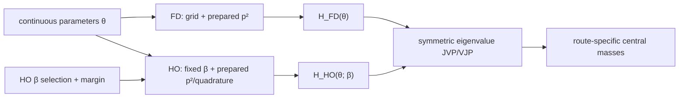

# Differentiation support research

This directory preserves research and probes for a possible differentiable
numerical core. It is not an active work plan. Nothing here is loaded by
`GIModel`, and no AD package has been added to the project dependencies.

Snapshot: repository commit `7aef9a8`, 2026-08-06. The audit also records the
concurrent, uncommitted HO quadrature memoization separately wherever it affects
measurements.

## Current conclusion

Implementation update: the solver split and cleanup/genericity Gates A--C have
landed in the current working tree. See
[`implementation_status.md`](implementation_status.md). The material below
defines the remaining derivative boundary and preserves the numerical evidence
that motivated it.

Differentiable central masses are realistic on both numerical routes without
differentiating through a general eigensolver. The routes share scalar physics
and the final spectral rule, but their matrix construction and preparation must
remain separate:



On the FD route, the grid and `p²` matrix are independent of every continuous
physics parameter. On a fixed-beta, fixed-quadrature HO branch, the exact `p²`
matrix and Gauss--Laguerre nodes/projector are likewise constant with respect to
the physical parameters. Each remaining central Hamiltonian is built from
smooth scalar functions and dense matrix products. For a simple eigenpair of a
real symmetric matrix,

```math
\dot E_i = v_i^T \dot H v_i.
```

Separate numerical probes confirm this relation for `b`, `c`, `sigma0`, `s`, and
the common charm mass. At a relative central-difference step of `1e-4`, the FD
level-1 comparison agrees to `1.5e-8` or better, while the fixed-beta HO probe
agrees to about `5.5e-8` or better for its first three levels.

The difficult shared parts are eigenvector derivatives, degeneracies and state
crossings, remaining `Float64` presentation boundaries, and report-layer state
assignment. HO additionally needs explicit semantics for discrete beta selection
and fixed preparation of its adaptive quadrature.

## Documents

- [`audit_report.md`](audit_report.md) gives the general cleanup and
  type-stability findings, route baselines, and ranked risks.
- [`implementation_status.md`](implementation_status.md) records which audit
  gates are now implemented, verified, and still deliberately deferred.
- [`code_audit.md`](code_audit.md) traces parameter flow, mutation, control flow,
  caches, and current type barriers.
- [`routes/comparison.md`](routes/comparison.md) defines what is shared and what
  must remain route-specific.
- [`routes/finite_difference.md`](routes/finite_difference.md) gives the FD
  preparation, risks, evidence, and acceptance gate.
- [`routes/harmonic_oscillator.md`](routes/harmonic_oscillator.md) gives the
  fixed-beta HO kernel, beta-selection semantics, quadrature preparation, and
  acceptance gate.
- [`hamiltonian_derivatives.md`](hamiltonian_derivatives.md) records the active
  central-Hamiltonian equations and the proposed spectral derivatives.
- [`backend_research.md`](backend_research.md) maps current Julia AD backends to
  this codebase and links to primary documentation.
- [`risk_register.md`](risk_register.md) preserves the cross-route risks and
  design constraints without scheduling implementation work.
- [`probes/central_hamiltonian_probe.jl`](probes/central_hamiltonian_probe.jl)
  checks the FD matrix/eigenvalue derivatives.
- [`probes/ho_fixed_beta_probe.jl`](probes/ho_fixed_beta_probe.jl) independently
  checks one smooth HO branch.
- [`probes/type_stability_probe.jl`](probes/type_stability_probe.jl) records the
  current compiler return-type baseline.
- [`probes/audit_baseline.jl`](probes/audit_baseline.jl) records lightweight FD
  and fixed-beta HO warm timing/allocation baselines.

## Reproduce the probes

From the repository root:

```bash
julia --project=. diff_support/probes/type_stability_probe.jl
julia --project=. diff_support/probes/central_hamiltonian_probe.jl
julia --project=. diff_support/probes/ho_fixed_beta_probe.jl
julia --project=. diff_support/probes/audit_baseline.jl
```

The FD probe uses `ngrid=160`; the HO probe uses `beta=0.65`, `nbasis=8`. They are
quick derivative-consistency checks, not precision spectrum results.

## Scope boundary

With the split into `FiniteDifferenceSolver` and `OscillatorSolver` complete,
the first derivative-facing maps should share a name but dispatch on distinct
prepared problem types built from those solver contexts:

```julia
central_masses(theta, prepared::PreparedFDProblem)::Vector
central_masses(theta, prepared::PreparedHOBranch)::Vector
```

The FD preparation fixes grid and FD solver context. The HO preparation fixes a
beta branch, basis size, and quadrature rule; beta-grid selection is a separate
orchestration result carrying a branch margin. Neither kernel should initially
include:

- parameter-file parsing;
- dictionaries or spectrum caches;
- adaptive HO quadrature or HO beta selection inside the active trace;
- report generation or reference-state assignment;
- annihilation calibration;
- an optimizer or experimental-data fit.

Those are orchestration or later-project concerns, not part of the initial
differentiability contract.
