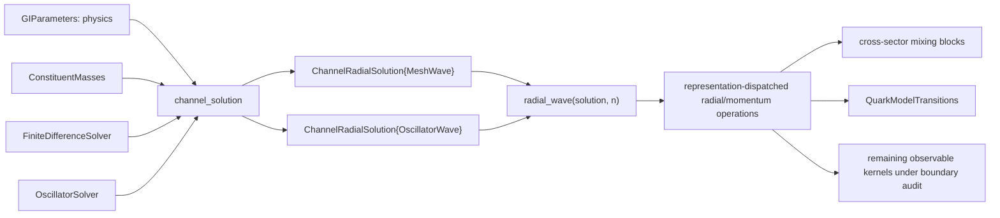
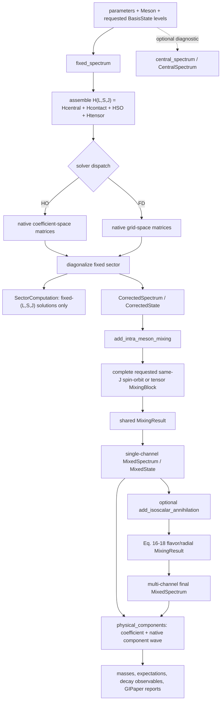

# Code architecture

This document describes the current `GIModel` runtime. Bare transition
operators and amplitudes live in `QuarkModelTransitions/`; paper-specific CSV
loading, comparisons, plots, and residual reports live in `GIPaper/`.
Transitions are loaded as `GIModel.QuarkModelTransitions`, sharing GIModel’s
project and test suite. GIPaper remains a separate downstream package.

## The central contract

Every radial method returns the same object:

```julia
ChannelRadialSolution(
    eigenvalues_GeV::Vector{Float64},
    waves::Vector{<:RadialWave},
)
```

Obtain a level with `radial_wave(solution, n)`. A consumer must operate on the
`RadialWave` interface and must not ask the solution which solver produced it.
There is deliberately no virtual `.eigenvectors`, `.r`, tuple iteration, or
implicit mesh reconstruction on `ChannelRadialSolution`.

The current representations are:

- `MeshWave`: reduced radial samples `u(r)` on a uniform grid; produced by the
  finite-difference solver.
- `OscillatorWave`: harmonic-oscillator coefficients, `L`, and `beta`; produced
  natively by the Appendix-A oscillator central solve.
- `MeshMomentumWave` and `OscillatorMomentumWave`: the corresponding momentum
  representations returned by `momentum_wave`.

Shared operations are `wave_norm`, `radial_expect`, `radial_overlap`,
`momentum_expect`, `momentum_overlap`, and `momentum_functional`.
`wave_mean_squares(wave, L)` is the convenience composition returning
`(r2, p2)` without exposing either representation. Plotting or a genuinely
grid-defined operator may explicitly sample a native wave with
`sample_wave(wave, r)`; that conversion belongs at that boundary, not in the
solution object.



## Spectrum stages

The production spectrum is a typed pipeline rather than one mutable result.
The central-only solve is a separate diagnostic and is not evaluated by
`compute_spectrum`:



`compute_spectrum` is exactly `fixed_spectrum` followed by
`add_intra_meson_mixing`. Each fixed-sector Hamiltonian is solved once. The
reported central/contact/spin-orbit/tensor values are expectations in that same
spin-distorted eigenstate and sum to its eigenvalue; they are not differences
from a second central-only calculation. `SectorComputation` stores only
`params`, the selected `solver`, and the production fixed-sector solutions.
For self-conjugate isoscalars, `compute_isoscalar_spectrum` solves the
nonstrange and strange channels through those same stages and then applies the
explicitly requested annihilation blocks. Its `Spectrum.channels` and cache own
both inputs; reference-row naming and ordering remain in GIPaper.

`StateMixing` records how a reported state changed; generic diagonalization is
owned by `MixingBlock`, `MixingResult`, and `diagonalize_mixing_block`. Mechanism
code constructs matrices but does not introduce another result container.
`radial_wave(spec, state)` returns the native fixed-sector wave for an unmixed
state and deliberately rejects a mixed physical state. `physical_components`
recursively composes spectroscopic and flavor mixing, with flavor carried by
`BasisState.flavors`; no representative or silently unmixed wave is fabricated.

## Source ownership

- `model_objects.jl`: masses and radial-wave interface/representations.
- `solver_options.jl`: numerical method objects and spin-term switches.
- `sector_solver.jl`: radial channel key, solution, and spectrum computation cache.
- `hamiltonian.jl`, `harmonic_oscillator_basis.jl`, `channel_solver.jl`: the FD
  and oscillator implementations behind `channel_solution`.
- `contact_hyperfine.jl`, `spin_fine_structure.jl`: native spin-dependent matrix
  builders and cross-sector elements.
- `fixed_channel_solver.jl`: solver-dispatched complete fixed-`(L,S,J)` solve.
- `state_mixing.jl`: shared mixing matrix/result abstraction.
- `spectrum.jl`: the independent central diagnostic, production spectrum
  stages, and state-level accessors.
- `flavor_mixing.jl`, `pseudoscalar_annihilation.jl`: annihilation block builders
  and the reference-free final isoscalar spectrum stage.
- `QuarkModelTransitions/src/mock_meson_overlaps.jl`: generic mock-meson overlap
  kernels consuming `RadialWave`/`MomentumWave`.
- `QuarkModelTransitions/src/photon_emission.jl` and `radiative_decays.jl`:
  typed photon-current dispatch plus its M1/E1/M2 and recoil primitives.
- `QuarkModelTransitions/`: transition domain objects, strong and
  electromagnetic operators, matrix elements, partial waves, and widths. This
  submodule is included after the solver definitions and imports its parent
  with `using ..GIModel`.
- `GIPaper/`: reference-data interpretation and reproducibility reports.

## Input ownership

`GIParameters` contains model parameters only. `ConstituentMasses` contains the
two masses for a dynamical calculation. `FiniteDifferenceSolver` or
`OscillatorSolver` contains numerical choices. Do not encode the basis in
`GIParameters`, and do not add loose numerical keywords beside a solver object.

## Numerical qualification

`OscillatorSolver` owns its adaptive convergence certificate because beta and
basis refinement are part of that solver. FD accuracy has two independent
external controls, spacing and box extent, so its package-level qualification
is a report-side sweep rather than another result-holder type. The historical
`FiniteDifferenceSolver()` defaults `(450, 24)` remain useful for fast reports;
precision HO cross-checks use `(2400, 32)`. The complete q/s/c/b, P/F mixing,
and transition audit is
`fd_comparator_convergence.md` (historical report retired).

## Rules for extensions

1. A new radial solver implements `channel_solution` and returns native
   `RadialWave` objects in `ChannelRadialSolution`.
2. A new radial representation implements the shared radial and momentum
   operations required by its consumers.
3. Physics consumers dispatch on `RadialWave`, never on solver type and never on
   storage fields belonging to one representation.
4. A mesh is explicit only where the mathematical operator or output format is
   actually mesh-defined.
5. An unavailable path throws or returns `nothing` when the physics term is
   genuinely inactive; it never returns an empty tuple that triggers a silent
   algorithm fallback.
6. `OscillatorSolver` contains only native-HO numerical controls: the initial,
   stepped, and maximum basis sizes; energy tolerance; beta bracket/refinement
   tolerance; convergence mode; and requested level capacity. Plot grids are
   owned by plotting code, never by the HO calculation. The achieved
   `OscillatorConvergence` certificate lives on `ChannelRadialSolution`.

## Spin-operator ownership and partial waves

`ContactHyperfine` owns the smeared kernel, spin/mass coefficient and momentum
prescription. `contact_matrix` represents that definition on an FD grid or in
an HO basis, with the sector's actual `L`. Both fixed-sector diagonalization and
`contact_hyperfine_shift_active` use these same matrix builders. Wave-specific
expectation adapters are representation implementations, not additional physics
consumers. There is no contact selection rule that excludes S, P, D or higher
waves. The local approximation is an explicit prescription, not an orbital
branch.

The contact-only diagnostic delegates to `fixed_channel_solution` for all
partial waves. It no longer returns `nothing` for P/D states or invalid spins;
invalid input throws. The explicit-grid overload validates and translates the
mesh into solver settings, then calls that same solver.

Diagonal spin-orbit and tensor terms share `diagonal_fine_structure_active`
and `_fine_structure_algebra` between matrix assembly and reported scalar
contributions. In a triplet, each single-spin L·S factor is half the total;
the A15 tensor bracket is Pauli S12/12 because S_i = sigma_i/2. Their zeros for L=0 and spin singlets follow angular matrix
elements. Off-diagonal tensor S-D mixing remains allowed: a zero diagonal
matrix element must not be generalized into absence of the operator.

Review any new state-dependent branch against its mathematical reason:

1. Is this an angular selection rule, a numerical representation choice, an
   explicit approximation, or merely an inherited restriction?
2. Does the same operator definition control solving and contribution reporting?
3. Could two solvers agree because they copied the same incorrect exclusion?
4. Does an independent analytic limit or integral test the selected and
   neighboring sectors, including a nonzero higher-wave matrix element?
5. Does unsupported input fail explicitly rather than masquerading as zero?

The audit and regression evidence are recorded in
[`operator_path_review.md`](operator_path_review.md).
