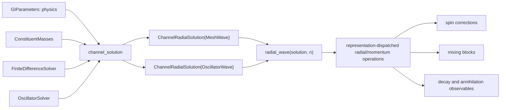
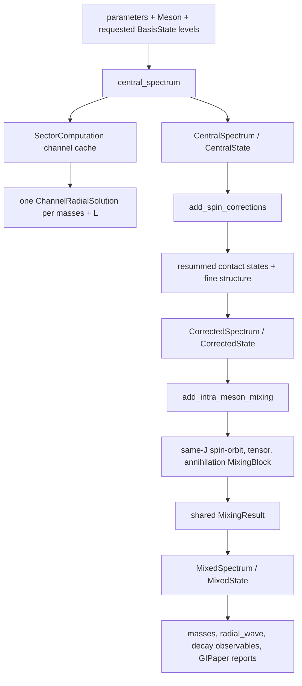

# Code architecture

This document describes the current `GIModel` runtime. Paper-specific CSV
loading, comparisons, plots, and residual reports live in the separate
`GIPaper/` project; they are not part of the core module.

## The central contract

Every radial method returns the same object:

```julia
ChannelRadialSolution(
    eigenvalues_GeV::Vector{Float64},
    waves::Vector{<:RadialWave},
)
```

Obtain a level with `radial_wave(solution, n)`. A consumer must operate on the
`RadialWave` interface and must not ask the solution which solver produced it.
There is deliberately no virtual `.eigenvectors`, `.r`, tuple iteration, or
implicit mesh reconstruction on `ChannelRadialSolution`.

The current representations are:

- `MeshWave`: reduced radial samples `u(r)` on a uniform grid; produced by the
  finite-difference solver and by grid-defined distorted-state solves.
- `OscillatorWave`: harmonic-oscillator coefficients, `L`, and `beta`; produced
  natively by the Appendix-A oscillator central solve.
- `MeshMomentumWave` and `OscillatorMomentumWave`: the corresponding momentum
  representations returned by `momentum_wave`.

Shared operations are `wave_norm`, `radial_expect`, `radial_overlap`,
`momentum_expect`, `momentum_overlap`, and `momentum_functional`. Plotting or a
genuinely grid-defined operator may explicitly sample a native wave with
`sample_wave(wave, r)`; that conversion belongs at that boundary, not in the
solution object.



## Spectrum stages

The full meson spectrum is a typed pipeline rather than one mutable result:



`compute_spectrum` is exactly the composition of those three stages.
`SectorComputation` stores only `params`, the selected `solver`, and the channel
cache. Later stages reuse that solver whenever they must solve a new eigenproblem.

`StateMixing` records how a reported state changed; generic diagonalization is
owned by `MixingBlock`, `MixingResult`, and `diagonalize_mixing_block`. Mechanism
code constructs matrices but does not introduce another result container.

## Source ownership

- `model_objects.jl`: masses and radial-wave interface/representations.
- `solver_options.jl`: numerical method objects and spin-term switches.
- `sector_solver.jl`: radial channel key, solution, and spectrum computation cache.
- `hamiltonian.jl`, `harmonic_oscillator_basis.jl`, `channel_solver.jl`: the FD
  and oscillator implementations behind `channel_solution`.
- `contact_hyperfine.jl`, `spin_fine_structure.jl`: spin-dependent operators and
  distorted-state solves.
- `state_mixing.jl`: shared mixing matrix/result abstraction.
- `spectrum.jl`: the three spectrum stages and state-level accessors.
- `flavor_mixing.jl`, `pseudoscalar_annihilation.jl`: annihilation block builders.
- `strong_decays.jl`, `annihilation_widths.jl`, `mock_meson_overlaps.jl`:
  downstream observables consuming `RadialWave`/`MomentumWave`.
- `GIPaper/`: reference-data interpretation and reproducibility reports.

## Input ownership

`GIParameters` contains model parameters only. `ConstituentMasses` contains the
two masses for a dynamical calculation. `FiniteDifferenceSolver` or
`OscillatorSolver` contains numerical choices. Do not encode the basis in
`GIParameters`, and do not add loose numerical keywords beside a solver object.

## Rules for extensions

1. A new radial solver implements `channel_solution` and returns native
   `RadialWave` objects in `ChannelRadialSolution`.
2. A new radial representation implements the shared radial and momentum
   operations required by its consumers.
3. Physics consumers dispatch on `RadialWave`, never on solver type and never on
   storage fields belonging to one representation.
4. A mesh is explicit only where the mathematical operator or output format is
   actually mesh-defined.
5. An unavailable path throws or returns `nothing` when the physics term is
   genuinely inactive; it never returns an empty tuple that triggers a silent
   algorithm fallback.
