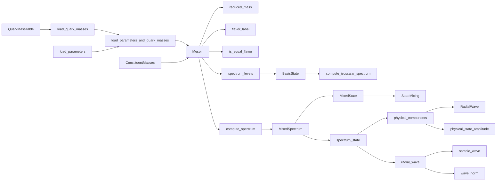
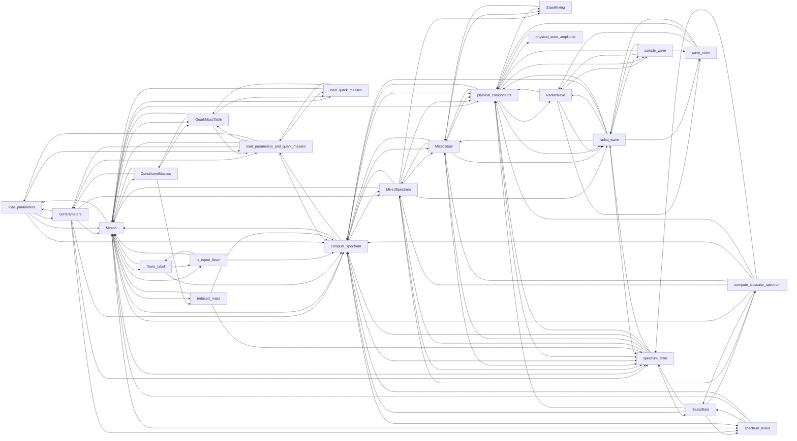

# Public API documentation link audit

See [Discoverability](discoverability.md) for the documentation conventions.

Generated by `python3 scripts/audit_doc_links.py`. Nodes are a curated set of
24 public entry points along the input → spectrum → wavefunction workflow.
Edges are explicit ``[`name`](@ref)`` links in source docstrings, directed from
the entry being read to its linked destination. Overloads are merged; self-links
are excluded. This is a static documentation graph, not a call graph or a
measurement of Pluto rendering. Prose and code identifiers without links do not count.

Baseline: `e3c9e8674c3d287bf12078423b4075be41eee33d`. Core edges: **12 → 118**.
Entries with no incoming core link: **13 → 0**.
Entries with no outgoing core link: **15 → 0**.
Core entries reachable from `Meson` (including itself): **7 → 24 of 24**.

| Entry | Incoming before → after | Outgoing before → after |
|---|---:|---:|
| `load_parameters` | 1 → 3 | 1 → 4 |
| `load_quark_masses` | 0 → 3 | 0 → 3 |
| `load_parameters_and_quark_masses` | 1 → 5 | 0 → 6 |
| `GIParameters` | 1 → 3 | 2 → 7 |
| `QuarkMassTable` | 1 → 4 | 0 → 4 |
| `ConstituentMasses` | 1 → 2 | 1 → 4 |
| `Meson` | 0 → 13 | 2 → 11 |
| `reduced_mass` | 0 → 2 | 0 → 3 |
| `flavor_label` | 0 → 2 | 0 → 3 |
| `is_equal_flavor` | 0 → 2 | 0 → 3 |
| `BasisState` | 1 → 3 | 0 → 5 |
| `spectrum_levels` | 0 → 4 | 2 → 3 |
| `compute_spectrum` | 2 → 15 | 0 → 7 |
| `MixedSpectrum` | 1 → 5 | 0 → 8 |
| `MixedState` | 1 → 7 | 1 → 6 |
| `StateMixing` | 1 → 3 | 1 → 1 |
| `spectrum_state` | 0 → 10 | 0 → 6 |
| `radial_wave` | 0 → 7 | 0 → 7 |
| `physical_components` | 1 → 12 | 1 → 8 |
| `RadialWave` | 0 → 4 | 0 → 4 |
| `sample_wave` | 0 → 3 | 0 → 4 |
| `wave_norm` | 0 → 3 | 0 → 3 |
| `physical_state_amplitude` | 0 → 1 | 1 → 1 |
| `compute_isoscalar_spectrum` | 0 → 2 | 0 → 7 |

## Suggested reading paths

A selected subset of actual links makes the main workflow easier to read.

## Complete graph after editing

Show all core documentation links

This curated sample covers the main workflow. Extend `CORE` to audit
additional observables or solver methods. For how to interpret the links,
see [Discoverability](discoverability.md).
