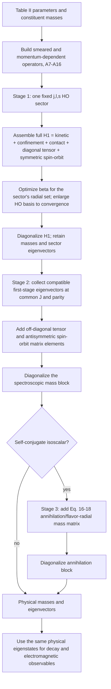
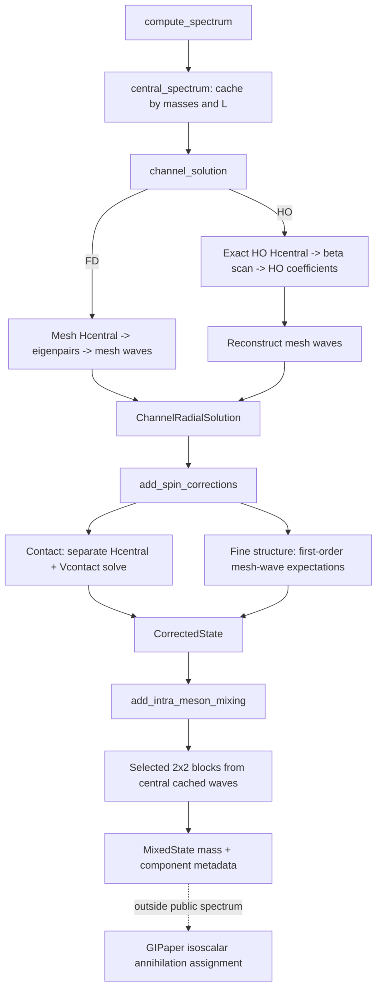

# Original 1985 Spectrum Algorithm Integration Audit

Status: architecture audit, 2026-08-07. No implementation changes are proposed
as completed work in this document.

The executable follow-up queue is
[`paper_algorithm_work_plan.md`](paper_algorithm_work_plan.md).

## Executive verdict

The 1985 production spectrum calculation did not use finite differences or a
radial mesh. Godfrey and Isgur built Hamiltonian matrices in a large
harmonic-oscillator (HO) basis, evaluated momentum- and position-space factors
with the factorization of Eq. (A17), optimized the oscillator parameter `beta`,
and expanded the basis until convergence.

The repository is not missing an HO central solver. The active
`AppendixAMomentumSandwich` central Hamiltonian has a genuine mesh-free HO
implementation and is already well validated. The missing unit is the
**paper-order spectrum algorithm around it**:

1. assemble the complete relativized Hamiltonian in each fixed `|jm;ls>` HO
   sector;
2. diagonalize that complete sector Hamiltonian and retain its eigenvectors;
3. build tensor and antisymmetric spin-orbit mass matrices from those
   eigenvectors;
4. apply annihilation mixing for self-conjugate isoscalars; and
5. expose the resulting physical eigenstates and their wavefunctions to all
   observables.

Most formulas and numerical primitives exist. They are split between the main
spectrum pipeline, standalone HO helpers, mesh operator builders, and the
GIPaper comparison layer. Several pieces are not yet native HO operators, and
the current state/cache abstractions cannot represent the paper's intermediate
or final eigenstates.

Therefore:

- `channel_solution(...; solver = OscillatorSolver())` is a real HO central
  calculation;
- `compute_spectrum(...; solver = OscillatorSolver())` is **not yet the 1985
  production algorithm**; it is a hybrid central-HO plus mesh-wave correction
  pipeline;
- FD remains valuable as an independent convergence and implementation
  comparator, but it should not define the paper-faithful execution path.

## Source-controlled statement of the paper algorithm

The controlling sources are the local paper PDF, main-text PDF page 4
(journal page 192), and Appendix-A PDF page 38 (journal page 226).

The main text says the meson Hamiltonian is solved in three stages. In the
first stage, the complete relativized Hamiltonian of Eq. (14), including
confinement, hyperfine, and spin-orbit terms, is directly diagonalized in large
HO sectors with fixed `j`, `l`, and `s`. In the second stage, off-diagonal
tensor and unequal-mass antisymmetric spin-orbit effects are included by
diagonalizing mass matrices in the basis of the first-stage eigenvectors. For
self-conjugate isoscalars, annihilation supplies the third mixing stage.

Appendix A then states how the matrices are calculated:

```text
<i|f(p) g(r)|j> = sum_n <i|f(p)|n><n|g(r)|j>       (A17)
```

Momentum factors are evaluated with momentum-space HO functions and radial
factors with configuration-space HO functions. `beta` is optimized
variationally. One `beta` is used for the orthogonal set in a sector, chosen in
practice by minimizing the last state in that set, and the basis is enlarged
until convergence.

No finite-difference discretization or reporting mesh is part of this
production algorithm. A numerical quadrature used to evaluate HO matrix
elements is compatible with the paper; projecting operators through a sampled
radial wavefunction is a different numerical realization and must be identified
as such.

## Paper-order data flow



## What the current public pipeline actually does

`compute_spectrum` currently composes three software stages, but they do not
match the three paper stages:

1. `central_spectrum` solves one spin-independent channel per orbital `L` and
   stores `ChannelRadialSolution` under `RadialChannelKey(masses, L)`.
2. `add_spin_corrections` resums the S-wave contact operator separately, but
   applies diagonal spin-orbit and tensor terms as expectation-value shifts on
   the central wave.
3. `add_intra_meson_mixing` constructs selected pairwise antisymmetric
   spin-orbit and tensor blocks using waves from the central channel cache.

With `OscillatorSolver`, only item 1 is natively mesh-free. The selected HO
coefficients are reconstructed onto `solver.ngrid/rmax`; items 2 and 3 then use
that sampled mesh wave and mesh `p2` operators. Isoscalar annihilation is not a
stage of `compute_spectrum`; it is applied later by `flavor_mixing.jl` and
`GIPaper.compare_reference`.



## Capability and gap matrix

Status vocabulary:

- **native** - implements the paper representation and is used in the relevant
  production path;
- **standalone** - the capability exists, but `compute_spectrum` does not use it;
- **hybrid** - HO eigenvectors are reconstructed on a mesh and a mesh operator
  is evaluated or projected;
- **partial** - only a restricted block, approximation, or data product exists;
- **missing** - no object/method currently owns the required responsibility.

| Paper requirement | Current objects and methods | Status | What remains |
| --- | --- | --- | --- |
| Relativistic kinetic energy in an HO basis | `ho_p2_matrix`, `oscillator_kinetic_matrix` | native | Nothing structural for the central operator. |
| Smeared central `G~`, `S~` and Coulomb momentum sandwich | `ho_operator_matrix`, `oscillator_momentum_factor_matrix`, `oscillator_hamiltonian_for_beta` | native | Keep the active `AppendixAMomentumSandwich` path as the paper target. Comparator potentials may remain mesh based. |
| Eq. (A17) position/momentum factorization | Exact HO `p2` plus Gauss-Laguerre/DVR position matrices | native for central only | Generalize the same native operator algebra to all A15-A16 spin terms. |
| Full fixed-`j,l,s` Hamiltonian diagonalization | `ho_full_distorted_states` can diagonalize `Hcentral + V` | standalone and hybrid | Introduce a fixed-sector Hamiltonian builder and route the public spectrum through it. The current helper accepts an externally built mesh `V`. |
| Contact hyperfine in the first diagonalization | Native `radial_expect_momentum_sandwich` expectation; mesh `contact_hyperfine_operator`/`resummed_channel_solution` | native first-order element, hybrid full solve | Implement/validate the A15 contact **matrix** natively in HO space. The active kernel is a smeared-delta approximation rather than a demonstrated HO matrix of `nabla^2 G~`. |
| Symmetric vector/scalar spin-orbit in the first diagonalization | Native HO sandwich expectations; `fine_structure_grid_operator`, `ho_full_distorted_states` | native first-order element, hybrid full solve | Build native HO A15/A16 matrices and include them in every fixed sector instead of adding first-order shifts in `compute_spectrum`. |
| Diagonal tensor term in the first diagonalization | Native HO sandwich expectation; `fine_structure_grid_operator` | native first-order element, hybrid full solve | Same as spin-orbit: include it in the full native sector Hamiltonian. |
| Paper strengths without extra bridge factors | `k_spin_orbit = 0.48`, `k_tensor = 0.42` in the active parameters | partial/non-paper | Remove these diagnostic scales from the paper mode after native HO A15-A16 matrices reproduce the paper without them. Keep them only in an explicitly named legacy/comparator mode. |
| Sector-specific eigenvectors after all diagonal spin terms | `ChannelRadialSolution` is keyed only by masses and `L`; `CorrectedState` stores shifts, not waves | missing | Add a solution keyed by at least masses, `L`, `S`, and `J`, with native-basis coefficients and optional sampled views. |
| Variational `beta` optimization for the complete sector Hamiltonian | `OscillatorSolver.beta_grid`; `oscillator_channel_solution`; `ho_full_distorted_states` | partial | Optimize after the complete sector Hamiltonian is assembled. Replace or refine the coarse discrete scan and make the radial set controlling the last-state objective explicit. |
| Expand basis until convergence | Fixed `nbasis`, endpoint warning, and convergence tests | partial | Add a convergence controller over `nbasis` (and beta refinement), record achieved tolerances, and fail or warn on non-convergence. |
| Stage-2 tensor matrix in the basis of first-stage eigenvectors | `tensor_mixing_components`, native HO cross-wave sandwich, `MixingBlock`, `diagonalize_mixing_block` | partial | Use spin-distorted sector eigenvectors and assemble the complete compatible block rather than only prescribed pairs. |
| Stage-2 antisymmetric spin-orbit matrix | `spin_orbit_mixing_components`, `same_j_mixing` | partial | Use both singlet and triplet first-stage eigenvectors. The current spectrum path evaluates one central radial wave and applies a `2x2` block. |
| General simultaneous radial/spectroscopic mixing | Pairing rules in `_apply_same_j_spin_orbit_mixing!` and `_apply_tensor_mixing!` | partial | Define blocks from all requested compatible first-stage eigenvectors. Demonstrate when a `2x2` truncation is sufficient instead of encoding it as the architecture. |
| Stage-3 annihilation and flavor/radial mixing | `isoscalar_annihilation_block`, `pseudoscalar_annihilation_block`, general Eq. (16), P1/P2, and GIPaper assignment | implemented kernels, external orchestration | Add a model-level physical-spectrum orchestrator. Keep calibrated P1 clearly separate from the literal paper P1/P2 modes. |
| Final physical wavefunction/eigenvector | `MixedState.mixings` stores block components; `radial_wave(spec, ...)` returns the central cached wave | missing | Represent a physical state as a composition of sector eigenvectors and make observables consume that composition. |
| One paper-order spectrum entry point | No current entry point; scripts manually combine HO helpers and mesh operators | missing | Add an end-to-end paper algorithm distinct from the FD comparator, then decide whether it becomes the default. |
| Independent FD validation | `FiniteDifferenceSolver` | extra, useful | Preserve as a convergence/reference implementation, not as a hidden dependency of paper mode. |

## Code evidence map

| Claim | Evidence |
| --- | --- |
| The public entry point is central -> corrections -> intra-meson mixing | [`src/spectrum.jl:377-386`](../src/spectrum.jl#L377-L386) |
| The central cache is one solve per distinct `L` | [`src/spectrum.jl:217-232`](../src/spectrum.jl#L217-L232), [`src/sector_solver.jl:21-58`](../src/sector_solver.jl#L21-L58) |
| The HO central operator uses exact `p2` and DVR position matrices | [`src/harmonic_oscillator_basis.jl:324-351`](../src/harmonic_oscillator_basis.jl#L324-L351) |
| HO channel solutions retain `OscillatorWave`; mesh sampling is an explicit diagnostic/plot operation | [`src/harmonic_oscillator_basis.jl`](../src/harmonic_oscillator_basis.jl), [`src/sector_solver.jl`](../src/sector_solver.jl) |
| Contact is solved separately and fine structure is evaluated on the cached central wave | [`src/spectrum.jl:269-327`](../src/spectrum.jl#L269-L327) |
| The standalone HO full-H helper projects an externally supplied mesh operator | [`src/harmonic_oscillator_basis.jl:417-439`](../src/harmonic_oscillator_basis.jl#L417-L439) |
| The active contact operator is built from mesh `p2` and a sampled radial kernel | [`src/contact_hyperfine.jl:86-106`](../src/contact_hyperfine.jl#L86-L106) |
| First-order fine-structure elements dispatch natively, while the standalone full matrix is still mesh-built | [`src/spin_fine_structure.jl`](../src/spin_fine_structure.jl) |
| Stage-2-like blocks consume central cached waves | [`src/spectrum.jl:432-537`](../src/spectrum.jl#L432-L537) |
| `radial_wave` returns a central cache column even for corrected/mixed spectra | [`src/spectrum.jl:589-624`](../src/spectrum.jl#L589-L624) |
| Annihilation kernels exist outside `compute_spectrum` | [`src/flavor_mixing.jl:54-157`](../src/flavor_mixing.jl#L54-L157), [`GIPaper/src/comparison.jl:476-515`](../GIPaper/src/comparison.jl#L476-L515) |
| Full-H HO use is currently demonstrated by specialized audits/examples | [`GIPaper/scripts/audit_w6_ho_order.jl`](../GIPaper/scripts/audit_w6_ho_order.jl), [`examples/chi_c_annihilation_widths.jl`](../examples/chi_c_annihilation_widths.jl) |

One current detail makes the paper's beta prescription ambiguous in the public
API. `central_spectrum` always requests `solver.nlevels_per_channel`, rather
than the maximum radial state explicitly requested in each `L`; the HO solver
then minimizes the last returned eigenvalue. Cache capacity therefore changes
the beta objective. Reporting meshes no longer enter native first-order spin,
mixing, or decay matrix elements, but the standalone full-H helpers still
project externally built mesh operators. Both remaining issues belong in the
native fixed-sector builder below.

## Main architectural finding

> Implementation update (2026-08-07): the lower radial boundary described in
> this audit is now repaired. `OscillatorWave` and oscillator momentum waves are
> native, `ChannelRadialSolution` retains them, and downstream radial consumers
> dispatch without reconstructing a production mesh. The main finding below
> still applies at the next level: `compute_spectrum` has not yet become the
> paper's full fixed-sector Hamiltonian followed by complete physical mixing.

The current abstraction boundary is too low and too spin-independent.
`RadialSolver` abstracts how to solve `Hcentral(L)`, while the paper's natural
unit of computation is a complete fixed `j,l,s` Hamiltonian followed by coupled
mass blocks.

Changing only `channel_solution` cannot make `compute_spectrum` paper-faithful,
because the following responsibilities sit above that boundary today:

- deciding which diagonal spin terms belong in the first Hamiltonian;
- selecting `beta` for the complete sector;
- retaining sector-specific eigenvectors;
- constructing off-diagonal cross-sector matrix elements;
- composing physical-state eigenvectors; and
- handing those physical states to observables.

A better boundary is the **prepared fixed-sector problem**, not the radial
channel. It should be expressed by extending the abstractions already present,
not by adding parallel representation and physical-state hierarchies:

```julia
abstract type RadialWave end                    # existing
struct MeshWave <: RadialWave ... end           # existing
struct OscillatorWave <: RadialWave ... end     # now implemented and retained natively

prepare_sector(solver::RadialSolver, params, masses, state::BasisState)
assemble_fixed_sector_hamiltonian(prepared, terms)
solve_fixed_sector(prepared, terms) -> ChannelRadialSolution
assemble_mixing_block(mechanism, solutions)
solve_physical_block(block) -> MixingResult
```

`ChannelRadialSolution` should be generalized to retain native `RadialWave`
objects and convergence metadata. `Spectrum`, `MixedState`, `StateMixing`, and
`MixingResult` should be completed so the final composition resolves those same
waves. A mesh-sampled view should be derived for plotting or an explicitly
hybrid observable, not be the canonical HO state.

This does not require forcing FD and HO through identical internal matrices.
They should share the semantic operations above while dispatching to separate
native implementations. `RadialSolver` already owns that dispatch distinction;
the former `GIBasis` hierarchy was deliberately removed and should not return.

## Recommended implementation sequence

### Gate 0 - freeze the current behavior as a comparator

- Name the existing path `legacy_staged` or equivalent in internal tests.
- Add regression fixtures for current FD and current HO-hybrid spectra.
- Fix the independent nonrelativistic-contact defect before treating FD as an
  oracle: `_resummed_channel_solution(::FiniteDifferenceSolver)` currently
  rebuilds a relativistic Hamiltonian even for `kinetic = :nonrelativistic`.

### Gate 1 - complete the existing wave/sector/result data model

- Add the already-documented `OscillatorWave` implementation.
- Generalize `ChannelRadialSolution` to store native waves, eigenvalues, beta,
  basis size, convergence metadata, and optional derived sampled views.
- Reuse `BasisState` for sector identity; introduce a more specific cache key
  only if the existing `(masses, BasisState)` information cannot serve.
- Complete `Spectrum`/`MixedState` lookup so it distinguishes central,
  fixed-sector, spectroscopic-mixed, and flavor-mixed components.
- Reuse `MixingBlock`/`MixingResult`; do not introduce another physical-state
  or eigensystem result hierarchy.

Acceptance: two states with the same `L` but different `S,J` can carry different
waves, while central-only mode can still share one solution.

### Gate 2 - native HO spin-dependent matrices

- Express contact, vector spin-orbit, scalar/Thomas spin-orbit, and tensor
  radial kernels as HO matrices using the same A17 spectral/DVR primitives as
  the central operator.
- Apply each `(m1*m2/E1*E2)^(1/2+epsilon_i)` factor as a native spectral
  function of exact HO `p2`.
- Validate contact against `nabla^2 G~`, including the analytic origin limit.
- Do not use `ngrid`, `rmax`, `p2_operator`, or a sampled `U` inside these
  production kernels.

Acceptance: fixed-beta matrix elements agree with independently refined
quadrature, are invariant under reporting-mesh changes, and reproduce the
appropriate FD limit under independent refinement.

### Gate 3 - full first-stage diagonalization

- Assemble `H1` for every requested fixed `L,S,J` sector.
- Optimize beta on that complete Hamiltonian and the explicit radial set.
- Increase `nbasis` until masses and relevant matrix elements converge.
- Retire `k_spin_orbit` and `k_tensor` from paper mode.

Acceptance: the light `1^1S_0` discriminator, P-wave splittings, and
spin-distorted wavefunction observables are reproduced through the same public
sector solution, not special audit scripts.

### Gate 4 - full second-stage spectroscopic blocks

- Build tensor and antisymmetric spin-orbit matrix elements between first-stage
  eigenvectors.
- Assemble blocks by conserved `J`, parity, flavor, and charge conjugation where
  applicable, including all requested radial states.
- Diagonalize once per block and retain the full transformation.

Acceptance: the current pairwise results are recovered when the larger block
decouples; known S-D and singlet-triplet compositions converge with basis/block
enlargement.

### Gate 5 - annihilation and physical spectrum

- Apply literal Eq. (16)-Eq. (18) blocks to the stage-2 states for
  self-conjugate isoscalars.
- Keep calibrated controls in comparison code, not in the paper algorithm.
- Return physical masses, complete compositions, and usable physical
  wavefunctions from one model-level entry point.

Acceptance: GIPaper consumes model results rather than reconstructing a second
spectrum workflow.

### Gate 6 - switch the headline reports

- Run FD, current HO-hybrid, and paper-order HO side by side during migration.
- Require the full GIModel and GIPaper gates plus convergence reports.
- Switch default/headline reporting only after all sectors and observables use
  the same physical-state objects.

## Acceptance tests that are currently missing

1. A paper-mode dependency test proving central and spin HO kernels do not touch
   `radial_grid`, `p2_operator`, `ngrid`, or `rmax`.
2. Full-H fixed-sector equivalence between the new public path and the existing
   `ho_full_distorted_states` discriminator cases.
3. Automatic `nbasis` and beta convergence records per fixed sector.
4. Invariance of paper-mode masses and matrix elements under changes to a
   reporting mesh.
5. Cross-matrix-element tests using different spin-distorted left and right
   sector eigenvectors.
6. Enlargement tests for mixing blocks, not only fixed `2x2` expected numbers.
7. A state-provenance test showing that `radial_wave` or its replacement is the
   wave of the returned physical state, not the central precursor.
8. End-to-end isoscalar tests in which masses, eigenvectors, and observables all
   use the same annihilation-mixed state.
9. A paper-mode test with `k_spin_orbit = k_tensor = 1` and no hidden bridge
   scales.

## What should remain unchanged

- `FiniteDifferenceSolver` should remain available as an independent
  implementation and convergence comparator.
- The physical wave normalization and phase invariants should remain.
- `GIParameters` should continue to contain physics, not solver/basis choices.
- The exact central HO matrix elements and Gauss-Laguerre/DVR cache should be
  reused.
- Generic `MixingBlock` and `diagonalize_mixing_block` are appropriate reusable
  primitives.
- Paper reference data and assignment conventions should remain in GIPaper;
  only model-defined annihilation dynamics and physical model eigenstates belong
  in GIModel.

## Bottom line

The repository has crossed the hard mathematical threshold: the exact HO
central representation, relativistic spectral functions, spin kernels, full-HO
diagonalization helper, and generic mixing algebra all exist.

It has not crossed the integration threshold. The public spectrum still treats
the spin-independent radial channel as the canonical state, adds some spin
physics afterward, and lets reports assemble paper-order wavefunctions through
special-purpose calls. Completing the 1985 algorithm is therefore primarily an
orchestration, native-operator, and state-model refactor - not another attempt
to invent an HO central solver.
