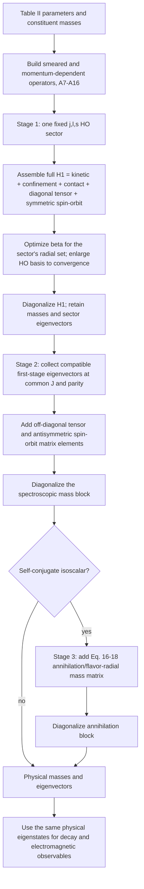
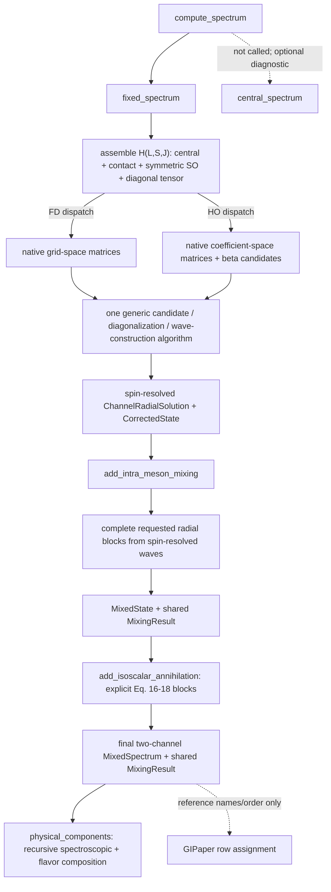

# Original 1985 Spectrum Algorithm Integration Audit

Status: audited baseline plus implementation update, 2026-08-07.

The executable follow-up queue is
[`paper_algorithm_work_plan.md`](paper_algorithm_work_plan.md).

## Executive verdict

The 1985 production spectrum calculation did not use finite differences or a
radial mesh. Godfrey and Isgur built Hamiltonian matrices in a large
harmonic-oscillator (HO) basis, evaluated momentum- and position-space factors
with the factorization of Eq. (A17), optimized the oscillator parameter `beta`,
and expanded the basis until convergence.

The repository was not missing an HO central solver; it was missing the
paper-order spectrum algorithm around it. The audit originally identified five
integration steps:

1. assemble the complete relativized Hamiltonian in each fixed `|jm;ls>` HO
   sector;
2. diagonalize that complete sector Hamiltonian and retain its eigenvectors;
3. build tensor and antisymmetric spin-orbit mass matrices from those
   eigenvectors;
4. apply annihilation mixing for self-conjugate isoscalars; and
5. expose the resulting physical eigenstates and their wavefunctions to all
   observables.

Steps 1-4 and the state-composition part of step 5 are now implemented. Native HO
contact, spin-orbit, and tensor matrices enter one fixed-sector Hamiltonian;
`compute_spectrum` caches the resulting `(L,S,J)` waves; complete requested
radial subspaces enter the later tensor/antisymmetric-spin-orbit blocks; and
`physical_components` resolves the final signed component waves through both
spectroscopic and flavor mixing. HO has no `ngrid`/`rmax` fields and no
mesh-operator fallback.

Still open are automatic HO basis/beta convergence records, migration of every
flavor-sensitive observable to the final composition, and removal or formal
isolation of the fitted spin bridge factors.

Therefore:

- `channel_solution(...; solver = OscillatorSolver())` is a real HO central
  calculation;
- `compute_spectrum(...; solver = OscillatorSolver())` now implements the
  paper's native fixed-sector and spectroscopic-mixing stages;
- `compute_isoscalar_spectrum(...; solver=OscillatorSolver())` is the
  reference-free end-to-end three-stage entry point when explicit annihilation
  models/amplitudes are supplied;
- FD remains valuable as an independent convergence and implementation
  comparator, but it should not define the paper-faithful execution path.

## Source-controlled statement of the paper algorithm

The controlling sources are the local paper PDF, main-text PDF page 4
(journal page 192), and Appendix-A PDF page 38 (journal page 226).

The main text says the meson Hamiltonian is solved in three stages. In the
first stage, the complete relativized Hamiltonian of Eq. (14), including
confinement, hyperfine, and spin-orbit terms, is directly diagonalized in large
HO sectors with fixed `j`, `l`, and `s`. In the second stage, off-diagonal
tensor and unequal-mass antisymmetric spin-orbit effects are included by
diagonalizing mass matrices in the basis of the first-stage eigenvectors. For
self-conjugate isoscalars, annihilation supplies the third mixing stage.

Appendix A then states how the matrices are calculated:

```text
<i|f(p) g(r)|j> = sum_n <i|f(p)|n><n|g(r)|j>       (A17)
```

Momentum factors are evaluated with momentum-space HO functions and radial
factors with configuration-space HO functions. `beta` is optimized
variationally. One `beta` is used for the orthogonal set in a sector, chosen in
practice by minimizing the last state in that set, and the basis is enlarged
until convergence.

No finite-difference discretization or reporting mesh is part of this
production algorithm. A numerical quadrature used to evaluate HO matrix
elements is compatible with the paper; projecting operators through a sampled
radial wavefunction is a different numerical realization and must be identified
as such.

## Paper-order data flow



## What the current public pipeline actually does

`compute_spectrum` composes two production stages:

1. `fixed_spectrum` assembles and diagonalizes the complete fixed `(L,S,J)`
   Hamiltonian for every requested sector.
2. `add_intra_meson_mixing` builds one complete requested radial block for each
   allowed antisymmetric-spin-orbit or tensor sector from those spin-resolved
   waves, then stores a shared `MixingResult`.

`central_spectrum` remains a separately callable spin-independent diagnostic;
the production calculation neither calls it nor retains its cache. Both
solvers follow the production path in their native representations.
`radial_wave` returns the fixed-sector wave for an unmixed state;
`physical_components` returns flavor-tagged coefficient/wave pairs for a mixed
state and recursively composes spectroscopic and annihilation transformations.
`compute_isoscalar_spectrum` owns the final two-flavor result; GIPaper only
assigns those model eigenstates to named reference rows.



## Capability and gap matrix (current)

Status vocabulary:

- **native** - implements the paper representation and is used in the relevant
  production path;
- **standalone** - the capability exists, but `compute_spectrum` does not use it;
- **hybrid** - HO eigenvectors are reconstructed on a mesh and a mesh operator
  is evaluated or projected;
- **partial** - only a restricted block, approximation, or data product exists;
- **missing** - no object/method currently owns the required responsibility.

| Paper requirement | Current objects and methods | Status | What remains |
| --- | --- | --- | --- |
| Relativistic kinetic energy in an HO basis | `ho_p2_matrix`, `oscillator_kinetic_matrix` | native | Nothing structural for the central operator. |
| Smeared central `G~`, `S~` and Coulomb momentum sandwich | `ho_operator_matrix`, `oscillator_momentum_factor_matrix`, `oscillator_hamiltonian_for_beta` | native | Keep the active `AppendixAMomentumSandwich` path as the paper target. Comparator potentials may remain mesh based. |
| Eq. (A17) position/momentum factorization | Exact HO `p2`, Gauss-Laguerre/DVR position matrices, `ho_momentum_sandwich_matrix` | native | Used by central and every diagonal spin term. |
| Full fixed-`j,l,s` Hamiltonian diagonalization | `fixed_channel_solution` | native | Automatic convergence control remains. |
| Contact hyperfine in the first diagonalization | `ho_contact_hyperfine_matrix`; FD `contact_hyperfine_operator` | native in both backends | Further formula-level comparison to a direct `nabla^2 G~` construction remains a physics validation item. |
| Symmetric vector/scalar spin-orbit in the first diagonalization | `ho_fine_structure_matrices`; FD `fine_structure_grid_operator` | native in both backends | Nothing structural. |
| Diagonal tensor term in the first diagonalization | `ho_fine_structure_matrices`; FD `fine_structure_grid_operator` | native in both backends | Nothing structural. |
| Paper strengths without extra bridge factors | `k_spin_orbit = 0.48`, `k_tensor = 0.42` in the active parameters | partial/non-paper | Remove these diagnostic scales from the paper mode after native HO A15-A16 matrices reproduce the paper without them. Keep them only in an explicitly named legacy/comparator mode. |
| Sector-specific eigenvectors after all diagonal spin terms | `RadialChannelKey(masses,L,S,J)` -> `ChannelRadialSolution` | implemented | No sampled view is stored. |
| Variational `beta` optimization for the complete sector Hamiltonian | `fixed_channel_solution`; `OscillatorSolver.beta_grid` | implemented, coarse scan | Requested radial range controls the objective; refinement and metadata remain. |
| Expand basis until convergence | Fixed `nbasis`, endpoint warning, and convergence tests | partial | Add a convergence controller over `nbasis` (and beta refinement), record achieved tolerances, and fail or warn on non-convergence. |
| Stage-2 tensor matrix in the basis of first-stage eigenvectors | `tensor_mixing_components`, `MixingBlock`, `MixingResult` | implemented | Uses every compatible requested radial state. |
| Stage-2 antisymmetric spin-orbit matrix | two-wave `spin_orbit_mixing_components`, `MixingBlock`, `MixingResult` | implemented | Uses distinct singlet/triplet fixed-sector waves. |
| General simultaneous radial/spectroscopic mixing | complete blocks in `_apply_same_j_spin_orbit_mixing!` and `_apply_tensor_mixing!` | implemented for disjoint paper mechanisms | A future overlapping mechanism must be assembled in one block, not applied sequentially. |
| Stage-3 annihilation and flavor/radial mixing | `add_isoscalar_annihilation`, general Eq. (16), P1/P2 | integrated | Model-order assignment and final composition live in GIModel; reference naming/order and calibrated targets remain explicit in GIPaper. |
| Final physical wavefunction/eigenvector | `StateMixing` + `MixingResult`; recursive `physical_components` | implemented | Every component carries explicit flavor identity and its solver-native wave. |
| One paper-order spectrum entry point | `compute_isoscalar_spectrum(...; solver=OscillatorSolver())` | implemented, uncertified | Add automatic convergence and remove/isolate fitted spin bridge factors before headline certification. |
| Independent FD validation | `FiniteDifferenceSolver` | extra, useful | Preserve as a convergence/reference implementation, not as a hidden dependency of paper mode. |

## Code evidence map

| Claim | Evidence |
| --- | --- |
| The public entry point is fixed-sector solutions -> intra-meson mixing; the central-only solve is independent | [`src/spectrum.jl`](../src/spectrum.jl) |
| A production cache contains only fixed solutions keyed by `(L,S,J)` | [`src/sector_solver.jl`](../src/sector_solver.jl), [`src/spectrum.jl`](../src/spectrum.jl) |
| The HO central operator uses exact `p2` and DVR position matrices | [`src/harmonic_oscillator_basis.jl`](../src/harmonic_oscillator_basis.jl) |
| HO channel solutions retain `OscillatorWave`; mesh sampling is an explicit diagnostic/plot operation | [`src/harmonic_oscillator_basis.jl`](../src/harmonic_oscillator_basis.jl), [`src/sector_solver.jl`](../src/sector_solver.jl) |
| Contact, symmetric spin-orbit, and diagonal tensor enter the same sector Hamiltonian | [`src/fixed_channel_solver.jl`](../src/fixed_channel_solver.jl), [`src/contact_hyperfine.jl`](../src/contact_hyperfine.jl), [`src/spin_fine_structure.jl`](../src/spin_fine_structure.jl) |
| Cross-sector blocks consume spin-resolved waves and all requested radial levels | [`src/spectrum.jl`](../src/spectrum.jl) |
| A mixed state resolves to signed native component waves and cannot masquerade as one radial wave | [`physical_components` and `radial_wave` in `src/spectrum.jl`](../src/spectrum.jl) |
| Annihilation projects the physical composition coherently into the requested channel | [`src/flavor_mixing.jl`](../src/flavor_mixing.jl), [`src/pseudoscalar_annihilation.jl`](../src/pseudoscalar_annihilation.jl) |
| Flavor-annihilation eigenstates, masses, and native components share the final `Spectrum` | [`src/flavor_mixing.jl`](../src/flavor_mixing.jl), [`src/spectrum.jl`](../src/spectrum.jl) |

## Architectural conclusion after implementation

The fixed-sector problem is now the production boundary. FD and HO share one
candidate-selection, diagonalization, and result-construction algorithm in
`fixed_channel_solution`; only native matrix assembly and native-wave
construction dispatch on the solver. FD now exposes the same vector/Thomas
spin-orbit and tensor matrix decomposition as HO. No `GIBasis`, second wave
type, fixed-sector result wrapper, or sampled HO state was added.

`ChannelRadialSolution` retains native waves; a production `SectorComputation`
owns only `(L,S,J)` cache entries; and `StateMixing` points to one shared
`MixingResult`. `CorrectedState` reuses `BasisState` directly rather than
embedding a central precursor. Pairwise scalar angles were deliberately removed from the core
state because a complete multi-radial block has no unique angle. Reports derive
an explicitly stated two-row projection from the shared eigenvector instead.

## What remains external after PA-16

GIModel now owns construction, diagonalization, model-order assignment, final
masses, and component resolution for Eq. (16)-Eq. (18). `Spectrum.channels`
holds the nonstrange and strange solved sectors, while one shared
`MixingResult` supplies each annihilation eigensystem. `physical_components`
recursively flattens earlier tensor/spin-orbit mixing with the later flavor
mixing.

Only comparison semantics remain external: `GIPaper.compare_reference` chooses
which explicit model/control to request, supplies digitized targets for the
calibrated control, and maps ascending model eigenstates to named paper rows by
reference ordering. Those choices do not modify the model spectrum.

## Nonrelativistic and alternative central paths

They are repository comparators, not alternative production algorithms from
the 1985 paper. The paper writes down the nonrelativistic limit of its
Hamiltonian to motivate Eqs. (2)-(7), discusses conventional Coulomb-plus-linear
models, and says several alternatives were tried and rejected. Its reported
spectrum is nevertheless obtained by direct diagonalization of the relativized
Eq. (14) in large HO sectors. The code's nonrelativistic FD solve and pointwise,
1D-smearing, derivative-expansion, and diagonal-only central constructions are
useful research controls added by this repository; they must not be presented
as paper execution modes. Consequently the nonrelativistic FD solver is
accepted by the standalone `channel_solution`/`central_spectrum` diagnostic but
rejected by `fixed_spectrum` instead of being silently converted to the
relativistic Hamiltonian.

## Remaining implementation sequence

1. **PA-12: convergence control.** Refine beta beyond the current discrete
   grid, enlarge `nbasis` automatically, record achieved tolerances, and fail or
   warn when a requested sector is not converged.
2. **PA-17: final-state consumers.** Make flavor-mixed
   observables consume that final composition, remove the fitted
   precursor-vector paths, and retain one coherent phase convention.
3. **PA-18: native-HO paper certification.** Remove the fitted
   `k_spin_orbit`/`k_tensor` bridge from paper mode after calibration is settled
   and add HO convergence reports to the full gate. FD remains a separate
   implementation comparator, not a PA-18 acceptance criterion.

Outstanding acceptance tests are correspondingly narrow: automatic basis/beta
convergence metadata, flavor-sensitive observables consuming the final
composition, and native-HO paper validation without hidden spin bridge scales.
The end-to-end isoscalar mass/eigenvector/composition invariant is covered now.

## What should remain unchanged

- `FiniteDifferenceSolver` should remain available as an independent
  implementation and convergence comparator.
- The physical wave normalization and phase invariants should remain.
- `GIParameters` should continue to contain physics, not solver/basis choices.
- The exact central HO matrix elements and Gauss-Laguerre/DVR cache should be
  reused.
- Generic `MixingBlock` and `diagonalize_mixing_block` are appropriate reusable
  primitives.
- Paper reference data and assignment conventions should remain in GIPaper;
  only model-defined annihilation dynamics and physical model eigenstates belong
  in GIModel.

## Bottom line

The repository has now crossed both the native-matrix and spectroscopic
integration thresholds: the public spectrum solves each complete fixed-sector
Hamiltonian once, uses complete requested cross-sector radial blocks, and
exposes resolvable physical component waves. It does not reconstruct HO states
on an FD mesh or run a central-only precursor in production.

The remaining gap to a certified 1985 calculation is now numerical and
consumer-facing: automatic basis/beta convergence, migration of all observables
to the final flavor composition, and removal or formal isolation of the fitted
spin bridge factors. FD validation remains useful but separate from that claim.
