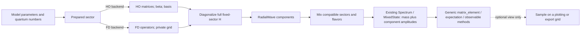

# Paper-Order Spectrum Work Plan

Status: live code-stream queue, 2026-08-07.

This document turns the findings in
[`original_1985_algorithm_audit.md`](original_1985_algorithm_audit.md) into
small, dependency-ordered work units. It is the source-controlled follow-up
board for restoring the paper's HO calculation. Physics reproduction status
still belongs in `docs/paper_manifest/*.toml`; historical reproduction work
remains in [`work_plan.md`](work_plan.md); cross-cutting engineering invariants
remain in [`engineering_work_plan.md`](engineering_work_plan.md).

## Goal in one sentence

Once a radial problem has been solved, all later code should receive a solved
state and ask it for matrix elements or representations through dispatch. It
must not know whether that state came from HO coefficients or FD samples, and
it must not read a mesh from the state.

The qualification is important: an FD implementation necessarily owns grid
samples internally. The grid is an implementation detail of `MeshWave`, not an
argument or field used by physics consumers. An HO implementation owns `beta`,
basis labels, and coefficients internally and never needs to create a mesh for
production calculations.

## What exists and what is incomplete

The intended boundary is already described in `src/model_objects.jl`:

- `RadialWave` is the abstract representation of one radial eigenlevel;
- `MeshWave <: RadialWave` implements mesh quadrature;
- `MomentumWave` and `MeshMomentumWave` represent the transformed wave;
- `wave_norm`, `radial_expect`, `radial_overlap`, `momentum_wave`,
  `momentum_expect`, and `momentum_functional` are the beginning of a generic
  operation set.

The first implementation slice now meets the radial representation boundary:

- `OscillatorWave` retains `L`, `beta`, and normalized HO coefficients;
- `ChannelRadialSolution` stores native waves; the temporary tuple/virtual-mesh
  compatibility adapter has been removed;
- exact oscillator coordinate and momentum operations implement the same
  interface as `MeshWave`;
- spectrum, spin shifts, spectroscopic mixing, annihilation, and decay
  observables consume `RadialWave` operations; and
- `radial_wave(spectrum, ...)` returns the solver-native wave without exposing a
  mesh to the caller.

The fixed-sector transformation is now complete: contact, symmetric spin-orbit,
and diagonal tensor matrices are assembled with the central Hamiltonian in both
native backends, then diagonalized once per requested `(L,S,J)` sector. Complete
requested radial subspaces enter the later antisymmetric-spin-orbit and tensor
blocks. `physical_components` exposes the resulting signed composition, while
`radial_wave` rejects mixed states instead of returning a precursor.

The remaining physics work is sharply smaller: automatic HO basis/beta
convergence metadata and integration of flavor-annihilation blocks into the
same model-level physical-state pipeline.

## Forensic trace of the unfinished abstraction

The repository history makes the intended continuation unusually explicit:

| Commit | Intended step | What remained at that commit |
| --- | --- | --- |
| `30dcbfb` - "A1: one interface for a radial wave" | Introduced `RadialWave`, renamed the concrete grid object to `MeshWave`, retained `RadialWaveOnUniformMesh` as an alias, and described a future `OscillatorWave(beta, coefficients)`. | Only the mesh implementation was added. The commit message counted 23 consuming functions but did not migrate their mesh-specific signatures and field access. |
| `522dcd1` - "A1b: momentum space is its own noun" | Added `MomentumWave`, `MeshMomentumWave`, and distinct quadratic/linear momentum operations. Removed `origin_amplitude` from the interface for the correct physics reason. | The older `RadialWave` docstring was not corrected and no oscillator momentum-wave implementation followed. |
| `1ef42ee`, `3a92ae8` - A2 slices | Migrated charge-radius and Appendix-D radial-moment calculations to `radial_expect`/`radial_overlap`; added scale-invariance checks. | These were two contained consumers, not a complete consumer migration. Spin, annihilation, and most transition code still require `MeshWave`. |
| `9c4a319` through `8655d68` - A3/A17 | Implemented exact HO `p^2`, position matrices, phase convention, and the mesh-free central A17 Hamiltonian. | `oscillator_channel_solution` keeps `(beta, coeffs)` only in a temporary `best` named tuple, reconstructs `best.basis * best.coeffs` on a reporting mesh, and returns only `(values, waves, r)`. The native solution is discarded at the solver boundary. |
| `de07702` - B3 solver types | Correctly moved the method choice out of `GIParameters` into `RadialSolver`, `FiniteDifferenceSolver`, and `OscillatorSolver`. | This means a new `SpectrumRepresentation`, `GIBasis`, `HORepresentation`, or `FDRepresentation` hierarchy would duplicate a distinction already owned by solver dispatch. |
| `fd281b1` - remove second wave cache | Removed a separate HO cache that had compensated for a normalization bug and established one solver per spectrum. | The one remaining `ChannelRadialSolution` is still a mesh-shaped container, so even an HO spectrum loses its native wave representation. |

That historical break has now been repaired: native HO information crosses the
solver boundary and downstream radial consumers dispatch on it. The next break
is one level higher, between a central radial component and the paper's full
fixed-`j,l,s` plus mixed physical state.

## Reuse map: entities to keep, extend, or retire

| Responsibility | Existing entity | Decision |
| --- | --- | --- |
| Numerical method selection | `RadialSolver`, `FiniteDifferenceSolver`, `OscillatorSolver` | Keep. Do not recreate a basis/representation hierarchy. |
| One radial eigenlevel | `RadialWave`, `MeshWave`, `OscillatorWave` | Keep exactly. Both native representations now exist; do not add `FDWave` or `HOWave` synonyms. |
| Backward-compatible mesh names | Removed | Do not restore aliases; this pre-release code has no compatibility obligation. |
| Momentum representation | `MomentumWave`, `MeshMomentumWave`, `OscillatorMomentumWave` | Keep without synonyms or another generic momentum abstraction. |
| Multi-level eigensolution | `ChannelRadialSolution` | Keep its native `Vector{<:RadialWave}`. Add convergence metadata here only when PA-12 defines it; do not add a parallel `FixedSectorSolution`. |
| Calculation cache/provenance | `SectorComputation` | Keep and evolve its cache key/value types. It already owns parameters, solver, and solutions. |
| Spectroscopic identity | `BasisState` and `FineStructureMultiplet` | Keep both roles explicit: `BasisState` identifies one radial level (`n,L,S,J,label`); `FineStructureMultiplet` identifies a fixed radial sector (`L,S,J`) before an `n` exists. This is containment, not two names for one entity. |
| Spectrum stages and physical mass | `CentralState`, `CorrectedState`, `MixedState`, `Spectrum` | `central_spectrum` is an independent diagnostic. Production starts at `fixed_spectrum`; `CorrectedState` reuses `BasisState` and does not embed a central precursor. Do not add `SolvedMesonState`. |
| Mixing algebra | `MixingBlock`, `MixingResult`, `diagonalize_mixing_block` | Keep. Annihilation and `same_j_mixing` should return or wrap `MixingResult` instead of returning named tuples that repeat `block`, `masses`, and `vectors`. |
| Per-state mixing projection | `StateMixing` | Completed: it references one shared `MixingResult` plus the selected eigenstate column; no eigensystem copies are stored. |
| Annihilation input metadata | `PseudoscalarAnnihilationBasisInput` | Keep the physics-specific mass/flavor metadata with a signed projection of the physical state's native radial components. Do not replace it with a generic duplicate state wrapper. |
| Matrix-element name | exported `matrix_element` generic | Extend it with radial/operator methods if a general operator protocol is adopted. Do not create a second synonymous public function. |
| HO operator construction | `ho_p2_matrix`, `ho_operator_matrix`, `oscillator_momentum_factor_matrix`, ordinary matrices | Reuse as implementation primitives. Add small operator descriptors only where dispatch must preserve an unevaluated A17 sandwich; do not wrap every existing matrix in a second object graph. |

One result duplication remains outside the spectroscopic pipeline:

1. Four annihilation paths construct a `MixingBlock` and then return named
   tuples repeating the block, masses, and vectors instead of returning a
   `MixingResult` plus only their genuinely additional diagnostics.

These are compatibility migrations, not reasons to add another state/result
hierarchy.

## Basis, radial solution, and physical state are different objects

"The basis has been computed" can mean two different stages:

1. **Prepared representation.** HO functions and operator matrices, or an FD
   grid and difference operators, are ready. The Hamiltonian still has to be
   assembled and diagonalized.
2. **Solved radial state.** Eigenvalue and normalized eigenvector are known. HO
   stores coefficients; FD stores samples. Downstream radial computations can
   now use the common interface.

A single solved radial function is enough only before state mixing. The final
meson can be a linear combination of several radial/spectroscopic/flavor
components: singlet-triplet, S-D, different radial levels, or different flavor
sectors. The public result therefore needs two levels of abstraction:



`RadialWave` hides a representation of one component. The existing `MixedState`
inside `Spectrum` should own or resolve the physical mass and normalized
composition of such components. Observables should normally consume a spectrum
state; low-level radial kernels can consume `RadialWave`.

## Target contract

This is the reuse-first target. Names without a comment already exist.

```julia
abstract type RadialWave end                       # existing

struct OscillatorWave <: RadialWave                # implemented promised type
    # private implementation data: L, beta, normalized HO coefficients
end

struct MeshWave <: RadialWave                      # existing
    # private to mesh implementation: normalized samples and grid definition
end

struct ChannelRadialSolution{W<:RadialWave}        # current type
    eigenvalues_GeV::Vector{Float64}
    waves::Vector{W}
end

radial_wave(solution::ChannelRadialSolution, n)
radial_wave(spectrum::Spectrum, state::BasisState) # return stage-correct wave/components
state_components(spectrum::Spectrum, state::MixedState)

wave_norm(w::RadialWave)
radial_expect(w::RadialWave, f)
radial_overlap(left::RadialWave, right::RadialWave, f)
momentum_wave(w::RadialWave, L)
momentum_expect(w::MomentumWave, f)
momentum_functional(w::MomentumWave, f)
```

The existing small operation set covers local observables and transforms. It
does not yet cover the relativized Hamiltonian's nonlocal sandwiches such as
`B(p) f(r) B(p)`. PA-01 must decide the smallest extension: either one general
method on the already-exported `matrix_element` generic, or explicitly named
sandwich methods. If an abstract `RadialOperator` is introduced, it is the only
new operator abstraction and must describe unevaluated physics, not duplicate
the existing HO/FD matrices.

Useful operator families are:

- a local position kernel `f(r)`;
- a spectral momentum kernel `g(p^2)`;
- a sandwich `B(p^2) f(r) B(p^2)`;
- sums and scalar multiples of operators; and
- spin-angular factors separated from their radial operators.

For an existing `MixedState`, a matrix element is the component sum
`sum(conj(c_i) c_j <u_i|O_ij|u_j>)`. That rule belongs in one generic method,
not in each decay or spectrum report.

## What is needed after solving `u`

If `u` means a normalized eigenstate with its native representation retained,
then no further basis setup is needed. Later calculations require only:

1. its eigenvalue and quantum-number identity;
2. normalization and a deterministic phase convention;
3. generic diagonal and transition matrix elements in coordinate and momentum
   space;
4. composition coefficients if spectroscopic or flavor mixing has occurred;
5. convergence/provenance metadata so a result says how accurately it was
   solved; and
6. optional sampling for plots, exports, or explicit FD/HO comparisons.

The mesh is not one of these public requirements. The basis is also not a
public requirement. Both remain private data needed by the relevant dispatch
implementation.

## Work-unit rules

States used below:

- **done** - merged and covered by the normal verification gate;
- **ready** - dependencies are satisfied and the unit can be taken next;
- **pending** - waits for the listed dependency;
- **blocked** - needs a recorded physics or API decision.

Each unit should be one reviewable change with one primary responsibility. A
unit is complete only when its acceptance tests and documentation land in the
same change. FD and native paper-order HO remain independently named; the
former HO-hybrid path has been deleted and no silent fallback is allowed.

## Dependency board

| ID | Status | Depends on | Deliverable | Acceptance |
| --- | --- | --- | --- | --- |
| PA-00 | done | - | Architecture audit of the paper and current paths | [`original_1985_algorithm_audit.md`](original_1985_algorithm_audit.md) identifies native, hybrid, partial, and missing stages. |
| PA-00R | done | PA-00 | Trace existing abstractions and history before naming new entities | The forensic trace and reuse map above identify the exact solver boundary where HO data is lost and prohibit duplicate wave, representation, solution, and physical-state hierarchies. |
| PA-01 | done | PA-00R | Freeze the reuse-first wave, solution, state, and operator contracts | Existing wave/solution/state types were retained; no parallel representation or solution hierarchy was added. |
| PA-02 | done | PA-01 | Implement native `OscillatorWave` | `L`, `beta`, normalized coefficients, analytic coordinate evaluation, and exact HO momentum transform are retained without a mesh. |
| PA-03 | done | PA-02 | Implement local position matrix elements for `OscillatorWave` | Diagonal/cross expectations use HO matrices or independent infinite-domain quadrature. |
| PA-04 | done | PA-02 | Implement momentum matrix elements and linear functionals for `OscillatorWave` | Momentum expectations, overlaps, and annihilation functionals use the exact oscillator representation. |
| PA-05 | done | PA-01 | Make `MeshWave` satisfy the same finalized contract | FD remains native mesh internally and shares the public normalization/expectation/overlap operations. |
| PA-06 | done | PA-03, PA-04, PA-05 | Complete the needed nonlocal radial primitive | Explicit two-sided momentum-sandwich methods dispatch for both backends; no general operator object graph was added because current consumers need only this primitive. |
| PA-07 | done | PA-06 | Migrate leaf observables from mesh fields | Spectrum spin shifts/mixing, annihilation, mock-meson overlaps, leptonic/two-photon observables, and charge radii accept `RadialWave`. |
| PA-08 | done | PA-06 | Implement native HO contact matrix | `ho_contact_hyperfine_matrix` uses the exact HO momentum sandwich and enters the fixed-sector Hamiltonian. |
| PA-09 | done | PA-06 | Implement native HO vector and scalar spin-orbit matrices | `ho_fine_structure_matrices` builds both terms from exact HO spectral factors and position matrices. |
| PA-10 | done | PA-06 | Implement native HO tensor matrices | Diagonal HO tensor matrices and cross-sector native wave elements are symmetric and covered by solver-agreement tests. |
| PA-11 | done | PA-08, PA-09, PA-10 | Add the full stage-1 builder to `ChannelRadialSolution` | `fixed_channel_solution` diagonalizes one complete fixed-`L,S,J` Hamiltonian and returns native waves. |
| PA-12 | partial | PA-11 | Add beta refinement and basis convergence | The complete sector and requested radial range now control beta selection; automatic refinement, convergence metadata, and tolerance enforcement remain. |
| PA-13 | done | PA-11 | Route paper-order stage 1 through `compute_spectrum` | Every requested state is resolved from the fixed-sector solve; the HO route has no mesh field or mesh fallback. Fitted fine-structure scale removal remains a separate physics calibration decision. |
| PA-13R | done | PA-13 | Remove the central-only solve from production and unify the backend algorithm | `compute_spectrum` starts from `fixed_spectrum`; production caches contain only `(L,S,J)` solves. One generic candidate/diagonalization/result algorithm serves HO and FD, while dispatch owns native matrices and waves. FD exposes the same spin-component matrix fields as HO. |
| PA-14 | done | PA-10, PA-13 | Assemble complete stage-2 spectroscopic blocks | Tensor and antisymmetric spin-orbit blocks use spin-resolved waves and every compatible requested radial state. |
| PA-15 | done | PA-14 | Complete `MixedState`/`Spectrum` physical components | `StateMixing` shares its `MixingResult`; `physical_components` resolves coefficient/wave pairs and mixed `radial_wave` calls fail loudly. |
| PA-16 | partial | PA-04, PA-15 | Integrate stage-3 annihilation | Literal annihilation kernels coherently consume the stage-2 spectroscopic projection; their flavor eigensystem still needs to become the final model-level `Spectrum` composition. Calibrated comparison modes remain visibly separate in GIPaper. |
| PA-17 | partial | PA-07, PA-16 | Finish physical-state consumer migration | Spectroscopic expectations use `physical_components` and cannot silently use a precursor; flavor-mixed observables await PA-16. |
| PA-18 | pending | PA-12, PA-16, PA-17 | Certify the headline path | Full verification and convergence reports pass for native HO and independent FD; there is no legacy-hybrid mode to preserve. |

## Completed first follow-up: PA-01 through PA-07

The reuse-first slice completed the following checklist:

1. Retained `MeshWave`, `MeshMomentumWave`, and the already documented
   `OscillatorWave`; removed the old long-name aliases.
2. Added the smallest missing nonlocal primitive as explicitly named
   momentum-sandwich dispatch. No abstract operator holder was needed for the
   current consumers.
3. Specified how `ChannelRadialSolution`, `CorrectedState`, `MixedState`,
   `StateMixing`, and `MixingResult` share rather than copy native waves and
   transformations. The later PA-13R cleanup made `CentralState` diagnostic-only
   and reused `BasisState` directly in production. Mass and mixing coefficients
   do not belong to a bare radial wave.
4. Corrected the `RadialWave` docstring and implemented its promised HO form.
5. Added reusable contract tests covering normalization, phase,
   diagonal expectation, transition overlap, and coordinate/momentum duality.
6. Reduced direct mesh access to mesh implementations and explicit plot/export
   sampling. Removed the obsolete `FDOriginP2Smearing` approximation and label-
   inferred flavor-coherence compatibility path.
7. Added migration regression tests before changing the `StateMixing` and
   `ChannelRadialSolution` storage layouts.

The next independent units are PA-12 (automatic convergence) and completion of
PA-16 (putting the flavor-annihilation eigensystem into the final spectrum).
Neither requires another wave, solution, or mixing holder type.

## Migration boundary

Direct access to `.u`, `.r`, and `.h` is legitimate only inside:

- the FD/mesh implementation of the wave and operator interfaces;
- constructors and validation of that representation; and
- an explicitly named diagnostic/export adapter.

It is not legitimate inside contact, fine-structure, mixing, annihilation,
decay, or report logic. Likewise, access to HO coefficients and `beta` is
legitimate inside the HO implementation, but not in consumers.

The practical review question for every later change is therefore simple:

> Could this method run on an HO state without constructing a mesh, and on an
> FD state without knowing the grid?

If the answer is no, the method is either a representation implementation or
the abstraction is still incomplete.
