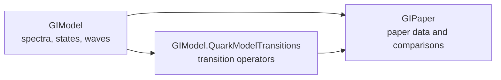
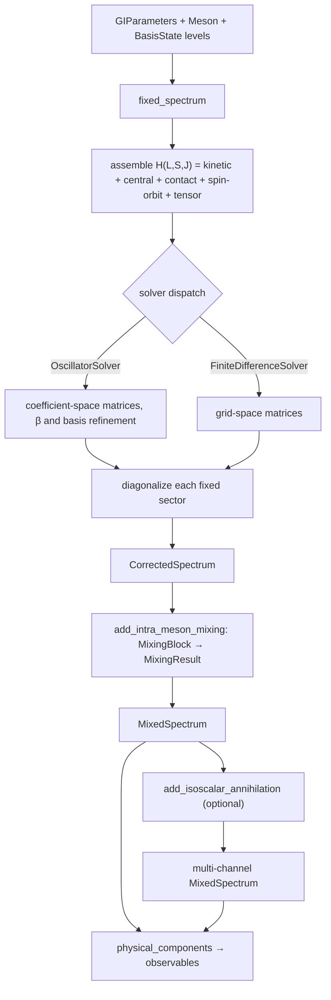

# Architecture

This page is for people changing the code. It explains how GIModel is
organized and the rules that keep the two solvers and the physics consistent.

## Packages



- **GIModel** (repository root) solves the Hamiltonian and owns states,
  mixing and wavefunctions. It has no knowledge of the paper's tables.
- **QuarkModelTransitions** (`QuarkModelTransitions/`) is included into
  GIModel as a submodule. It shares GIModel's project file and test suite and
  imports its parent with `using ..GIModel`.
- **GIPaper** (`GIPaper/`) is a separate package that depends on GIModel. It
  owns reference data, row-to-meson mapping, table-specific prescriptions and
  reports.

## The central contract

Every radial solver returns the same object:

```julia
ChannelRadialSolution(eigenvalues_GeV::Vector{Float64}, waves::Vector{<:RadialWave})
```

A consumer asks for a level with `radial_wave(solution, n)` and works only
through the [`RadialWave`](@ref) interface. It must not ask which solver
produced the wave. There is deliberately no `.eigenvectors`, `.r` or implicit
mesh on a solution.

| representation | produced by | fields |
|---|---|---|
| [`MeshWave`](@ref) | finite differences | samples `u`, radii `r`, spacing `h` |
| [`OscillatorWave`](@ref) | oscillator basis | `L`, `beta`, `coefficients` |
| [`MeshMomentumWave`](@ref) | `momentum_wave` of a mesh wave | `p`, `phi` |
| [`OscillatorMomentumWave`](@ref) | `momentum_wave` of an oscillator wave | exact view of its source |

Shared operations: [`wave_norm`](@ref), [`radial_expect`](@ref),
[`radial_overlap`](@ref), [`momentum_wave`](@ref), [`momentum_expect`](@ref),
[`momentum_overlap`](@ref), [`momentum_functional`](@ref),
[`wave_mean_squares`](@ref). A grid-defined operation (plotting, export) calls
[`sample_wave`](@ref) explicitly at that boundary.

## The spectrum pipeline



- `compute_spectrum` is exactly `fixed_spectrum` followed by
  `add_intra_meson_mixing`. Each fixed sector is solved once and cached in the
  spectrum's [`SectorComputation`](@ref).
- The reported contributions are expectation values in the same eigenstate
  and sum to its eigenvalue.
- All mixing, spectroscopic or flavor, goes through [`MixingBlock`](@ref),
  [`diagonalize_mixing_block`](@ref) and [`MixingResult`](@ref). Mechanism code
  builds matrices; it does not introduce another result type.
- `radial_wave(spec, state)` refuses a mixed state. `physical_components`
  composes all mixing steps recursively and never fabricates a representative
  wave.

## Where things live

| file | contents |
|---|---|
| `src/parameters.jl`, `src/quark_mass_table.jl` | parameter types and TOML loading |
| `src/quark.jl`, `src/meson.jl` | quark types and [`Meson`](@ref) |
| `src/model_objects.jl` | masses, [`RadialWave`](@ref), [`MeshWave`](@ref) |
| `src/solver_options.jl` | solver objects and [`SpinTerms`](@ref) |
| `src/sector_solver.jl` | channel keys, solutions, cache |
| `src/hamiltonian.jl`, `src/harmonic_oscillator_basis.jl`, `src/channel_solver.jl` | the two radial methods |
| `src/running_coupling.jl`, `src/smearing_appendix_a.jl` | ``\alpha_s`` and smeared potentials |
| `src/contact_hyperfine.jl`, `src/spin_fine_structure.jl` | spin-dependent operators |
| `src/fixed_channel_solver.jl` | the complete fixed-sector solve |
| `src/state_mixing.jl` | mixing blocks and results |
| `src/spectrum.jl` | spectrum stages, states, accessors, display |
| `src/flavor_mixing.jl`, `src/pseudoscalar_annihilation.jl` | isoscalar annihilation |
| `src/momentum_waves.jl` | momentum-space transforms |
| `QuarkModelTransitions/src/` | transition operators, amplitudes, widths |

## Input ownership

- [`GIParameters`](@ref) holds the model and nothing else.
- [`ConstituentMasses`](@ref) holds the two masses of one calculation.
- A solver object holds every numerical choice. Do not add loose numerical
  keywords next to it, and do not put a basis or mesh into `GIParameters`.
- [`SpinTerms`](@ref) holds physics switches whose purpose is to change the
  answer.

## Rules for extensions

1. A new radial solver implements `channel_solution` and returns native
   `RadialWave`s in a `ChannelRadialSolution`.
2. A new representation implements the shared radial and momentum operations
   its consumers need.
3. Physics code dispatches on `RadialWave`, never on the solver type or on the
   storage fields of one representation.
4. A mesh appears only where an operator or output is genuinely mesh-defined.
5. An unavailable path throws, or returns `nothing` when the physics term is
   genuinely inactive. It never returns an empty result that triggers a silent
   fallback.
6. One operator definition serves both the Hamiltonian and the reported
   contribution, and both solvers share the angular and mass algebra.

## Reviewing a state-dependent branch

Every `if L == 0`, `if multiplicity == 1` or similar branch in an operator
needs a reason. Before adding one, ask:

1. Is it an angular selection rule, a numerical representation choice, an
   explicit approximation, or an inherited restriction?
2. Does the same definition control solving and reporting?
3. Could the two solvers agree only because they copied the same exclusion?
4. Does an independent test cover the neighboring sectors, including a
   nonzero higher-wave matrix element?
5. Does unsupported input fail loudly instead of returning zero?

This checklist exists because an unjustified branch, the contact term
restricted to S waves, once propagated into both solvers and distorted the
mixing angles (see [Mixing angles: a paper erratum](@ref)).
