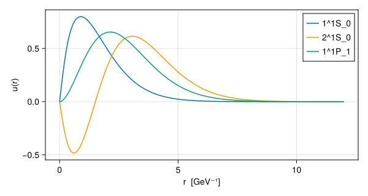

<!-- Generated from docs/quarto/getting_started.qmd by docs/render.jl. Edit the .qmd file. source-sha256: 40214d4711795f9cf66b0a86e8b36a75c0db27fe247e73e7f71747fa671f04a8 -->


# Getting started

This page takes one calculation through every step: load the model, pick a meson, compute its spectrum, read one state, and look at its wavefunction. Later pages explain each step in more depth.

## Installation

GIModel needs Julia 1.11 or later. It is not yet registered, so add it from GitHub:

```julia
using Pkg
Pkg.add(url = "https://github.com/mmikhasenko/GIModel.jl")
```

For a local checkout, use `Pkg.develop(path = "/path/to/GIModel.jl")`. The package has four external dependencies (KrylovKit, PartialWaveFunctions, QuadGK and SpecialFunctions) and no plotting or file-format dependencies.

## Step 1: load the model

The model is a set of numbers taken from the paper: quark masses, the confinement slope and offset, smearing widths, and relativistic factors. They ship with the package as a TOML file.

```julia
using GIModel
params, mq = load_parameters_and_quark_masses(default_parameters_path())
mq
```

```
Dict{String, Float64} with 6 entries:
  "c" => 1.628
  "b" => 4.977
  "u" => 0.22
  "q" => 0.22
  "s" => 0.419
  "d" => 0.22
```

`params` is a [`GIParameters`](@ref) object holding the interaction. `mq` is a [`QuarkMassTable`](@ref) with constituent masses in GeV. They are kept separate on purpose: the interaction is flavor-blind, and quark masses enter only through the meson you build.

## Step 2: choose a meson

A [`Meson`](@ref) is a quark–antiquark pair. The first flavor is the quark, the second is the antiquark:

```julia
charmonium = Meson(mq, :c, :c)
```

```
Meson: c cbar   (m1 = 1.628, m2 = 1.628 GeV, reduced = 0.814 GeV)
  self-conjugate: same-J antisymmetric spin-orbit mixing vanishes
```

`Meson(mq, :c, :s)` would be the $c\bar s$ system (the $D_s$ family), and `Meson(mq, :q, :q)` uses the averaged light mass for $u$ and $d$.

## Step 3: choose which levels to compute

States are labeled $n\,{}^{2S+1}L_J$: radial quantum number $n$, total quark spin $S$, orbital angular momentum $L$, and total angular momentum $J$. [`spectrum_levels`](@ref) lists all of them up to a radial number:

```julia
levels = spectrum_levels(1; L_labels = ("S", "P"))
[level.label for level in levels]
```

```
6-element Vector{String}:
 "1^1S_0"
 "1^3S_1"
 "1^1P_1"
 "1^3P_0"
 "1^3P_1"
 "1^3P_2"
```

## Step 4: compute the spectrum

```julia
spectrum = compute_spectrum(params, charmonium; levels = spectrum_levels(2))
```

```
MixedSpectrum: cc, 20 levels — all values in GeV
  level     central    contact   fine str     mixing       mass
  1^1S_0     3.0784    -0.1117     0.0000     0.0000     2.9667
  1^3S_1     3.0656     0.0256     0.0000    -0.0002     3.0910
  2^1S_0     3.6665    -0.0411     0.0000     0.0000     3.6254
  2^3S_1     3.6661     0.0127     0.0000    -0.0000     3.6788
  1^1P_1     3.5232    -0.0082     0.0000     0.0000     3.5151
  1^3P_0     3.5348     0.0037    -0.0957     0.0000     3.4428
  1^3P_1     3.5238     0.0028    -0.0185     0.0000     3.5082
  1^3P_2     3.5248     0.0022     0.0211     0.0000     3.5481
  2^1P_1     3.9625    -0.0064     0.0000     0.0000     3.9561
  2^3P_0     3.9641     0.0025    -0.0503     0.0000     3.9163
  2^3P_1     3.9625     0.0022    -0.0116     0.0000     3.9531
  2^3P_2     3.9631     0.0018     0.0145     0.0000     3.9794
  1^1D_2     3.8384    -0.0019     0.0000     0.0000     3.8366
  1^3D_1     3.8405     0.0007    -0.0231     0.0001     3.8182
  1^3D_2     3.8385     0.0006    -0.0018     0.0000     3.8373
  1^3D_3     3.8391     0.0006     0.0081     0.0000     3.8477
  2^1D_2     4.2091    -0.0016     0.0000     0.0000     4.2075
  2^3D_1     4.2101     0.0006    -0.0168     0.0001     4.1941
  2^3D_2     4.2091     0.0005    -0.0015     0.0000     4.2081
  2^3D_3     4.2095     0.0005     0.0065     0.0000     4.2165
  (4 levels carry mixing; see `spec.states[i].mixings`)
```

Each row is a level. The columns are in GeV and add up to the mass:

| column | meaning |
|----|----|
| `central` | the spin-independent energy: kinetic term, confinement and Coulomb, plus the quark masses |
| `contact` | the spin–spin contact (hyperfine) interaction |
| `fine str` | spin–orbit plus tensor, diagonal in the level |
| `mixing` | the shift from mixing with other levels of the same $J^{PC}$ |
| `mass` | the physical meson mass |

All contributions are evaluated in the same eigenstate, which is why they sum exactly to the mass. The last line says that some levels carry mixing: here the tensor force mixes ${}^3S_1$ with ${}^3D_1$.

## Step 5: look at one state

[`spectrum_state`](@ref) picks a level by its label:

```julia
chi_c1 = spectrum_state(spectrum, "1^3P_1")
chi_c1.mass_GeV
```

```
3.5081502109538754
```

The state also carries its quantum numbers and every contribution:

```julia
(chi_c1.n, chi_c1.L, chi_c1.multiplicity, chi_c1.J)
```

```
(1, "P", 3, 1)
```

```julia
(central = chi_c1.central_GeV,
 spin_orbit = chi_c1.spin_orbit_shift_GeV,
 tensor = chi_c1.tensor_shift_GeV,
 contact = chi_c1.contact_shift_GeV)
```

```
(central = 3.5238043169507294, spin_orbit = -0.028732806502261746, tensor = 0.010230059107934618, contact = 0.002848641397473027)
```

## Step 6: get its wavefunction

For a level that does not mix, [`radial_wave`](@ref) returns the radial wavefunction:

```julia
eta_c = radial_wave(spectrum, "1^1S_0")
wave_norm(eta_c)
```

```
0.9999999999999999
```

The $J/\psi$ is slightly mixed with the ${}^3D_1$ states, so it has more than one component. [`physical_components`](@ref) returns all of them, each with a signed coefficient and its own radial wave:

```julia
[(c.basis.label, round(c.coefficient; digits = 4))
 for c in physical_components(spectrum, "1^3S_1")]
```

```
4-element Vector{Tuple{String, Float64}}:
 ("1^3S_1", 0.9999)
 ("2^3S_1", -0.0)
 ("1^3D_1", -0.0133)
 ("2^3D_1", 0.0086)
```

Asking `radial_wave` for a mixed state throws an error. That is deliberate: a mixed state has no single radial wave, so the package does not return one.

The mean-square radius and momentum come from [`wave_mean_squares`](@ref), in $\mathrm{GeV}^{-2}$ and $\mathrm{GeV}^2$:

```julia
wave_mean_squares(eta_c, 0)
```

```
(r2 = 2.1229942234941013, p2 = 1.2899911969232778)
```

To plot the wave, sample it on a grid of radii in $\mathrm{GeV}^{-1}$:

```julia
using CairoMakie
r = range(0, 12; length = 241)
fig = Figure(size = (600, 320))
ax = Axis(fig[1, 1]; xlabel = "r  [GeV⁻¹]", ylabel = "u(r)")
for label in ("1^1S_0", "2^1S_0", "1^1P_1")
    wave = sample_wave(radial_wave(spectrum, label), r)
    lines!(ax, wave.r, wave.u; label)
end
axislegend(ax)
fig
```



Here `u(r)` is the reduced radial wavefunction, normalized as $\int_0^\infty u(r)^2\,dr = 1$.

## Step 7: use the paper’s numerical method

`compute_spectrum` uses a fast finite-difference solver by default. Godfrey and Isgur expanded the wavefunctions in harmonic-oscillator functions instead. Pass an [`OscillatorSolver`](@ref) to use that method:

```julia
ho = compute_spectrum(params, charmonium;
    levels = spectrum_levels(1; L_labels = ("S",)), solver = OscillatorSolver())
```

```
MixedSpectrum: cc, 2 levels — all values in GeV
  level     central    contact   fine str     mixing       mass
  1^1S_0     3.0785    -0.1114     0.0000     0.0000     2.9671
  1^3S_1     3.0658     0.0256     0.0000     0.0000     3.0914
```

The two methods agree to a fraction of an MeV. The oscillator solver also checks its own convergence; [Solvers and convergence](@ref) explains both solvers.

## Where to go next

- [The model](@ref) writes out the Hamiltonian behind these numbers.
- [Computing a spectrum](@ref) covers level selection, the stages of the calculation, and switching spin terms on and off.
- [Wavefunctions](@ref) covers wave representations, momentum space and mixed states.
- [Charmonium, start to finish](@ref) continues this example with radiative and leptonic decays.
