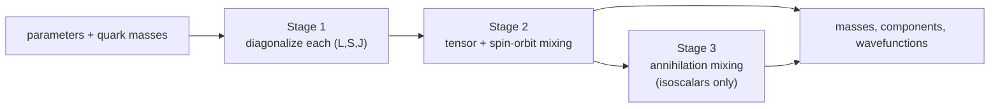

# The model

This page describes the Hamiltonian that GIModel solves. It follows Sec. II
and Appendix A of Godfrey and Isgur (1985); equation numbers refer to that
article. The goal is to show which physical idea sits behind each column of a
computed spectrum.

## The idea in one paragraph

A meson is treated as a constituent quark and antiquark bound by a
flavor-independent interaction. At long distance the interaction is linear
confinement; at short distance it is one-gluon exchange with a running
coupling. What makes the model *relativized* is that the kinetic energy is
fully relativistic, and every potential is smeared over a distance of order
the inverse quark mass and multiplied by momentum-dependent factors. These
modifications stand in for relativistic effects without solving a
Bethe–Salpeter equation, and they let one set of parameters describe mesons
from the pion to the ``\Upsilon``.

## The Hamiltonian

In the meson rest frame, Eq. (1) reads

```math
H = \sqrt{p^2 + m_1^2} + \sqrt{p^2 + m_2^2}
  + \tilde V_\text{conf}(\boldsymbol p, \boldsymbol r)
  + \tilde V_\text{hyp}(\boldsymbol p, \boldsymbol r)
  + \tilde V_\text{so}(\boldsymbol p, \boldsymbol r),
```

where ``m_1`` and ``m_2`` are the constituent masses and ``\boldsymbol p``
is the relative momentum. A tilde marks a relativized operator. The three
potentials are:

| term | physics | shown in the spectrum as |
|---|---|---|
| ``\tilde V_\text{conf}`` | spin-independent: Coulomb plus linear confinement | part of `central` |
| ``\tilde V_\text{hyp}`` | color-magnetic contact and tensor interactions | `contact`, and the tensor part of `fine str` |
| ``\tilde V_\text{so}`` | spin–orbit: color-magnetic plus Thomas precession | the spin-orbit part of `fine str` |

### The nonrelativistic starting point

Without relativization, the spin-independent potential of a color-singlet
``q\bar q`` pair is

```math
V(r) = G(r) + S(r), \qquad
G(r) = -\frac{4\alpha_s(r)}{3r}, \qquad
S(r) = b\,r + c .
```

``G`` is one-gluon exchange with color factor ``4/3`` and ``S`` is the
confining scalar potential with string tension ``b`` and offset ``c``.

### The running coupling

The strong coupling is parametrized in momentum space by three Gaussians
(Eq. (12) and the Fig. 2 caption), which in position space become

```math
\alpha_s(r) = \sum_{k=1}^{3} \alpha_k \,\operatorname{erf}(\gamma_k r),
\qquad
\alpha_k = (0.25,\ 0.15,\ 0.20),\quad
\gamma_k = \left(\tfrac12,\ \tfrac{\sqrt{10}}{2},\ \tfrac{\sqrt{1000}}{2}\right)\ \mathrm{GeV}.
```

The coupling vanishes as ``r \to 0`` (asymptotic freedom) and saturates at
``\sum_k \alpha_k = 0.60`` at large distance. These six numbers are fixed by
the paper and live in the code as constants; [`alpha_s_r`](@ref) and
[`alpha_s_q`](@ref) evaluate the profile.

### Smearing

The quarks are not treated as point particles. Each potential is convolved
with a Gaussian of width ``\sigma_{12}^{-1}`` (Eqs. (A7)–(A9)), where

```math
\sigma_{12}^2 = \sigma_0^2\left[\tfrac12 + \tfrac12\left(\frac{4 m_1 m_2}{(m_1+m_2)^2}\right)^4\right]
             + s^2\left(\frac{2 m_1 m_2}{m_1+m_2}\right)^2 ,
```

with ``\sigma_0 = 1.80`` GeV and ``s = 1.55``. Heavy quarks are more
localized and are smeared less. [`contact_smearing_sigma`](@ref) returns
``\sigma_{12}``.

Because ``\alpha_s`` is a sum of error functions, the smeared Coulomb
potential has a closed form (Eqs. (A12)–(A14)):

```math
\tilde G(r) = -\sum_k \frac{4\alpha_k}{3r}\operatorname{erf}(\tau_k r),
\qquad \frac{1}{\tau_k^2} = \frac{1}{\gamma_k^2} + \frac{1}{\sigma_{12}^2}.
```

Smearing the linear potential also gives a closed form,

```math
\tilde S(r) = b\,r\left[\frac{e^{-\sigma^2 r^2}}{\sqrt\pi\,\sigma r}
  + \left(1 + \frac{1}{2\sigma^2 r^2}\right)\operatorname{erf}(\sigma r)\right] + c .
```

### Momentum-dependent factors

Relativistic kinematics also modify the strength of each interaction. Appendix
A replaces the nonrelativistic ``1/m`` factors by functions of
``E_i = \sqrt{p^2 + m_i^2}``, placed symmetrically on both sides of the
potential so that the operator stays Hermitian. For the Coulomb part of the
central potential,

```math
\tilde V_\text{conf} = A(p)\,\tilde G(r)\,A(p) + \tilde S(r),
\qquad A(p) = \left(1 + \frac{p^2}{E_1 E_2}\right)^{1/2}.
```

For each spin-dependent term ``i``, the factor is

```math
\left(\frac{m_1 m_2}{E_1 E_2}\right)^{1/2 + \epsilon_i}
\;\; V_i(r) \;\;
\left(\frac{m_1 m_2}{E_1 E_2}\right)^{1/2 + \epsilon_i},
```

with a separate exponent ``\epsilon_c``, ``\epsilon_t``,
``\epsilon_{so(v)}`` and ``\epsilon_{so(s)}`` for the contact, tensor, vector
spin-orbit and scalar spin-orbit terms. With ``\epsilon_i = 0`` the
nonrelativistic ``1/(m_1 m_2)`` becomes ``1/(E_1 E_2)``. The pairwise terms
below use the appropriate mass pair (``11``, ``22`` or ``12``) in both the
smearing width and the factor.

### Spin-dependent terms

All spin-dependent potentials come from derivatives of the smeared ``\tilde G``
and ``\tilde S``, with ``\boldsymbol S_1`` and ``\boldsymbol S_2`` the quark
and antiquark spins.

**Contact hyperfine.** The Laplacian of ``\tilde G`` gives a smeared delta
function:

```math
V_\text{cont} = \frac{32\pi}{9 m_1 m_2}\,
\boldsymbol S_1\!\cdot\!\boldsymbol S_2
\sum_k \alpha_k\,\delta_{\tau_k}(r),
\qquad
\delta_\tau(r) = \frac{\tau^3}{\pi^{3/2}} e^{-\tau^2 r^2}.
```

Since ``\langle\boldsymbol S_1\!\cdot\!\boldsymbol S_2\rangle`` is ``-3/4`` for spin
singlets and ``+1/4`` for triplets, this term splits ``\pi`` from ``\rho`` and
``\eta_c`` from ``J/\psi``. Because the delta function is smeared, it acts in
every partial wave, not only in S waves.

**Tensor.**

```math
V_\text{ten} = \frac{S_{12}}{12\, m_1 m_2}
\left(\frac{1}{r}\frac{d\tilde G}{dr} - \frac{d^2\tilde G}{dr^2}\right),
\qquad
S_{12} = 3\,\boldsymbol\sigma_1\!\cdot\!\hat r\;\boldsymbol\sigma_2\!\cdot\!\hat r
       - \boldsymbol\sigma_1\!\cdot\!\boldsymbol\sigma_2 .
```

It is nonzero only in spin triplets with ``L > 0`` on the diagonal, and it
mixes ``L = J-1`` with ``L = J+1`` (for example ``{}^3S_1`` with ``{}^3D_1``).

**Spin–orbit.** The one-gluon exchange (vector) part and the Thomas precession
from the scalar confining potential are

```math
V_\text{so}^{(v)} =
\left(\frac{\boldsymbol S_1\!\cdot\!\boldsymbol L}{2m_1^2}
 + \frac{\boldsymbol S_2\!\cdot\!\boldsymbol L}{2m_2^2}
 + \frac{(\boldsymbol S_1 + \boldsymbol S_2)\!\cdot\!\boldsymbol L}{m_1 m_2}\right)
\frac{1}{r}\frac{d\tilde G}{dr},
\qquad
V_\text{so}^{(s)} =
-\left(\frac{\boldsymbol S_1\!\cdot\!\boldsymbol L}{2m_1^2}
 + \frac{\boldsymbol S_2\!\cdot\!\boldsymbol L}{2m_2^2}\right)
\frac{1}{r}\frac{d\tilde S}{dr}.
```

The two usually have opposite signs, so the net spin-orbit splitting is a
partial cancellation.

When ``m_1 \neq m_2``, the spin-orbit operator has a part proportional to
``\boldsymbol L\cdot(\boldsymbol S_1 - \boldsymbol S_2)`` that does not
conserve total spin ``S``. It mixes the spin singlet ``{}^1L_J`` with the
spin triplet ``{}^3L_J`` at ``J = L``. This is why the physical
``K_1(1270)`` and ``K_1(1400)``, or ``D_1(2420)`` and ``D_1(2430)``, are
superpositions of ``{}^1P_1`` and ``{}^3P_1``. For equal masses (``c\bar c``,
``b\bar b``) the operator vanishes, and so does the mixing.

## Annihilation mixing

For self-conjugate isoscalar mesons, the ``q\bar q`` pair can annihilate
into gluons and reappear as another flavor. This mixes ``u\bar u``,
``d\bar d``, ``s\bar s`` and heavier ``Q\bar Q`` states with the same
quantum numbers. The paper models it with a matrix element proportional to
the smeared wavefunctions at the origin (Eqs. (16)–(18)):

- **Pseudoscalars** (``\eta``, ``\eta'``) mix strongly. Eq. (18) gives two
  versions, `P1` and `P2`, each with a nonperturbative and a perturbative term.
- **Vectors** (``\omega``, ``\phi``) and **tensors** (``f_2``, ``f_2'``) mix
  weakly, through the general Eq. (16) with amplitudes ``A({}^3S_1)`` and
  ``A({}^3P_2)`` from Table III.

[Isoscalar flavor mixing](@ref) shows how to compute this.

## The three stages of the calculation

Godfrey and Isgur solve the model in stages (text near Eq. (14) and
Appendix A). GIModel follows the same order:

1. **Fixed sectors.** For each ``(L, S, J)``, assemble the kinetic,
   central, contact, diagonal spin-orbit and diagonal tensor terms into one
   matrix and diagonalize it. This gives masses and radial wavefunctions that
   already include the spin-dependent forces.
2. **Spectroscopic mixing.** Using those eigenstates as a basis, add the
   off-diagonal tensor (``L = J\pm1``) and antisymmetric spin-orbit
   (``{}^1L_J \leftrightarrow {}^3L_J``) matrix elements, and diagonalize
   each block.
3. **Annihilation mixing.** For isoscalars, add the flavor-changing
   annihilation matrix elements and diagonalize again.

In code, stage 1 is [`fixed_spectrum`](@ref), stage 2 is
[`add_intra_meson_mixing`](@ref), and stage 3 is
[`add_isoscalar_annihilation`](@ref). [`compute_spectrum`](@ref) runs stages
1 and 2; [`compute_isoscalar_spectrum`](@ref) runs all three.



## Numerical method

The paper solves stage 1 by expanding the radial wavefunction in
harmonic-oscillator functions. It uses one oscillator scale ``\beta`` per
sector, chosen variationally, and enlarges the basis until the energies
converge. Matrix elements of functions of ``p`` are computed in momentum
space, matrix elements of functions of ``r`` in position space, and products
are joined by inserting a complete set of states (Eq. (A17)):

```math
\langle i|\,f(p)\,g(r)\,|j\rangle = \sum_n \langle i|f(p)|n\rangle\langle n|g(r)|j\rangle .
```

GIModel implements this as [`OscillatorSolver`](@ref). It also provides
[`FiniteDifferenceSolver`](@ref), which solves the same Hamiltonian on a radial
mesh. The paper does not use this second method; it serves as an independent
check. [Solvers and convergence](@ref) compares them.
