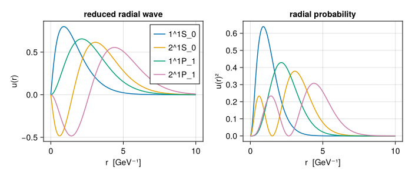
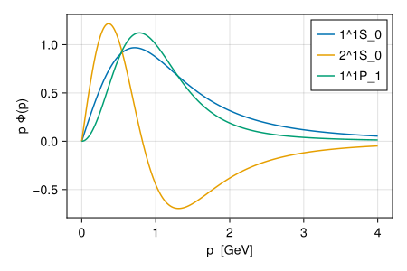

<!-- Generated from docs/quarto/manual/wavefunctions.qmd by docs/render.jl. Edit the .qmd file. source-sha256: 34febc7a9040e73e95de9065f197ac570183bbe21df9948753d4ac6695ce1c39 -->


# Wavefunctions

Every state in a spectrum carries its wavefunction. Decays, radii and annihilation widths are all computed from it, so this page explains how wavefunctions are represented and how to work with them.

```julia
using GIModel
params, mq = load_parameters_and_quark_masses(default_parameters_path())
spec = compute_spectrum(params, Meson(mq, :c, :c);
    levels = spectrum_levels(2), solver = OscillatorSolver())
```

## The radial wavefunction

For a state with orbital angular momentum $L$, the position-space wavefunction factorizes as

```math
\psi(\boldsymbol r) = \frac{u(r)}{r}\, Y_{LM}(\hat r),
\qquad \int_0^\infty u(r)^2\,dr = 1,
```

where $r$ is the quark–antiquark separation in $\mathrm{GeV}^{-1}$ and $u$ is the *reduced* radial wavefunction. GIModel always works with $u$.

### Two representations

The abstract type [`RadialWave`](@ref) has two concrete forms, one per solver:

- [`OscillatorWave`](@ref): coefficients $c_k$ of an expansion in harmonic-oscillator functions with scale $\beta$, plus $L$.
- [`MeshWave`](@ref): samples $u(r_i)$ on a uniform mesh.

```julia
eta_c = radial_wave(spec, "1^1S_0")
(typeof(eta_c), eta_c.L, eta_c.beta, length(eta_c.coefficients))
```

```
(OscillatorWave, 0, 1.1146264602468243, 40)
```

Code that uses a wave should not depend on which form it has. The operations below work for both, so the same analysis runs with either solver.

### Operations

| operation | computes |
|----|----|
| [`wave_norm`](@ref)`(w)` | $\int u^2\,dr$ (1 for solver output) |
| [`radial_expect`](@ref)`(w, f)` | $\int u(r)^2 f(r)\,dr$ |
| [`radial_overlap`](@ref)`(w1, w2, f)` | $\int u_1(r)\,f(r)\,u_2(r)\,dr$ |
| [`wave_mean_squares`](@ref)`(w, L)` | $\langle r^2\rangle$ and $\langle p^2\rangle$ |
| [`momentum_wave`](@ref)`(w, L)` | the momentum-space wave $\Phi_L(p)$ |
| [`momentum_expect`](@ref)`(Φ, g)` | $\int p^2\,\Phi(p)^2 g(p)\,dp$ |
| [`momentum_overlap`](@ref)`(Φ1, Φ2, g)` | $\int p^2\,\Phi_1\Phi_2\, g\,dp$ |
| [`sample_wave`](@ref)`(w, r)` | samples on a grid, for plotting or export |

```julia
radial_expect(eta_c, r -> r^2)          # ⟨r²⟩ in GeV⁻²
```

```
2.1260097242008693
```

```julia
psi2S = radial_wave(spec, "2^1S_0")
radial_overlap(eta_c, psi2S, r -> 1.0)  # orthogonal radial states
```

```
-6.427880256879021e-16
```

```julia
wave_mean_squares(eta_c)                # (r2 in GeV⁻², p2 in GeV²)
```

```
(r2 = 2.1260097242008693, p2 = 1.286903453345401)
```

Convert with $\hbar c = 0.1973$ GeV fm: the root-mean-square separation of the $\eta_c$ is $\sqrt{2.13}\times0.197 \approx 0.29$ fm.

**Smooth functions integrate best.** For oscillator waves, `radial_expect` evaluates `\int u^2 f\,dr` by Gauss–Laguerre quadrature in `x = (\beta r)^2`. Even powers of `r` are exact. Functions like `r` or `1/r` are not polynomials in `x`; they converge more slowly and may emit a quadrature warning. The warning reports what was reached rather than hiding it.

## Plotting wavefunctions

[`sample_wave`](@ref) evaluates any radial wave on a grid of radii and returns a `MeshWave` with fields `r` and `u`:

```julia
using CairoMakie
r = range(0, 10; length = 301)
fig = Figure(size = (700, 300))
ax1 = Axis(fig[1, 1]; xlabel = "r  [GeV⁻¹]", ylabel = "u(r)", title = "reduced radial wave")
ax2 = Axis(fig[1, 2]; xlabel = "r  [GeV⁻¹]", ylabel = "u(r)²", title = "radial probability")
for label in ("1^1S_0", "2^1S_0", "1^1P_1", "2^1P_1")
    w = sample_wave(radial_wave(spec, label), r)
    lines!(ax1, w.r, w.u; label)
    lines!(ax2, w.r, w.u .^ 2)
end
axislegend(ax1; position = :rt)
fig
```



Each radial excitation adds a node. All waves use the same sign convention: the outermost lobe is positive (see [Conventions and units](@ref)).

## Momentum space

The momentum-space radial wave is the spherical Bessel transform

```math
\Phi_L(p) = \sqrt{\frac{2}{\pi}} \int_0^\infty r\, u(r)\, j_L(pr)\,dr,
\qquad \int_0^\infty p^2\,\Phi_L(p)^2\,dp = 1 .
```

For an oscillator wave the transform is exact; for a mesh wave it is computed numerically on a momentum grid (`pmax`, `npoints`). A mesh wave does not store $L$, so pass it explicitly:

```julia
Φ = momentum_wave(eta_c)
momentum_expect(Φ, p -> p^2)             # ⟨p²⟩ in GeV²
```

```
1.286903453345401
```

To plot, transform a sampled wave, which gives values on a momentum grid:

```julia
fig = Figure(size = (450, 300))
ax = Axis(fig[1, 1]; xlabel = "p  [GeV]", ylabel = "p Φ(p)")
for label in ("1^1S_0", "2^1S_0", "1^1P_1")
    w = radial_wave(spec, label)
    Φs = momentum_wave(sample_wave(w, range(0, 20; length = 801)), w.L; pmax = 4.0, npoints = 400)
    lines!(ax, Φs.p, Φs.p .* Φs.phi; label)
end
axislegend(ax)
fig
```



The relativistic kinetic energy $\sqrt{p^2+m^2}$ matters because these distributions reach $p \sim m_c$.

## Mixed states

A mixed state is a superposition of basis states, each with its own radial wave, so it has no single `u(r)`. [`radial_wave`](@ref) refuses it:

```julia
try
    radial_wave(spec, "1^3S_1")
catch err
    println(sprint(showerror, err))
end
```

```
ArgumentError: 1^3S_1 is a mixed physical state; use physical_components instead of selecting one precursor radial wave
```

[`physical_components`](@ref) returns the full decomposition. Each component is a named tuple with the pure `basis` state, its signed `coefficient`, and its native `wave`:

```julia
components = physical_components(spec, "1^3S_1")
[(c.basis.label, round(c.coefficient; digits = 4), typeof(c.wave)) for c in components]
```

```
4-element Vector{Tuple{String, Float64, DataType}}:
 ("1^3S_1", 0.9999, OscillatorWave)
 ("2^3S_1", -0.0, OscillatorWave)
 ("1^3D_1", -0.0133, OscillatorWave)
 ("2^3D_1", 0.0086, OscillatorWave)
```

The squared coefficients sum to one:

```julia
sum(abs2(c.coefficient) for c in components)
```

```
1.0
```

The decomposition is recursive. For an isoscalar that has gone through spectroscopic mixing and then annihilation mixing, `physical_components` multiplies through both steps and returns flavor-tagged components; see [Isoscalar flavor mixing](@ref).

For an unmixed state, `physical_components` returns one component with coefficient 1, so code written with it works for every state.

### Coherent amplitudes

Physical amplitudes are linear in the state: an amplitude for a mixed state is the coefficient-weighted sum of the amplitudes of its components, with signs. [`physical_state_amplitude`](@ref) performs this sum. You write a `kernel` for one pure component, without its coefficient:

```julia
# An illustrative linear amplitude: overlap of each S-wave component with η_c through r².
kernel(c) = c.basis.L_label == "S" ? radial_overlap(eta_c, c.wave, r -> r^2) : 0.0
physical_state_amplitude(kernel, spec, "1^3S_1")
```

```
2.4267853186103885
```

Transition matrix elements in [Transitions and decays](@ref) are built this way, so interference between components is always kept.

### Before mixing

`radial_wave(spec, state.corrected)` returns the wave of the *assigned* basis state before mixing. This is useful for diagnostics, but it is not the physical state.
