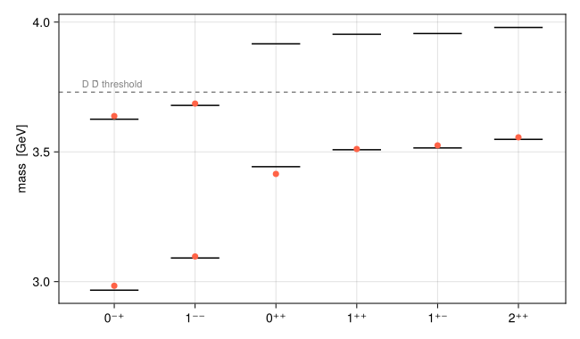
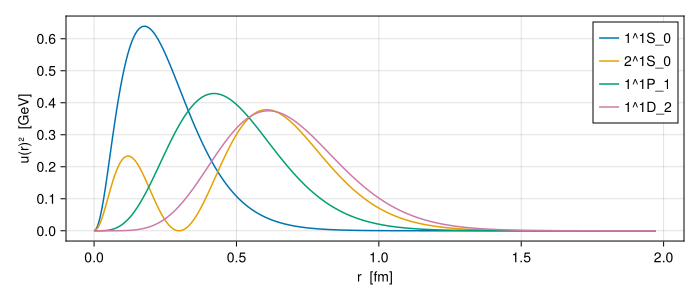

```@meta
EditURL = "../../quarto/tutorials/charmonium.qmd"
```


# Charmonium, start to finish

This tutorial carries out a complete study of one system: the charmonium spectrum, where each mass comes from, what the states look like, and their radiative, leptonic and annihilation widths. It uses the pieces introduced in the Manual; each step links back to the relevant page.

```julia
using GIModel
using GIModel.QuarkModelTransitions
using CairoMakie
params, mq = load_parameters_and_quark_masses(default_parameters_path())
charmonium = Meson(mq, :c, :c)
```

## 1. The spectrum

We use the paper’s oscillator method and compute S, P and D waves up to the second radial excitation:

```julia
spec = compute_spectrum(params, charmonium;
    levels = spectrum_levels(2), solver = OscillatorSolver())
```

```
MixedSpectrum: cc, 20 levels — all values in GeV
  level     central    contact   fine str     mixing       mass
  1^1S_0     3.0785    -0.1114     0.0000     0.0000     2.9671
  1^3S_1     3.0658     0.0256     0.0000    -0.0002     3.0912
  2^1S_0     3.6668    -0.0410     0.0000     0.0000     3.6258
  2^3S_1     3.6664     0.0127     0.0000    -0.0000     3.6791
  1^1P_1     3.5233    -0.0082     0.0000     0.0000     3.5151
  1^3P_0     3.5348     0.0037    -0.0956     0.0000     3.4429
  1^3P_1     3.5239     0.0028    -0.0185     0.0000     3.5082
  1^3P_2     3.5248     0.0022     0.0211     0.0000     3.5482
  2^1P_1     3.9626    -0.0064     0.0000     0.0000     3.9562
  2^3P_0     3.9643     0.0025    -0.0502     0.0000     3.9165
  2^3P_1     3.9627     0.0022    -0.0116     0.0000     3.9532
  2^3P_2     3.9632     0.0018     0.0145     0.0000     3.9795
  1^1D_2     3.8385    -0.0019     0.0000     0.0000     3.8366
  1^3D_1     3.8405     0.0007    -0.0231     0.0001     3.8183
  1^3D_2     3.8385     0.0006    -0.0018     0.0000     3.8374
  1^3D_3     3.8391     0.0006     0.0081     0.0000     3.8477
  2^1D_2     4.2092    -0.0016     0.0000     0.0000     4.2075
  2^3D_1     4.2102     0.0006    -0.0168     0.0001     4.1941
  2^3D_2     4.2092     0.0005    -0.0015     0.0000     4.2082
  2^3D_3     4.2095     0.0005     0.0065     0.0000     4.2166
  (4 levels carry mixing; see `spec.states[i].mixings`)
```

Compare the states below the open-charm threshold with their measured masses (PDG averages, rounded to 1 MeV):

```julia
measured = [
    "1^1S_0" => ("η_c(1S)", 2.984), "1^3S_1" => ("J/ψ", 3.097),
    "1^3P_0" => ("χ_c0", 3.415), "1^3P_1" => ("χ_c1", 3.511),
    "1^1P_1" => ("h_c", 3.525), "1^3P_2" => ("χ_c2", 3.556),
    "2^1S_0" => ("η_c(2S)", 3.638), "2^3S_1" => ("ψ(2S)", 3.686),
    "1^3D_1" => ("ψ(3770)", 3.774),
]
for (label, (name, m_exp)) in measured
    m = spectrum_state(spec, label).mass_GeV
    println(rpad(name, 9), rpad(label, 8), "model ", round(m; digits = 3),
        "  measured ", m_exp, "  Δ = ", round(Int, 1000 * (m - m_exp)), " MeV")
end
```

```
η_c(1S)  1^1S_0  model 2.967  measured 2.984  Δ = -17 MeV
J/ψ      1^3S_1  model 3.091  measured 3.097  Δ = -6 MeV
χ_c0     1^3P_0  model 3.443  measured 3.415  Δ = 28 MeV
χ_c1     1^3P_1  model 3.508  measured 3.511  Δ = -3 MeV
h_c      1^1P_1  model 3.515  measured 3.525  Δ = -10 MeV
χ_c2     1^3P_2  model 3.548  measured 3.556  Δ = -8 MeV
η_c(2S)  2^1S_0  model 3.626  measured 3.638  Δ = -12 MeV
ψ(2S)    2^3S_1  model 3.679  measured 3.686  Δ = -7 MeV
ψ(3770)  1^3D_1  model 3.818  measured 3.774  Δ = 44 MeV
```

A level diagram shows the pattern at a glance. Each column is one $J^{PC}$; black lines are the model’s first two radial levels and red dots are measured states:

```julia
columns = [
    ("0⁻⁺", "1^1S_0", [2.984, 3.638]), ("1⁻⁻", "1^3S_1", [3.097, 3.686]),
    ("0⁺⁺", "1^3P_0", [3.415]), ("1⁺⁺", "1^3P_1", [3.511]),
    ("1⁺⁻", "1^1P_1", [3.525]), ("2⁺⁺", "1^3P_2", [3.556]),
]
fig = Figure(size = (650, 380))
ax = Axis(fig[1, 1]; ylabel = "mass  [GeV]",
    xticks = (1:length(columns), [c[1] for c in columns]))
for (x, (_, label, masses)) in enumerate(columns)
    ground = spectrum_state(spec, label)
    for n in 1:2
        m = spectrum_state(spec, n, ground.L, ground.multiplicity, ground.J).mass_GeV
        lines!(ax, [x - 0.3, x + 0.3], [m, m]; color = :black)
    end
    scatter!(ax, fill(x, length(masses)), masses; color = :tomato, markersize = 10)
end
hlines!(ax, [3.730]; linestyle = :dash, color = :gray)
text!(ax, 0.6, 3.74; text = "D D̄ threshold", fontsize = 11, color = :gray)
fig
```



## 2. Where the masses come from

The spectrum table already splits each mass. The pattern is worth reading closely:

- The **contact** term pushes ${}^1S_0$ down by about 110 MeV and ${}^3S_1$ up by about 25 MeV. With identical wavefunctions the ratio would be the $-3 : 1$ of $\langle\boldsymbol S_1\cdot\boldsymbol S_2\rangle$; the attractive contact term makes the singlet more compact, which enhances its shift to about $-4 : 1$.
- In P waves, the contact term is small but nonzero: smearing gives the contact interaction a finite range.
- The **fine structure** orders the $\chi_{cJ}$ as $J = 0 < 1 < 2$.

Split the $\chi_{cJ}$ fine structure into its pieces:

```julia
for J in 0:2
    s = spectrum_state(spec, "1^3P_$J")
    println("χ_c$J   vector SO ", round(1000s.spin_orbit_vector_shift_GeV; digits = 1),
        "   Thomas ", round(1000s.spin_orbit_thomas_shift_GeV; digits = 1),
        "   tensor ", round(1000s.tensor_shift_GeV; digits = 1), "  (MeV)")
end
```

```
χ_c0   vector SO -94.6   Thomas 22.8   tensor -23.8  (MeV)
χ_c1   vector SO -39.8   Thomas 11.1   tensor 10.2  (MeV)
χ_c2   vector SO 33.6   Thomas -10.7   tensor -1.8  (MeV)
```

The one-gluon (vector) spin-orbit term and the Thomas precession from confinement have opposite signs. The tensor shifts roughly follow the ratio $-4 : +2 : -2/5$ of $\langle S_{12}\rangle$ in the three ${}^3P_J$ states; the deviation again reflects the different wavefunctions of the three states.

To see a term’s total effect, switch it off and recompute ([Computing a spectrum](@ref)). Without the spin-orbit and tensor terms, the three $\chi_{cJ}$ collapse onto one mass, and the $h_c$ lies about 10 MeV below them because of the contact term:

```julia
no_fine = compute_spectrum(params, charmonium;
    levels = spectrum_levels(1; L_labels = ("P",)), solver = OscillatorSolver(),
    terms = SpinTerms(fine_structure = false))
[s.label => round(s.mass_GeV; digits = 4) for s in no_fine.states]
```

```
4-element Vector{Pair{String, Float64}}:
 "1^1P_1" => 3.5151
 "1^3P_0" => 3.5256
 "1^3P_1" => 3.5256
 "1^3P_2" => 3.5256
```

## 3. What the states look like

```julia
r = range(0, 10; length = 301)
fig = Figure(size = (700, 300))
ax = Axis(fig[1, 1]; xlabel = "r  [fm]", ylabel = "u(r)²  [GeV]")
for label in ("1^1S_0", "2^1S_0", "1^1P_1", "1^1D_2")
    w = sample_wave(radial_wave(spec, label), r)
    lines!(ax, w.r .* 0.1973, w.u .^ 2; label)
end
axislegend(ax)
fig
```



```julia
for label in ("1^1S_0", "2^1S_0", "1^1P_1", "1^1D_2")
    w = radial_wave(spec, label)
    m = wave_mean_squares(w)
    println(rpad(label, 8), "√⟨r²⟩ = ", round(sqrt(m.r2) * 0.1973; digits = 3), " fm   ",
        "√⟨p²⟩ = ", round(sqrt(m.p2); digits = 3), " GeV   ",
        "v²/c² ≈ ", round(m.p2 / (m.p2 + mq["c"]^2); digits = 2))
end
```

```
1^1S_0  √⟨r²⟩ = 0.288 fm   √⟨p²⟩ = 1.134 GeV   v²/c² ≈ 0.33
2^1S_0  √⟨r²⟩ = 0.639 fm   √⟨p²⟩ = 1.118 GeV   v²/c² ≈ 0.32
1^1P_1  √⟨r²⟩ = 0.52 fm   √⟨p²⟩ = 0.98 GeV   v²/c² ≈ 0.27
1^1D_2  √⟨r²⟩ = 0.702 fm   √⟨p²⟩ = 1.0 GeV   v²/c² ≈ 0.27
```

The $c\bar c$ pair is 0.3 to 0.7 fm across, and the quark velocity is far from negligible, $v^2 \approx 0.3$. This is why the paper treats the kinetic energy relativistically.

The $J/\psi$ itself is a slightly mixed state:

```julia
[(c.basis.label, round(c.coefficient; digits = 4)) for c in physical_components(spec, "1^3S_1")]
```

```
4-element Vector{Tuple{String, Float64}}:
 ("1^3S_1", 0.9999)
 ("2^3S_1", -0.0)
 ("1^3D_1", -0.0133)
 ("2^3D_1", 0.0086)
```

The tensor force admixes ${}^3D_1$ components with amplitudes of about 0.01, a probability below 0.03%. Small as it is, this admixture is what gives a D-wave state such as the $\psi(3770)$ its $e^+e^-$ width.

## 4. Radiative transitions

The photon operators of the paper connect S waves with S waves (M1) and with P waves (E1, M2). In the spectrum above, the $J/\psi$ and $\psi(2S)$ carry small ${}^3D_1$ components from tensor mixing, which these operators do not cover, so `PhotonEmission` would refuse them. For radiative transitions we therefore solve the S and P waves only, as the paper does for its Table VI. Here we use a separate S/P spectrum:

```julia
radiative = compute_spectrum(params, charmonium;
    levels = spectrum_levels(2; L_labels = ("S", "P")), solver = OscillatorSolver())
```

Resolve the states once as [`PhysicalState`](@ref)s:

```julia
state(label) = physical_state(radiative, label)
psi, psi2S, eta_c = state("1^3S_1"), state("2^3S_1"), state("1^1S_0")
photon = PhotonEmission(mq)
```

The E1 transitions between S and P waves are the strongest radiative decays of charmonium:

```julia
for J in 0:2
    chi = state("1^3P_$J")
    down = decay_width(matrix_element(psi, photon, chi))
    up = decay_width(matrix_element(chi, photon, psi2S))
    println("χ_c$J → J/ψ γ: ", round(1000down; digits = 1), " keV     ",
        "ψ(2S) → χ_c$J γ: ", round(1000up; digits = 1), " keV")
end
```

```
χ_c0 → J/ψ γ: 128.9 keV     ψ(2S) → χ_c0 γ: 14.6 keV
χ_c1 → J/ψ γ: 210.4 keV     ψ(2S) → χ_c1 γ: 22.7 keV
χ_c2 → J/ψ γ: 268.4 keV     ψ(2S) → χ_c2 γ: 21.5 keV
```

The E1 width scales as $q^3$ times the square of a radial overlap, so the photon momentum drives most of the $J$ dependence.

Magnetic dipole transitions flip the quark spin. Between states of the same radial level (`DirectM1`) they are small; between different levels (`HinderedM1`) they would vanish without relativistic corrections and wavefunction differences:

```julia
direct = matrix_element(eta_c, photon, psi)
hindered = matrix_element(eta_c, photon, psi2S)
(direct = (direct.transition_class, round(1000decay_width(direct); digits = 2)),
 hindered = (hindered.transition_class, round(1000decay_width(hindered); digits = 2)))
```

```
(direct = (GIModel.QuarkModelTransitions.DirectM1(), 2.36), hindered = (GIModel.QuarkModelTransitions.HinderedM1(), 0.78))
```

Widths are in keV. The hindered transition is weaker even though its photon momentum is five times larger, because its overlap nearly cancels.

## 5. Leptonic and annihilation widths

These widths depend on the wavefunction near the origin:

```julia
current = LeptonicCurrent(:electromagnetic, mq)
two_photon = TwoPhotonAnnihilation(mq, AnnihilationTerm((:c, :c), 4 / 9))
gluons = GluonicAnnihilation(mq, M -> alpha_s_q(M))
(ψ_ee = 1000decay_width(MasslessLeptonPair(), current, psi),
 ψ2S_ee = 1000decay_width(MasslessLeptonPair(), current, psi2S),
 ηc_γγ = 1000decay_width(TwoPhotonChannel(), two_photon, eta_c),
 ηc_gg = decay_width(TwoGluonChannel(), gluons, eta_c))
```

```
(ψ_ee = 10.511053477744904, ψ2S_ee = 3.5329994712630834, ηc_γγ = 7.525020971568651, ηc_gg = 24.583472509534875)
```

The first three are in keV, the last in MeV. The ratio $\Gamma_{ee}(\psi(2S))/\Gamma_{ee}(J/\psi) \approx 0.34$ reflects the smaller wavefunction at the origin of the radially excited state.

## 6. Is it converged?

The oscillator solver certifies the energies (see [Solvers and convergence](@ref)). A width is a different quantity, so check it directly with the independent finite-difference solver:

```julia
fd = compute_spectrum(params, charmonium; levels = spectrum_levels(2; L_labels = ("S", "P")),
    solver = FiniteDifferenceSolver(ngrid = 1200))
compare(label_i, label_f) = (
    decay_width(matrix_element(physical_state(radiative, label_f), photon, physical_state(radiative, label_i))),
    decay_width(matrix_element(physical_state(fd, label_f), photon, physical_state(fd, label_i))))
for (i, f) in (("1^3P_1", "1^3S_1"), ("2^3S_1", "1^3P_2"), ("1^3S_1", "1^1S_0"))
    ho_w, fd_w = compare(i, f)
    println(rpad("$i → $f", 20), "HO ", round(1000ho_w; digits = 3), " keV   FD ",
        round(1000fd_w; digits = 3), " keV")
end
```

```
1^3P_1 → 1^3S_1     HO 210.421 keV   FD 210.412 keV
2^3S_1 → 1^3P_2     HO 21.521 keV   FD 21.507 keV
1^3S_1 → 1^1S_0     HO 2.364 keV   FD 2.365 keV
```

The two methods agree, so the widths are properly converged.

## Summary

In a few calls we obtained the charmonium spectrum with its decomposition, the wavefunctions, and a set of decay widths, and checked convergence with a second method. The same steps work for any flavor combination: [Heavy-light mesons and mixing](@ref) repeats them for a system where singlet–triplet mixing matters.
