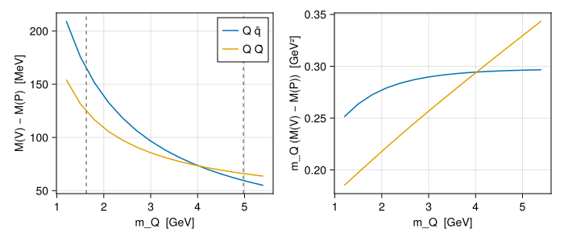
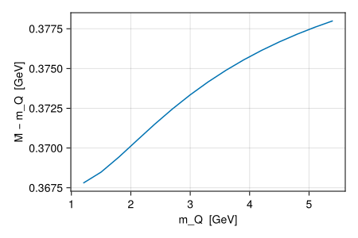

```@meta
EditURL = "../../quarto/tutorials/heavy_quark_sweep.qmd"
```


# From charm to bottom

In the Godfrey–Isgur model the interaction is flavor-blind: confinement, the running coupling and the smearing parameters do not depend on the quark. A quark mass is therefore a free dial. This tutorial turns it from the charm to the bottom mass and watches heavy-quark physics appear: the hyperfine splitting falls like $1/m_Q$, and heavy-light binding energies approach a constant.

```julia
using GIModel
using CairoMakie
params, mq = load_parameters_and_quark_masses(default_parameters_path())
S_levels = spectrum_levels(1; L_labels = ("S",))
```

## A heavy quark with a free mass

[`HeavyQuark`](@ref) takes any mass. A meson built from quark objects needs no mass table:

```julia
Q(m) = HeavyQuark{:up}(m, :Q)
light = LightQuark(mq["q"])
Meson(Q(2.5), light)
```

```
Meson: Q qbar   (m1 = 2.5, m2 = 0.22 GeV, reduced = 0.2022 GeV)
```

For each heavy mass we compute the ground-state pseudoscalar and vector of the heavy-light system $Q\bar q$ and of quarkonium $Q\bar Q$:

```julia
masses = range(1.2, 5.4; length = 15)
function ground_states(meson)
    spec = compute_spectrum(params, meson; levels = S_levels)
    (P = spectrum_state(spec, "1^1S_0").mass_GeV, V = spectrum_state(spec, "1^3S_1").mass_GeV)
end
heavy_light = [ground_states(Meson(Q(m), light)) for m in masses]
quarkonium = [ground_states(Meson(Q(m), Q(m))) for m in masses]
```

The fast finite-difference default is enough here: we are after trends, and [Solvers and convergence](@ref) showed it agrees with the oscillator solver to well below an MeV.

## The hyperfine splitting

The contact interaction is proportional to $1/(m_1 m_2)$. For heavy-light mesons, $m_Q\,\Delta M_\text{hf}$ should become constant as $m_Q$ grows:

```julia
fig = Figure(size = (700, 300))
ax1 = Axis(fig[1, 1]; xlabel = "m_Q  [GeV]", ylabel = "M(V) − M(P)  [MeV]")
ax2 = Axis(fig[1, 2]; xlabel = "m_Q  [GeV]", ylabel = "m_Q (M(V) − M(P))  [GeV²]")
for (states, name) in ((heavy_light, "Q q̄"), (quarkonium, "Q Q̄"))
    splitting = [s.V - s.P for s in states]
    lines!(ax1, masses, 1000 .* splitting; label = name)
    lines!(ax2, masses, masses .* splitting; label = name)
end
vlines!(ax1, [mq["c"], mq["b"]]; color = :gray, linestyle = :dash)
axislegend(ax1)
fig
```



The dashed lines mark the charm and bottom masses. For $Q\bar q$ the product $m_Q\Delta M$ levels off: this is heavy-quark spin symmetry. For $Q\bar Q$ the splitting falls more slowly, because the wavefunction shrinks as both masses grow and the value at the origin increases.

## The binding energy of a heavy-light meson

In the heavy-quark limit, the light degrees of freedom do not care about $m_Q$. The spin-averaged mass minus the heavy-quark mass, $\bar\Lambda = \bar M - m_Q$ with $\bar M = (M_P + 3M_V)/4$, should tend to a constant:

```julia
Λ̄ = [(s.P + 3s.V) / 4 - m for (s, m) in zip(heavy_light, masses)]
fig = Figure(size = (450, 300))
ax = Axis(fig[1, 1]; xlabel = "m_Q  [GeV]", ylabel = "M̄ − m_Q  [GeV]")
lines!(ax, masses, Λ̄)
fig
```



$\bar\Lambda$ stays close to 0.37 GeV over the whole range, changing by less than 10 MeV between the charm and bottom masses: the light degrees of freedom are nearly the same in $D$ and $B$ mesons.

## Why the medium does not need retuning

Changing the heavy mass leaves light mesons untouched, because the interaction parameters are shared by all flavors and only the constituent masses of each meson enter:

```julia
rho(p) = spectrum_state(compute_spectrum(p, Meson(mq, :u, :d); levels = S_levels), "1^3S_1").mass_GeV
rho(params)
```

```
0.7711896047422471
```

This mass does not depend on anything we varied above. By contrast, changing the *interaction*, for example the string tension, moves every meson:

```julia
steeper = GIParameters(params; potential = ConfinementPotential(params.potential; b = 0.20))
rho(steeper)
```

```
0.8230167453045851
```

This separation is what makes the Godfrey–Isgur model predictive: one set of interaction parameters for all flavors, and quark masses as the only flavor-dependent inputs.
