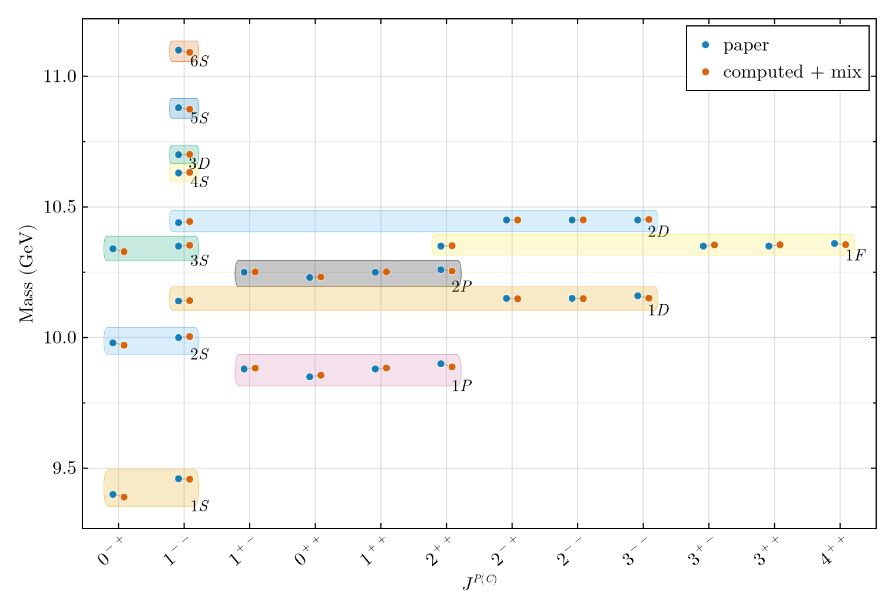
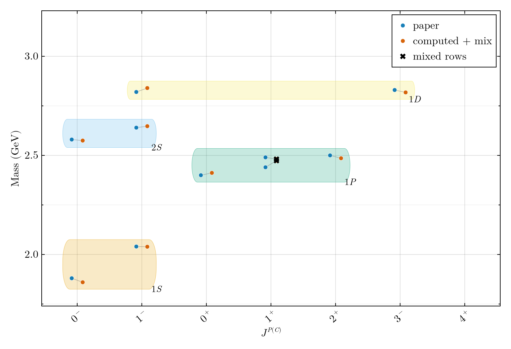
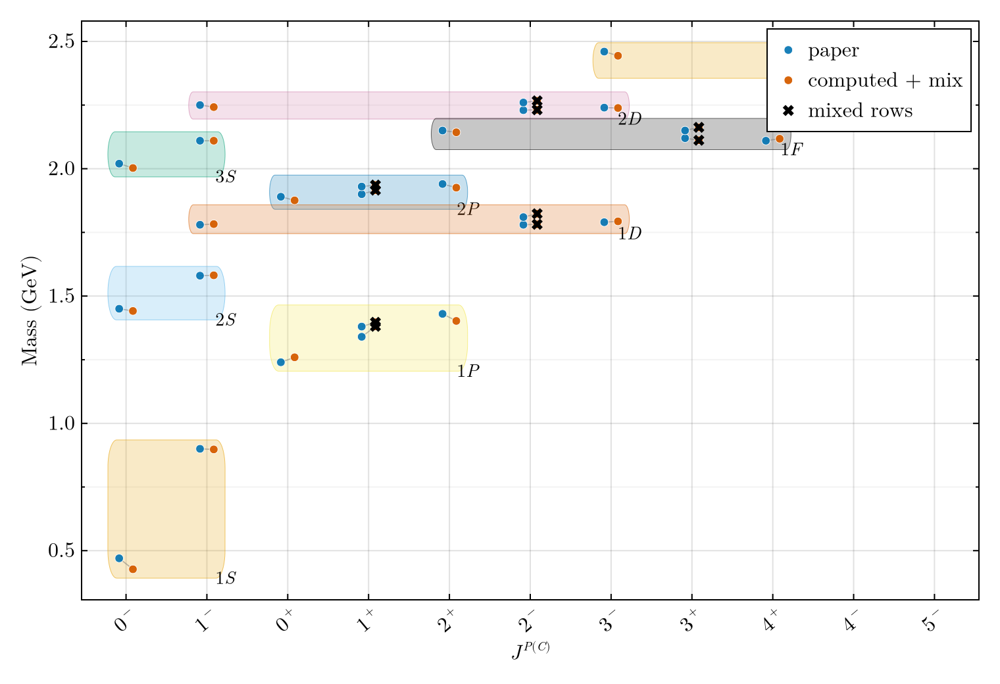
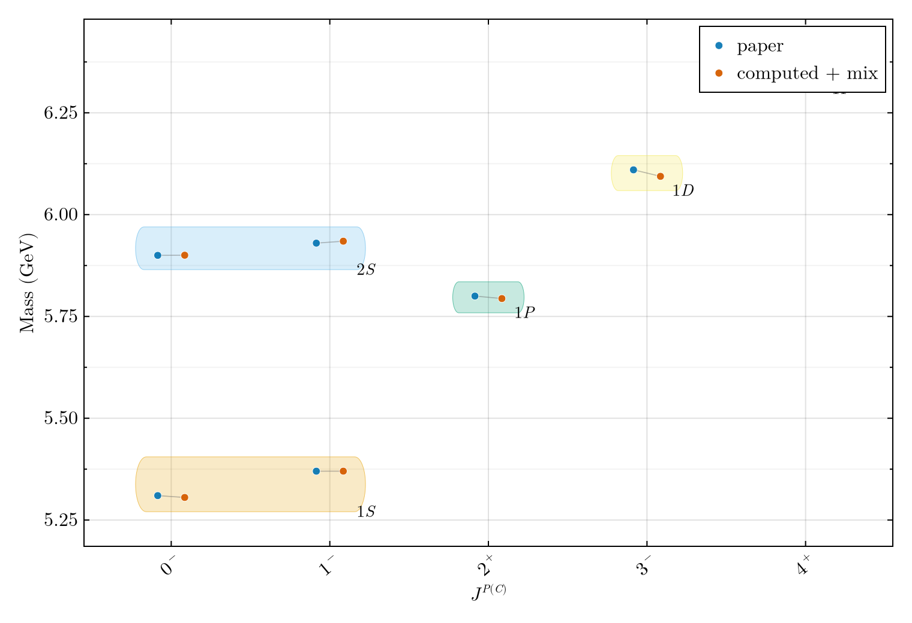
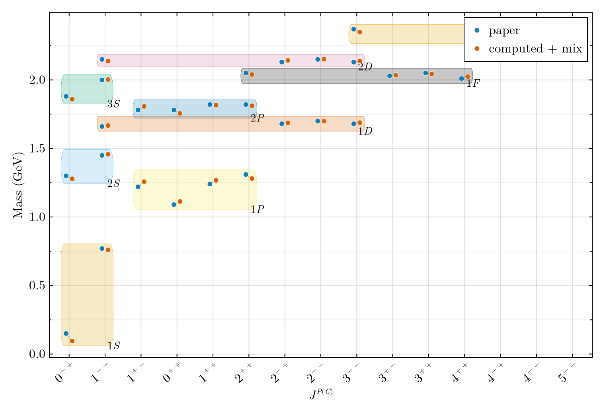

# Introduction

The relativized quark model of Godfrey and Isgur [@godfrey1985] (hereafter GI)
describes light and heavy mesons --- "from the pion to the upsilon" --- within a
single soft-QCD Hamiltonian. Its enduring value is that one fixed set of
parameters predicts the masses, and subsequently the couplings, of essentially
the entire meson nonet structure. Four decades on, the model is still a standard
spectroscopic baseline, yet the numbers in the paper are difficult to regenerate
from scratch: the relativistic smearing, the momentum-dependent operator
factors, and the isoscalar annihilation machinery are specified semiquantitatively
across the main text and Appendix A, and the published spectra appear as figures
rather than tables.

The goal of the present work is a *transparent reproduction*: to encode the
published ingredients into auditable code and to regenerate the GI meson spectrum
from the formulas alone, without retuning. We have implemented the model as a
Julia package, `GIModel`, in which every physical layer --- parameter inputs,
the central Hamiltonian, Appendix-A smearing and momentum sandwiches, the
spin-dependent operators, and the isoscalar mixing/annihilation blocks --- is a
separately testable stage with a documented map to the paper's equations.

This report mirrors the organization of the original paper. Section
@sec-model corresponds to GI Sec. II: the soft-QCD Hamiltonian, the
relativization and smearing prescription, the running coupling, the
annihilation interaction, and the Table II parameters, together with the
choices made in our finite-difference realization. Section @sec-spectrum
corresponds to GI Sec. III: the reproduced meson spectra for all flavor sectors,
with state-by-state residuals against the published masses and a discussion of
the similarities and the residual deviations. The analysis of meson couplings
(GI Sec. IV, Tables IV--V) is the subject of a separate report and is only
previewed here.

Throughout, the 1985 paper is treated as authoritative. Reference masses are
read from the published figures and from Table III for the isoscalars; model
parameters are read from Table II. All comparison numbers quoted below are
regenerated by the package scripts and recorded under
`docs/residual_reports/`.

# Soft QCD and the meson Hamiltonian {#sec-model}

## The relativistic Hamiltonian

GI take as the basic equation a rest-frame Schr\"odinger-type equation with a
relativistic kinetic term,
$$
H\,|\Psi\rangle = (H_0 + V)\,|\Psi\rangle = E\,|\Psi\rangle ,
$$ {#eq-schrodinger}
$$
H_0 = \sqrt{p^2 + m_1^2} + \sqrt{p^2 + m_2^2},
$$ {#eq-kinetic}
where $V=V(\mathbf{p},\mathbf{r})$ is a momentum-dependent potential and
$\mathbf{p}=\mathbf{p}_1=-\mathbf{p}_2$. In the nonrelativistic limit
$H_0\to\sum_i (m_i + p^2/2m_i)$ and $V$ reduces to the familiar sum of
confinement, hyperfine, and spin--orbit terms,
$$
V \to H^{\text{conf}} + H^{\text{hyp}} + H^{\text{so}} + H_A .
$$ {#eq-vlimit}

The spin-independent confinement piece combines a linear Lorentz-scalar term and
a Coulomb-type one-gluon-exchange term,
$$
H^{\text{conf}}_{ij}
  = -\Big[\tfrac34 c + \tfrac34 b r - \frac{\alpha_s(r)}{r}\Big]\,
    \mathbf{F}_i\!\cdot\!\mathbf{F}_j ,
$$ {#eq-conf}
with $\langle \mathbf{F}_i\!\cdot\!\mathbf{F}_j\rangle = -4/3$ in a meson. The
color hyperfine interaction contains the contact (spin--spin) and tensor pieces,
$$
H^{\text{hyp}}_{ij} = -\frac{\alpha_s(r)}{m_i m_j}
  \Big[\tfrac{8\pi}{3}\,\mathbf{S}_i\!\cdot\!\mathbf{S}_j\,\delta^3(\mathbf{r})
  + \frac{1}{r^3}\,S_{ij}\Big]\mathbf{F}_i\!\cdot\!\mathbf{F}_j ,
$$ {#eq-hyp}
and the spin--orbit interaction splits into a color-magnetic (one-gluon) part
and a Thomas-precession part,
$$
H^{\text{so}}_{ij} = H^{\text{so(cm)}}_{ij} + H^{\text{so(tp)}}_{ij},
\qquad
H^{\text{so(tp)}}_{ij} = -\frac{1}{2r}\,
  \frac{\partial H^{\text{conf}}_{ij}}{\partial r}\,
  \Big[\frac{\mathbf{S}_i}{m_i^2}+\frac{\mathbf{S}_j}{m_j^2}\Big]\!\cdot\!\mathbf{L}.
$$ {#eq-so}
Finally $H_A$ is the gluon-annihilation interaction, which contributes only in
self-conjugate isoscalar channels (Sec. @sec-isoscalar).

As GI emphasize, Eqs. @eq-hyp--@eq-so are more singular than $r^{-2}$ and are
illegal operators in @eq-schrodinger as written; the resolution is the
relativization of Appendix A.

## Relativization: smearing and momentum dependence

The relativistic potential differs from its nonrelativistic limit in two ways.
First, the relative coordinate is *smeared* over distances of order the inverse
quark masses through a Gaussian smearing function
$$
\rho_{ij}(\mathbf{r}'-\mathbf{r})
  = \frac{\sigma_{ij}^3}{\pi^{3/2}}\,
    e^{-\sigma_{ij}^2(\mathbf{r}'-\mathbf{r})^2},
$$ {#eq-smear}
with a mass-dependent width $\sigma_{ij}(\sigma_0,s)$. Smearing tames the
short-distance singularities, making the operators legal. Second, the
coefficients of the potentials acquire a dependence on the quark momenta:
mass factors $m^{-1}$ are promoted to operator factors built from
$E_i=(p^2+m_i^2)^{1/2}$, so that, e.g., the light-quark hyperfine term saturates
to a finite $m\to 0$ limit controlled by $\langle p^{-1}\rangle$ rather than
diverging.

In our finite-difference (FD) realization we keep both effects explicitly. The
central Coulomb and confinement terms are replaced by their closed-form smeared
forms $\widetilde G(r)$ and $\widetilde S(r)$ (Appendix-A
$\tau_k$/error-function expressions), and the Coulomb operator is dressed with a
Hermitian momentum sandwich on the FD $p^2$ eigenbasis,
$$
G' = A(p)\,\widetilde G\,A(p),
\qquad A(p) = \Big(1 + \tfrac{p^2}{E_1 E_2}\Big)^{1/2},
$$ {#eq-sandwich}
which is Hermitian by construction. The same momentum-factor sandwich, with the
side exponent $\tfrac12 + \epsilon_i$ set by the Table II relativization
exponents, is applied to the smeared contact, tensor, and spin--orbit kernels.
The spin-dependent radial kernels themselves are built from derivatives of the
*smeared* central functions, e.g. the OGE-tensor kernel
$K_T(r)=\tfrac1r\widetilde G'(r)-\widetilde G''(r)$ and the Thomas kernel
$\propto (\widetilde G+\widetilde S)'(r)$.

This is the active "1.0" operator path. It is selected by four switches that
together encode the physical content that made the heavy-quark reproduction
work:
`appendix_a_momentum_sandwich`, `contact_momentum_sandwich`,
`fine_structure_momentum_sandwich`, and `fine_structure_smeared_kernels`.

## Numerical procedure: solver, and relation to the paper

GI solve @eq-schrodinger in three stages: (i) diagonalize the relativized
Hamiltonian $\widetilde H_1$ [their Eq. (14)] in a large harmonic-oscillator
(HO) basis within fixed $|jm;ls\rangle$ sectors; (ii) diagonalize the smaller
mass matrices generated by the off-diagonal tensor ($^3L_J\!\leftrightarrow\!{}^3L'_J$)
and antisymmetric spin--orbit ($^3L_J\!\leftrightarrow\!{}^1L_J$, unequal masses
only) couplings; and (iii) for self-conjugate isoscalars, add the annihilation
mass matrix $H_A$.

Our package provides both an FD radial solver --- the headline path used for the
spectra below --- and an HO basis path (`GIParameters{HarmonicOscillatorBasis}`)
used for cross-checks; the central Appendix-A operator agrees between the two
bases at the sub-MeV level. The FD solver diagonalizes the spin-independent
$\widetilde H_1$ on a uniform radial mesh per $(n,L)$, then applies the
contact, spin--orbit, and tensor shifts, then the same-$J$ tensor and
antisymmetric spin--orbit $2\times2$ mixing blocks, and finally the isoscalar
annihilation block, reproducing the paper's staging. The reduced radial
function $u(r)$ is normalized as $\int |u(r)|^2\,dr = 1$, with the angular
factor carried by the spherical harmonic.

## The running coupling

The strong coupling is parametrized as a sum of Gaussians, frozen at low $Q^2$,
$$
\alpha_s(Q^2) = \sum_k a_k\, e^{-Q^2/4\gamma_k^2},
\qquad \alpha_s^{\text{crit}} \equiv \sum_k a_k ,
$$ {#eq-alphaq}
which transforms into a coordinate-space error-function profile,
$\alpha_s(r)=\sum_k a_k\,\mathrm{erf}(\gamma_k r)$, convenient for convolution
with the smearing @eq-smear. We use the published fit (GI Fig. 2),
$$
\alpha_s(Q^2) = 0.25\,e^{-Q^2} + 0.15\,e^{-Q^2/10} + 0.20\,e^{-Q^2/1000},
$$
with $Q$ in GeV, so that $\alpha_s^{\text{crit}} = 0.60$. This reproduces the
saturating curve of Fig. 2 and is regression-tested in the package.

## Annihilation in isoscalar channels

In self-conjugate isoscalars, $q\bar q$ can annihilate through gluons ($n=2$ for
$C=+$, $n=3$ for $C=-$). GI parametrize the diagonal contribution as
$A_{Q\bar Q}\sim \alpha_s^n |\Psi(0)|^2/M_Q^2$ [their Eq. (15)] and the full
channel-coupling element as
$$
A(^{2S+1}L_J)_{ji} = 4\pi(2L{+}1)\,A(^{2S+1}L_J)
  \Big[\tfrac{\alpha_s(M_j^2)\alpha_s(M_i^2)}{\pi^2}\Big]^{n/2}
  \frac{S_L(\Psi_j)S_L(\Psi_i)}{m_i m_j},
$$ {#eq-ann16}
with the origin-smeared wavefunction factor $S_L(\Psi_i)$ [their Eq. (17)]
evaluated by a $j_L$ momentum transform of the HO radial wavefunction. The
pseudoscalar channel is special (the U(1) problem): GI replace the bracket by
one of two nonperturbative models, P1 [Eq. (18a)] and P2 [Eq. (18b)]. Our
implementation of @eq-ann16, the P1/P2 pseudoscalar models, and their use in
the isoscalar spectrum are described in Sec. @sec-isoscalar.

## Parameters

A search over parameter space converged essentially uniquely to the Table II
values, which we adopt verbatim (Table~\ref{tab:params}). We make no fit of our own:
these constants, the $\alpha_s$ form above, and the figure/Table III reference
masses are the only inputs.

```{=latex}
\begin{table}[t]
\centering
\caption{GI Table II parameters, as used by the package. The tensor exponent is
the paper's $\epsilon_f$ (code \texttt{epsilon\_t}).}
\label{tab:params}
\begin{tabular}{llr}
\toprule
Quantity & Symbol & Value \\
\midrule
Light quark mass & $\tfrac12(m_u+m_d)$ & $220$ MeV \\
Strange mass & $m_s$ & $419$ MeV \\
Charm mass & $m_c$ & $1628$ MeV \\
Bottom mass & $m_b$ & $4977$ MeV \\
String tension & $b$ & $0.18$ GeV$^2$ \\
Constant & $c$ & $-253$ MeV \\
Frozen coupling & $\alpha_s^{\text{crit}}$ & $0.60$ \\
QCD scale & $\Lambda$ & $200$ MeV \\
Smearing width & $\sigma_0$ & $1.80$ GeV \\
Smearing exponent & $s$ & $1.55$ \\
Contact factor & $\epsilon_c$ & $-0.168$ \\
Tensor factor & $\epsilon_f$ & $+0.025$ \\
Vector spin--orbit & $\epsilon_{\text{so}(V)}$ & $-0.035$ \\
Scalar spin--orbit & $\epsilon_{\text{so}(S)}$ & $+0.055$ \\
\bottomrule
\end{tabular}
\end{table}
```

GI quote an expected accuracy of $25$ MeV for light-quark mesons and $10$ MeV
for heavy-quark systems, dominated by neglected coupled-channel shifts of order
$10$ MeV and by the schematic relativization. We measure our reproduction
against the same expectations.

# The meson spectrum of soft QCD {#sec-spectrum}

We solve the model for the seven flavor sectors of GI Figs. 3--9 and compare,
state by state, against the published masses. Table~\ref{tab:scorecard} summarizes
the mean and maximum absolute residuals per sector; the per-state tables follow.
All numbers are regenerated by `scripts/run_all_spectrum_checks.jl`.

```{=latex}
\begin{table}[t]
\centering
\caption{Reproduction scorecard: mean and maximum absolute residuals (MeV)
against the published masses, per sector.}
\label{tab:scorecard}
\begin{tabular}{lrrr}
\toprule
Sector & Rows & Mean $|\Delta|$ & Max $|\Delta|$ \\
\midrule
Bottomonium ($b\bar b$) & 30 & $4.3$ & $12.1$ \\
$b$-flavored & 21 & $5.2$ & $15.9$ \\
Charmonium ($c\bar c$) & 28 & $6.0$ & $24.4$ \\
Strange & 30 & $10.8$ & $43.0$ \\
Isoscalar & 48 & $11.5$ & $39.9$ \\
Charmed & 22 & $12.4$ & $34.2$ \\
Isovector & 30 & $14.5$ & $55.0$ \\
\bottomrule
\end{tabular}
\end{table}
```

Residuals are in MeV. Every sector reproduces within, or close to, the GI
accuracy target: the heavy-heavy sectors at the $\sim\!5$ MeV level and the
light/heavy-light sectors at $\sim\!10$--$15$ MeV.

Figures @fig-isovector--@fig-bflavored present the reproduced spectra in the
style of GI Figs. 3--9: each panel plots mass against the $J^{PC}$ (or $J^P$)
quantum numbers, with the published reference masses (blue) overlaid on the
computed masses including same-$J$ mixing (orange). States are grouped into
shaded $nL$ multiplet boxes; for the unequal-mass and isoscalar panels a thin
line connects each paper/computed pair to make the residual visible. The
figures are regenerated by `scripts/plot_all_sector_spectra.jl`.

## Heavy quarkonia: the cleanest reproduction

The heavy, compact $b\bar b$ and $c\bar c$ systems are the most stringent test
of the spin-independent backbone, since their fine structure is small and their
annihilation/mixing corrections are minor. They are reproduced essentially to
the GI heavy-quark target (Figs. @fig-charmonium and @fig-bottomonium).

{#fig-charmonium width=95%}

{#fig-bottomonium width=95%}

For bottomonium, the $30$ scored levels (S, P, D, F waves through $6S$) have a
mean absolute residual of $4.3$ MeV and a maximum of $12.1$ MeV, with a common
offset of only about $-0.8$ MeV. For charmonium, the $28$ levels give a mean
absolute residual of $6.0$ MeV (common offset $+0.7$ MeV). The radial and
orbital level spacings --- the most direct probe of the central potential ---
are reproduced to a few MeV (Table~\ref{tab:ccspacing}).

```{=latex}
\begin{table}[t]
\centering
\caption{Charmonium radial/orbital spacings and the leading spin splittings
(MeV), model vs. GI reference.}
\label{tab:ccspacing}
\begin{tabular}{lrrr}
\toprule
Quantity & Ref. & Model & Error \\
\midrule
$2S-1S$ & $597.5$ & $607.0$ & $+9.5$ \\
$3S-1S$ & $1022.5$ & $1032.4$ & $+9.9$ \\
$1P-1S$ & $455.8$ & $465.2$ & $+9.4$ \\
$1D-1P$ & $317.2$ & $315.4$ & $-1.7$ \\
$2P-1P$ & $439.2$ & $439.3$ & $+0.1$ \\
$1\,^3S_1-1\,^1S_0$ & $130.0$ & $132.4$ & $+2.4$ \\
$2\,^3S_1-2\,^1S_0$ & $60.0$ & $61.5$ & $+1.5$ \\
$1\,^3P_1-1\,^3P_0$ & $70.0$ & $61.8$ & $-8.2$ \\
$1\,^3P_2-1\,^3P_1$ & $40.0$ & $6.7$ & $-33.3$ \\
$1\,^3D_2-1\,^3D_1$ & $20.0$ & $17.0$ & $-3.0$ \\
\bottomrule
\end{tabular}
\end{table}
```

All spacings in MeV. The S-wave hyperfine splittings and the $L$-spacings are
reproduced at the few-MeV level; the one conspicuous outlier is the compressed
$^3P_2$--$^3P_1$ tensor splitting, discussed below.

A layered decomposition makes clear that the residuals live in the
spin-dependent shifts, not the central masses. Table~\ref{tab:ccdecomp} shows the
contributions for representative charmonium states: the central eigenvalue plus
contact, total spin--orbit, and tensor shifts assemble the predicted mass.

```{=latex}
\begin{table*}[t]
\centering
\caption{Charmonium contribution breakdown (MeV unless noted), relative to the
spin-independent FD eigenvalue, for representative states. The predicted mass is
the sum of the central value and all shifts.}
\label{tab:ccdecomp}
\begin{tabular}{lrrrrrr}
\toprule
state & central (GeV) & contact & L$\cdot$S total & tensor & predicted (GeV) & residual \\
\midrule
$1\,^1S_0$ & 3.064 & $-105.9$ & $0.0$ & $0.0$ & 2.958 & $-11.5$ \\
$1\,^3S_1$ & 3.064 & $+26.5$ & $0.0$ & $0.0$ & 3.091 & $-9.1$ \\
$1\,^3P_0$ & 3.523 & $0.0$ & $-26.2$ & $-32.5$ & 3.464 & $+24.4$ \\
$1\,^3P_1$ & 3.523 & $0.0$ & $-13.1$ & $+16.2$ & 3.526 & $+16.1$ \\
$1\,^3P_2$ & 3.523 & $0.0$ & $+13.1$ & $-3.2$ & 3.533 & $-17.1$ \\
$1\,^3D_1$ & 3.838 & $0.0$ & $-7.9$ & $-5.9$ & 3.825 & $+4.7$ \\
$1\,^3D_3$ & 3.838 & $0.0$ & $+5.3$ & $-1.7$ & 3.842 & $-8.0$ \\
\bottomrule
\end{tabular}
\end{table*}
```

The same-$J$ tensor mixing of the $^3S_1$--$^3D_1$ system is included as a
post-diagonalization $2\times2$ block; for $c\bar c$ it produces small
off-diagonal elements ($\sim\!3$ MeV) and a $1{}^3D_1$ that is $\sim\!98\%$
$D$-wave, consistent with the near-pure assignments of the figures.

## Heavy--light mesons

The charmed ($c\bar q$, $c\bar s$), $b$-flavored ($b\bar q$, $b\bar s$,
$b\bar c$), and strange ($q\bar s$) sectors test the unequal-mass machinery: the
mass-dependent smearing width, and the antisymmetric spin--orbit term that mixes
$^1L_J$ and $^3L_J$ states of the same $J$. With these blocks active, the
$b$-flavored sector reproduces at $5.2$ MeV mean (max $15.9$), charmed at
$12.4$ MeV (max $34.2$), and strange at $10.8$ MeV (max $43.0$). The
spin-averaged multiplet centers are excellent throughout (e.g. charmed $1P$
center off by $+2.3$ MeV over eight states, strange $2S$ off by $-1.0$ MeV);
the larger maxima are confined to the same-$J$ mixed $P$-wave pairs (the
$K_1$-type and $D_1$-type axial states), whose splitting and assignment depend
on the mixing angle (Figs. @fig-charmed--@fig-bflavored).

{#fig-charmed width=95%}

{#fig-strange width=95%}

{#fig-bflavored width=95%}

## Light isovector mesons

The isovector sector ($\rho/a/\pi$ family, Fig. 3) is the hardest non-isoscalar
test: light constituents maximize the relativistic corrections. The $30$ scored
levels reproduce at $14.5$ MeV mean (max $55.0$), within the GI light-meson
target of $25$ MeV. The $2S$ and $3S$ centers reproduce to a few MeV; the
largest residuals are the $1S$ hyperfine center ($-21$ MeV, tracking the $\pi$,
which our FD ground state places $\sim\!55$ MeV below the GI $0.15$ GeV) and the
$^3P_2$ tensor pattern, the same operator-ordering signature seen in $c\bar c$
(Fig. @fig-isovector).

{#fig-isovector width=95%}

## Light isoscalar mesons {#sec-isoscalar}

The isoscalars (Fig. 5, Table III) require the annihilation interaction $H_A$
and $n\bar n$/$s\bar s$ flavor mixing on top of the spin spectrum. We adopt the
GI Table III prescription directly, implemented as the `:table_iii` scheme:

- **$^1S_0$ (pseudoscalars):** the calibrated P1 model [Eq. (18a)] carries the
  headline mass scoring, with the literal P1/P2 modes available as eigenvector
  checks. With the GI annihilation phase convention $\Phi(0)>0$ enforced, the
  literal modes reproduce the Table III sign structure --- including the
  all-positive $\eta'$ row --- with amplitude RMS $0.078$ (P1) and $0.025$ (P2);
  the P2 $\eta_r$ row $(+0.993,+0.076,+0.069)$ matches the paper's
  $(+0.99,+0.07,+0.08)$ essentially exactly.
- **$^3S_1$ and $^3P_2$:** the general Eq. @eq-ann16 block, with $A(^3S_1)=+2.5$
  ($n=3$, three gluons) and $A(^3P_2)=-0.8$ ($n=2$). The $\omega/\phi$ block
  reproduces Table III amplitudes $(+1.000,-0.029)$ vs. $(+0.999,-0.02)$ and an
  $\omega$ shift of $+13$ MeV vs. the paper's $+10$ MeV; the $f_2/f_2'$ block
  gives $(+0.997,+0.080)$ vs. $(+0.997,+0.06)$.
- **All other channels:** ideal $n\bar n$/$s\bar s$ mixing, as Table III assumes
  for every channel it does not list.

With this prescription the isoscalar sector reproduces at $11.5$ MeV mean (max
$39.9$) over $48$ scored rows --- in line with the corresponding isovector
channels, whose residuals the isoscalar rows now track. The earlier
hundreds-of-MeV isoscalar gap is closed. A single low-confidence $2{}^3D_2$
digitization at $2.26$ GeV was crop-audited against Fig. 5 and rejected as
contamination from the neighboring strange figure.

Figure @fig-isoscalar shows the isoscalar ladder. Note that this diagnostic
plot displays the base spin spectrum plus same-$J$ mixing *without* the
annihilation block, so the large $0^{-+}$ offset (computed $\sim\!0.1$ GeV vs.
the paper's $\eta/\eta'$) is precisely the pseudoscalar annihilation
contribution that the `:table_iii` scheme restores; the $11.5$ MeV scorecard
above already includes it.

{#fig-isoscalar width=95%}

## Discussion: similarities and deviations

Across all seven sectors the spin-independent backbone --- the relativized
kinetic term, the smeared central potential, and the Coulomb momentum sandwich
--- reproduces the GI multiplet centers and radial/orbital spacings to a few
MeV. This is the central positive result: the published spectrum is recoverable
from the published ingredients, with no fit of our own.

The residual deviations are systematic and few:

1. **Compressed $^3P_2$ tensor splitting.** The $^3P_2$--$^3P_1$ gap is too
   small in every light-and-charm sector ($-33$ MeV in $c\bar c$). The tensor
   and color-magnetic spin--orbit shifts are individually of the right size, so
   this points to the operator-ordering and perturbative-vs-diagonalized
   treatment of the fine structure (GI's Eq. (14) staging on the HO basis)
   rather than to a wrong kernel.

2. **Light $^1S_0$ ground states.** The FD $\pi$ sits $\sim\!55$ MeV below the
   GI value, propagating into the isovector $1S$ center and the literal
   pseudoscalar isoscalar masses. This is a shared light-sector diagonal issue,
   not an annihilation issue.

3. **Same-$J$ heavy--light $P$-waves.** The largest heavy--light maxima are the
   mixed axial pairs, whose assignment is mixing-angle sensitive; tying the
   spectrum's antisymmetric spin--orbit angle to the published convention is the
   open refinement.

None of these is a gross solver failure; each is a localized
operator-ordering, extraction, or convention question, exactly the regime GI
anticipated for their $10$--$25$ MeV accuracy budget. The natural next step,
and the subject of the following report, is GI Sec. IV: the analysis of meson
couplings (the strong-decay amplitudes of Tables IV--V), which tests the model
wavefunctions rather than only the eigenvalues.

# References {.unnumbered}

::: {#refs}
:::
